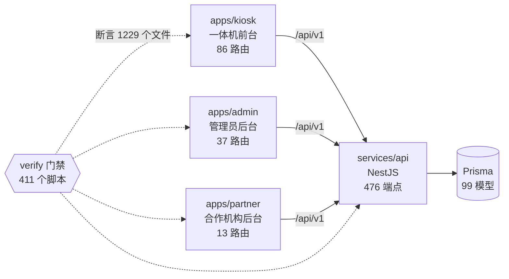

<!-- 本文件由 scripts/generate-project-graph.mjs 自动生成，请勿手改。 -->
<!-- 手改会在下次 `node scripts/generate-project-graph.mjs` 时被覆盖。 -->
# 项目图谱

> **这份文件是从代码算出来的，不是写出来的。**
>
> 每一条边都来自解析源码：路由表、import 图、NestJS 装饰器、Prisma schema、
> 门禁脚本里的路径断言。没有任何一条是人手抄的结论，因此它不会像手写文档那样
> 慢慢和代码脱节 —— 代码变了，重跑一次，diff 就是这段时间的真实变化。
>
> 重新生成：`node scripts/generate-project-graph.mjs`
> 只检查不写盘：`node scripts/generate-project-graph.mjs --check`

## 先看这里：图谱主要是拿来「查」的

三个每天都会遇到、翻文档翻不出来的问题，直接命令行问：

```bash
# 1. 我改了这个文件，会红哪条门禁？（今天多次踩到）
node scripts/project-graph-query.mjs file apps/kiosk/src/pages/print/PrintConfirmPage.tsx

# 2. 这个路由背后到底调了哪些接口、落到哪些表？
node scripts/project-graph-query.mjs route /print/confirm

# 3. 这个端点是谁在实现、动了哪些 Prisma 模型？
node scripts/project-graph-query.mjs endpoint /api/v1/print-jobs

# 4. 这个 Prisma 模型被哪些代码读写？
node scripts/project-graph-query.mjs model PrintTask
```

## 规模

| 应用 | 目录 | 路由数 | 源文件 | 入口可达 |
| --- | --- | --- | --- | --- |
| kiosk | `apps/kiosk` | 86 | 428 | 408 |
| admin | `apps/admin` | 37 | 138 | 135 |
| partner | `apps/partner` | 13 | 39 | 38 |

| 维度 | 数量 |
| --- | --- |
| HTTP 端点（services/api） | 476 |
| Prisma 模型 | 99 |
| 门禁脚本文件 | 411 |
| ├ 其中辅助库（被别的门禁 import） | 75 |
| ├ 已在 package.json 里有脚本名 | 370 |
| ├ 在 CI 执行闭包里 | 363 |
| └ **无脚本名，从未被执行** | 7 |
| 被至少一条门禁断言的文件 | 1229 |
| 孤儿候选 · protected（不得删） | 7 |
| 孤儿候选 · high（仍被 CI/门禁引用） | 13 |
| 孤儿候选 · medium（仅文档提及） | 8 |
| 孤儿候选 · low（全仓零提及） | 126 |

## 分册

| 文件 | 回答什么问题 |
| --- | --- |
| [routes.md](routes.md) | 三端每个路由对应哪个页面文件、调哪些端点、用哪些样式 |
| [api.md](api.md) | 每个 HTTP 端点由哪个 controller 方法实现、经过哪些 service、落到哪些 Prisma 模型 |
| [data-model.md](data-model.md) | Prisma 模型之间的关系，以及每个模型被哪些代码读写 |
| [gates.md](gates.md) | 每条 verify 门禁断言哪些文件；以及**文件 → 门禁**反向索引 |
| [orphans.md](orphans.md) | 零引用候选清单，按风险分级。**只出清单，不删任何东西** |
| [graph.json](graph.json) | 上面全部数据的机器可读版本，稳定排序，可直接 diff |

## 总体结构



──────────────────────────────────────────────────────────────────────

## 这份图谱不保证什么（读之前先知道边界）

写在最前面，是因为**一份被过度信任的自动产物，比一份没人读的文档更危险**。

1. **只解析静态结构。** 运行时才决定的跳转（`navigate(变量)`）、条件挂载的路由、
   反射式的 service 调用，图谱看不见。
2. **端点归属是 import 可达性，不是实际调用。** 页面 import 到了某个 service 模块，
   就算它「可能调用」该模块的全部端点；实际是否在某个分支里调用，图谱不判断。
   宁可多一条边，也不要漏 —— 但读的时候要知道这是上界不是精确值。
3. **后端 service → 模型走的是受限闭包**（只沿 `.service.ts` 和同目录文件，深度 2）。
   跨目录的间接数据访问会漏。放开成全量闭包的结果是几乎每个端点都连上全部
   99 个模型，那样的图没有分辨力。
4. **孤儿清单是候选，不是删除许可。** 判定用的是 CLAUDE.md §8 的五条证据；
   `protected` 名单里的目录即使五条全中也不得删除（原因见 orphans.md）。
5. **`apps/miniapp` 不在解析范围内**，只在门禁清单里只读引用它的 package.json 脚本名。
6. **门禁的「在 CI 里」是尽力而为的推断**，权威仍是 `scripts/verify-ci-gate-coverage.mjs`。
7. **自动产物会污染它自己的输入 —— 这不是假设，是本工具开发时真踩到的。**
   图谱产物列举了仓库里几乎每一个路径。第一版把 `docs/graph/` 也算进「提及索引」，
   于是「全仓没有任何其它文件提到它」这条判据对所有文件恒假：孤儿候选从 161 条
   塌到 45 条，`protected` 一条不剩 —— 而且**塌下来的那一版看起来完全正常**，
   没有报错、没有警告，只是安静地少报了 116 条。现已排除自身产物（见
   `scripts/project-graph/orphans.mjs` 的 `GRAPH_OUTPUT_DIR`），但同类盲区必然还有。
   这就是为什么本节排在最前面：**一份被过度信任的自动产物，比一份没人读的文档更危险。**

发现图谱和代码对不上，**以代码为准，并且这是脚本的 bug** —— 请修脚本，不要手改产物。
