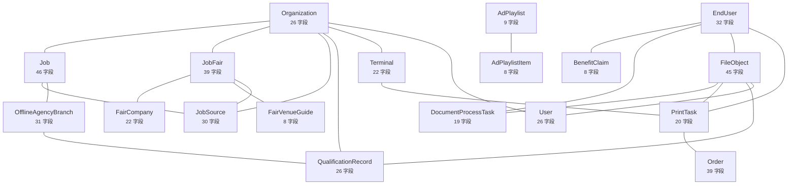

<!-- 本文件由 scripts/generate-project-graph.mjs 自动生成，请勿手改。 -->
<!-- 手改会在下次 `node scripts/generate-project-graph.mjs` 时被覆盖。 -->
# 数据模型图谱

`91` 个 Prisma 模型，来源 `services/api/prisma/schema.prisma`。

下图只画**关系度数最高的 18 个模型**：全量 91 个节点的
ER 图人是读不了的。全量关系见下方表格和 `graph.json`。

## 全部模型

| 模型 | 字段数 | 关联模型 | 被哪些文件读写 |
| --- | --- | --- | --- |
| **AdAsset** | 19 | AdPlaylistItem | 1 个文件 `content/content.service.ts` |
| **AdPlaylist** | 9 | AdPlaylistItem、TerminalScreensaverConfig | 1 个文件 `content/content.service.ts` |
| **AdPlaylistItem** | 8 | AdAsset、AdPlaylist | 1 个文件 `content/content.service.ts` |
| **AdvisorArtifact** | 11 | AdvisorSession | 3 个文件 `advisor/advisor-artifact.service.ts` `advisor/advisor-retention.task.ts` `advisor/advisor.service.ts` |
| **AdvisorPin** | 8 | AdvisorSession | 1 个文件 `advisor/advisor.service.ts` |
| **AdvisorSession** | 14 | AdvisorArtifact、AdvisorPin | 2 个文件 `advisor/advisor-retention.task.ts` `advisor/advisor.service.ts` |
| **AiResumeResult** | 15 | EndUser | 10 个文件 `admin-users/admin-users.service.ts` `ai/ai.service.ts` `ai/resume/appended-self-assessment.service.ts` … |
| **AiServiceLog** | 12 | EndUser | 2 个文件 `ai/ai-log.service.ts` `ai/ai-result.cleanup.task.ts` |
| **AuditLog** | 12 | User | 14 个文件 `admin-print-scan/admin-print-scan.service.ts` `audit/audit.service.ts` `auth/admin-initial-phone-bind.service.ts` … |
| **BenefitActivity** | 19 | BenefitClaim、User | 1 个文件 `benefit-activities/benefit-activities.service.ts` |
| **BenefitClaim** | 8 | BenefitActivity、BenefitGrant、EndUser | 1 个文件 `benefit-activities/benefit-activities.service.ts` |
| **BenefitGrant** | 16 | BenefitClaim、EndUser | 5 个文件 `benefit-activities/benefit-activities.service.ts` `benefit-redemption/benefit-redemption.service.ts` `member-benefits/admin-member-benefits.service.ts` … |
| **BroadcastReadState** | 9 | EndUser、SystemBroadcast | 1 个文件 `member-notifications/member-notifications.service.ts` |
| **BrowseLog** | 12 | EndUser | 3 个文件 `activity/activity.service.ts` `admin-users/admin-users.service.ts` `member-privacy/member-data-export.mapper.ts` |
| **CompanyProfile** | 37 | Job、Organization | 3 个文件 `activity/activity.service.ts` `companies/companies.service.ts` `orgs/partner-stats.service.ts` |
| **ContractReviewTask** | 30 | EndUser | 7 个文件 `contract-review/__tests__/contract-review-orchestrator.test.ts` `contract-review/contract-review-lifecycle.service.ts` `contract-review/contract-review-orchestrator.service.ts` … |
| **DocumentProcessTask** | 19 | EndUser、FileObject、PiiFinding | 5 个文件 `admin-print-scan/admin-print-scan.service.ts` `materials/materials.service.ts` `member-print-orders/member-print-order-create.service.ts` … |
| **EndUser** | 32 | AiResumeResult、AiServiceLog、BenefitClaim、BenefitGrant、BroadcastReadState、BrowseLog、ContractReviewTask、DocumentProcessTask、ExternalJumpLog、Favorite、FeedbackTicket、FileObject、JobAiSession、MemberLegalConsent、MemberNotification、PrintTask、ScanTask、UserAiConsent、UserDataRequest | 12 个文件 `admin-orders-readonly/admin-orders-readonly.service.ts` `admin-users/admin-users.service.ts` `benefit-activities/benefit-activities.service.ts` … |
| **ExternalJumpLog** | 13 | EndUser | 3 个文件 `activity/activity.service.ts` `admin-users/admin-users.service.ts` `member-privacy/member-data-export.mapper.ts` |
| **FairCompany** | 22 | FairCompanyPosition、FairVenueHallCompany、JobFair | 6 个文件 `activity/activity.service.ts` `jobs/admin-fairs.service.ts` `jobs/fair-company-print.service.ts` … |
| **FairCompanyBooth** | 9 | — | **无代码读写** |
| **FairCompanyPosition** | 16 | FairCompany | **无代码读写** |
| **FairMaterial** | 19 | FairMaterialPrintBridge、JobFair | 3 个文件 `jobs/admin-fairs.service.ts` `jobs/fair-material-print-bridge.service.ts` `jobs/fair-material.service.ts` |
| **FairMaterialPrintBridge** | 17 | FairMaterial、FileObject | 3 个文件 `files/files.service.ts` `jobs/fair-material-print-bridge.service.ts` `print-jobs/print-jobs.service.ts` |
| **FairVenueFacility** | 10 | FairVenueGuide | 1 个文件 `jobs/fair-venue-guide.service.ts` |
| **FairVenueGuide** | 8 | FairVenueFacility、FairVenueHall、JobFair | 1 个文件 `jobs/fair-venue-guide.service.ts` |
| **FairVenueHall** | 12 | FairVenueGuide、FairVenueHallCompany | 1 个文件 `jobs/fair-venue-guide.service.ts` |
| **FairVenueHallCompany** | 9 | FairCompany、FairVenueHall | **无代码读写** |
| **FairZone** | 11 | JobFair | 3 个文件 `jobs/admin-fairs.service.ts` `jobs/fair-company-zone.service.ts` `jobs/jobs-kiosk.service.ts` |
| **Favorite** | 7 | EndUser | 2 个文件 `member-favorites/member-favorites.service.ts` `member-privacy/member-data-export.mapper.ts` |
| **FeedbackReply** | 8 | FeedbackTicket、User | 1 个文件 `member-feedback/member-feedback.service.ts` |
| **FeedbackTicket** | 17 | EndUser、FeedbackReply | 3 个文件 `member-feedback/kiosk-feedback.service.ts` `member-feedback/member-feedback.service.ts` `member-privacy/member-data-export.mapper.ts` |
| **FieldMappingRule** | 9 | JobSource | 1 个文件 `jobs/jobs-excel.service.ts` |
| **FileObject** | 45 | DocumentProcessTask、EndUser、FairMaterialPrintBridge、OnlinePlatformDirectory、PrintTask、QualificationRecord、User | 25 个文件 `admin-print-scan/admin-print-scan.service.ts` `admin-users/admin-users.service.ts` `ai/ai.service.ts` … |
| **HelpItem** | 8 | — | **无代码读写** |
| **ImportBatch** | 17 | ImportRecord、JobSource | 2 个文件 `jobs/jobs-admin.service.ts` `jobs/jobs-excel.service.ts` |
| **ImportRecord** | 10 | ImportBatch | 1 个文件 `jobs/jobs-excel.service.ts` |
| **Job** | 46 | CompanyProfile、JobAiRecommendation、JobDataQualitySnapshot、JobSource、OfflineAgencyBranch、OfflineJob、Organization | 15 个文件 `activity/activity.service.ts` `ai/resume/job-fit.service.ts` `bulk-publish/bulk-publish.service.ts` … |
| **JobAiRecommendation** | 12 | Job、JobAiSession | 2 个文件 `job-ai/governed-job-fit.service.ts` `job-ai/job-ai.service.ts` |
| **JobAiSession** | 14 | EndUser、JobAiRecommendation | 5 个文件 `ai/ai-result.cleanup.task.ts` `job-ai/governed-job-fit.service.ts` `job-ai/job-ai.service.ts` … |
| **JobDataQualitySnapshot** | 10 | Job、Organization | 1 个文件 `job-ai/job-quality.service.ts` |
| **JobFair** | 39 | FairCompany、FairMaterial、FairVenueGuide、FairZone、JobSource、Organization | 15 个文件 `activity/activity.service.ts` `ai/resume/fair-visit-plan.service.ts` `bulk-publish/bulk-publish.service.ts` … |
| **JobSource** | 30 | FieldMappingRule、ImportBatch、Job、JobFair、Organization、SyncLog | 5 个文件 `job-sync/job-sync.service.ts` `jobs/jobs-excel.service.ts` `jobs/jobs-partner.service.ts` … |
| **KioskActivity** | 12 | — | **无代码读写** |
| **KioskSession** | 9 | — | **无代码读写** |
| **LegalDocVersion** | 10 | — | 2 个文件 `legal/legal.service.ts` `member-auth/member-auth.service.ts` |
| **MemberLegalConsent** | 10 | EndUser | 1 个文件 `member-auth/member-auth.service.ts` |
| **MemberNotification** | 12 | EndUser | 2 个文件 `member-notifications/member-notifications.service.ts` `member-privacy/member-data-export.mapper.ts` |
| **MockInterviewReport** | 6 | MockInterviewSession | 1 个文件 `mock-interview/mock-interview.service.ts` |
| **MockInterviewSession** | 21 | MockInterviewReport、MockInterviewTurn | 3 个文件 `ai/resume/career-plan.service.ts` `member-privacy/member-data-export.mapper.ts` `mock-interview/mock-interview.service.ts` |
| **MockInterviewTurn** | 13 | MockInterviewSession | 1 个文件 `mock-interview/mock-interview.service.ts` |
| **OfflineAgency** | 23 | OfflineJob | 1 个文件 `offline-agencies/offline-agencies.service.ts` |
| **OfflineAgencyBranch** | 31 | Job、OfflineAgencyProfile、QualificationRecord | 1 个文件 `recruitment-content/recruitment-content-read.service.ts` |
| **OfflineAgencyProfile** | 19 | OfflineAgencyBranch、Organization | 1 个文件 `recruitment-content/recruitment-content-read.service.ts` |
| **OfflineJob** | 22 | Job、OfflineAgency | 1 个文件 `offline-agencies/offline-agencies.service.ts` |
| **OnlinePlatformDirectory** | 33 | FileObject、Organization | 1 个文件 `recruitment-content/recruitment-content-read.service.ts` |
| **Order** | 39 | PaymentAttempt、PrintTask、Refund | 15 个文件 `admin-orders-readonly/admin-orders-readonly.service.ts` `admin-print-scan/admin-print-scan.service.ts` `benefit-redemption/benefit-redemption.service.ts` … |
| **Organization** | 26 | CompanyProfile、Job、JobDataQualitySnapshot、JobFair、JobSource、OfflineAgencyProfile、OnlinePlatformDirectory、PolicyPost、QualificationRecord、Terminal、User | 16 个文件 `auth/auth.service.ts` `auth/partner-account-action.service.ts` `auth/partner-phone-rebind.service.ts` … |
| **PaymentAttempt** | 13 | Order | 3 个文件 `payment/online-payment.service.ts` `payment/reconciliation.service.ts` `payment/refund.service.ts` |
| **PiiFinding** | 10 | DocumentProcessTask | 4 个文件 `materials/materials.service.ts` `member-print-orders/member-print-order-create.service.ts` `print-jobs/pickup-order.service.ts` … |
| **PolicyEligibilityRule** | 10 | PolicyPost | 1 个文件 `policies/policy-eligibility.service.ts` |
| **PolicyPost** | 22 | Organization、PolicyEligibilityRule | 7 个文件 `activity/activity.service.ts` `bulk-publish/bulk-publish.service.ts` `jobs/jobs-partner.service.ts` … |
| **PriceConfig** | 9 | — | 3 个文件 `payment/admin-billing.service.ts` `payment/price-config.seed.ts` `payment/pricing.service.ts` |
| **PrintMaterialPack** | 9 | — | **无代码读写** |
| **PrintTask** | 20 | EndUser、FileObject、Order、PrintTaskStatusLog、Terminal | 19 个文件 `admin-ops/admin-ops.service.ts` `admin-print-scan/admin-print-scan.service.ts` `admin-users/admin-users.service.ts` … |
| **PrintTaskStatusLog** | 7 | PrintTask | 6 个文件 `admin-orders-readonly/admin-orders-readonly.service.ts` `admin-print-scan/admin-print-scan.service.ts` `print-jobs/admin-closed-pending-print-task-disposition.service.ts` … |
| **QualificationRecord** | 26 | FileObject、OfflineAgencyBranch、Organization | 1 个文件 `recruitment-content/recruitment-content-read.service.ts` |
| **RedemptionRecord** | 11 | — | 2 个文件 `benefit-redemption/benefit-redemption.service.ts` `member-benefits/member-benefits.service.ts` |
| **Refund** | 12 | Order | 2 个文件 `payment/reconciliation.service.ts` `payment/refund.service.ts` |
| **ReviewDecision** | 18 | User | **无代码读写** |
| **ScanTask** | 15 | EndUser、Terminal | 5 个文件 `admin-print-scan/admin-print-scan.service.ts` `member-feedback/kiosk-feedback.service.ts` `scan-tasks/scan-task-reaper.task.ts` … |
| **ScreensaverContent** | 9 | — | **无代码读写** |
| **SyncLog** | 15 | JobSource | 5 个文件 `job-sync/job-sync.service.ts` `jobs/jobs-excel.service.ts` `jobs/jobs-partner.service.ts` … |
| **SystemBroadcast** | 9 | BroadcastReadState | 1 个文件 `member-notifications/member-notifications.service.ts` |
| **Terminal** | 22 | Organization、PrintTask、ScanTask、TerminalBindCode、TerminalCapability、TerminalCredential、TerminalHeartbeat、TerminalScanDeletionAudit | 19 个文件 `admin-ops/admin-ops.service.ts` `admin-orders-readonly/admin-orders-readonly.service.ts` `admin-print-scan/admin-print-scan.service.ts` … |
| **TerminalBindCode** | 10 | Terminal | 2 个文件 `terminals/terminal-credential-security.service.ts` `terminals/terminals-admin.service.ts` |
| **TerminalCapability** | 9 | Terminal | 1 个文件 `terminals/terminal-capabilities.service.ts` |
| **TerminalCredential** | 9 | Terminal | 2 个文件 `terminals/terminal-credential-security.service.ts` `terminals/terminals-admin.service.ts` |
| **TerminalHeartbeat** | 12 | Terminal | 1 个文件 `terminals/terminals-agent.service.ts` |
| **TerminalScanDeletionAudit** | 13 | Terminal | 1 个文件 `terminals/terminal-scan-deletion-audit.service.ts` |
| **TerminalScreensaverConfig** | 9 | AdPlaylist | 2 个文件 `content/content.service.ts` `device-fleet/device-fleet.service.ts` |
| **TerminalSmartCampusConfig** | 7 | — | 3 个文件 `device-fleet/device-fleet.service.ts` `smart-campus/smart-campus.service.ts` `terminals/terminals-agent.service.ts` |
| **TerminalToolboxConfig** | 7 | — | 3 个文件 `device-fleet/device-fleet.service.ts` `terminals/terminal-toolbox.service.ts` `terminals/toolbox-governance.service.ts` |
| **ToolboxAllowedHost** | 13 | — | 1 个文件 `terminals/toolbox-governance.service.ts` |
| **ToolboxApp** | 12 | ToolboxAppVersion | 1 个文件 `terminals/toolbox-governance.service.ts` |
| **ToolboxAppVersion** | 14 | ToolboxApp | 1 个文件 `terminals/toolbox-governance.service.ts` |
| **ToolboxLaunchEvent** | 10 | — | 1 个文件 `terminals/terminal-toolbox.service.ts` |
| **User** | 26 | AuditLog、BenefitActivity、FeedbackReply、FileObject、Organization、ReviewDecision | 14 个文件 `auth/admin-initial-phone-bind.service.ts` `auth/admin-phone-transfer.service.ts` `auth/auth.service.ts` … |
| **UserAiConsent** | 8 | EndUser | 3 个文件 `member-privacy/member-data-export.mapper.ts` `member-privacy/member-data-request.service.ts` `member-privacy/member-privacy.service.ts` |
| **UserDataRequest** | 22 | EndUser | 6 个文件 `member-privacy/member-data-export-download.service.ts` `member-privacy/member-data-export-reconciler.service.ts` `member-privacy/member-data-export.mapper.ts` … |
| **UserNotification** | 10 | — | **无代码读写** |

## 没有任何代码读写的模型（10）

> 注意：这里的判定只看 \`this.prisma.<model>.<op>\` 形式的调用。
> 通过关系字段级联读写、raw SQL 或迁移脚本访问的模型不会被计入，**不能据此删表**。

- `FairCompanyBooth`
- `FairCompanyPosition`
- `FairVenueHallCompany`
- `HelpItem`
- `KioskActivity`
- `KioskSession`
- `PrintMaterialPack`
- `ReviewDecision`
- `ScreensaverContent`
- `UserNotification`
