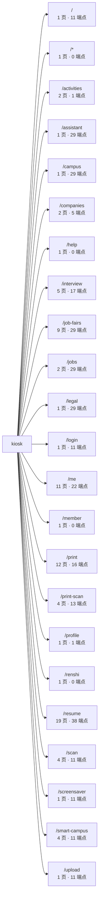
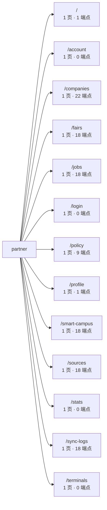

<!-- 本文件由 scripts/generate-project-graph.mjs 自动生成，请勿手改。 -->
<!-- 手改会在下次 `node scripts/generate-project-graph.mjs` 时被覆盖。 -->
# 路由图谱

三端每个路由 → 页面组件文件 → 该页面 import 闭包内触达的 API 端点。

「端点」是 **import 可达性上界**：页面能通过 import 链走到那个 service 模块，
不代表每次渲染都会调用它。用它回答「改这个接口会影响哪些页面」是可靠的；
用它回答「这个页面一定会发这些请求」不可靠。

──────────────────────────────────────────────────────────────────────

## kiosk（apps/kiosk）

路由表：`apps/kiosk/src/routes/index.tsx`　入口：`apps/kiosk/src/main.tsx`

| 路由 | 页面组件 | 页面文件 | 端点数 | 样式 |
| --- | --- | --- | --- | --- |
| `/` | HomePage | `apps/kiosk/src/pages/home/HomePage.tsx` | 11 | 3 |
| `/*` | KioskRouteErrorPage | `apps/kiosk/src/pages/errors/KioskRouteErrorPage.tsx` | 0 | — |
| `/activities` | BenefitActivitiesPage | `apps/kiosk/src/pages/activities/BenefitActivitiesPage.tsx` | 1 | 1 |
| `/activities/:id` | BenefitActivityDetailPage | `apps/kiosk/src/pages/activities/BenefitActivityDetailPage.tsx` | 1 | 1 |
| `/assistant` | AssistantPage | `apps/kiosk/src/pages/assistant/AssistantPage.tsx` | 29 | 13 |
| `/campus` | CampusPage | `apps/kiosk/src/pages/campus/CampusPage.tsx` | 29 | — |
| `/companies` | CompaniesPage | `apps/kiosk/src/pages/companies/CompaniesPage.tsx` | 5 | — |
| `/companies/:id` | CompanyDetailPage | `apps/kiosk/src/pages/companies/CompanyDetailPage.tsx` | 5 | — |
| `/help` | HelpCenterPage | `apps/kiosk/src/pages/help/HelpCenterPage.tsx` | 0 | 1 |
| `/interview/report` | InterviewReportPage | `apps/kiosk/src/pages/interview/InterviewReportPage.tsx` | 17 | 7 |
| `/interview/reports` | InterviewReportsPage | `apps/kiosk/src/pages/interview/InterviewReportsPage.tsx` | 17 | 7 |
| `/interview/session` | InterviewSessionPage | `apps/kiosk/src/pages/interview/InterviewSessionPage.tsx` | 17 | 7 |
| `/interview/setup` | InterviewSetupPage | `apps/kiosk/src/pages/interview/InterviewSetupPage.tsx` | 17 | 8 |
| `/interview/tips` | InterviewTipsPage | `apps/kiosk/src/pages/interview/InterviewTipsPage.tsx` | 11 | 7 |
| `/job-fairs` | JobFairsPage | `apps/kiosk/src/pages/job-fairs/JobFairsPage.tsx` | 29 | — |
| `/job-fairs/:id` | JobFairDetailPage | `apps/kiosk/src/pages/job-fairs/JobFairDetailPage.tsx` | 29 | — |
| `/job-fairs/:id/companies` | FairCompaniesPage | `apps/kiosk/src/pages/job-fairs/FairCompaniesPage.tsx` | 29 | — |
| `/job-fairs/:id/companies/:companyId` | FairCompanyDetailPage | `apps/kiosk/src/pages/job-fairs/FairCompanyDetailPage.tsx` | 29 | — |
| `/job-fairs/:id/map` | FairMapPage | `apps/kiosk/src/pages/job-fairs/FairMapPage.tsx` | 29 | — |
| `/job-fairs/:id/materials` | FairMaterialsPage | `apps/kiosk/src/pages/job-fairs/FairMaterialsPage.tsx` | 29 | — |
| `/job-fairs/:id/stats` | FairStatsPage | `apps/kiosk/src/pages/job-fairs/FairStatsPage.tsx` | 29 | — |
| `/job-fairs/:id/visit-plan` | FairVisitPlanPage | `apps/kiosk/src/pages/job-fairs/FairVisitPlanPage.tsx` | 12 | — |
| `/job-fairs/checkin` | JobFairCheckinPage | `apps/kiosk/src/pages/job-fairs/JobFairCheckinPage.tsx` | 29 | — |
| `/jobs` | JobsPage | `apps/kiosk/src/pages/jobs/JobsPage.tsx` | 29 | — |
| `/jobs/:id` | JobDetailPage | `apps/kiosk/src/pages/jobs/JobDetailPage.tsx` | 29 | — |
| `/legal/:doc` | LegalDocPage | `apps/kiosk/src/pages/legal/LegalDocPage.tsx` | 29 | 1 |
| `/login` | LoginPage | `apps/kiosk/src/pages/auth/LoginPage.tsx` | 11 | 7 |
| `/me/activity` | MyActivityPage | `apps/kiosk/src/pages/profile/me/MyActivityPage.tsx` | 0 | 6 |
| `/me/ai-records` | MyAiRecordsPage | `apps/kiosk/src/pages/profile/me/MyAiRecordsPage.tsx` | 19 | 6 |
| `/me/benefits` | MyBenefitsPage | `apps/kiosk/src/pages/profile/me/MyBenefitsPage.tsx` | 1 | 6 |
| `/me/documents` | MyDocumentsPage | `apps/kiosk/src/pages/profile/me/MyDocumentsPage.tsx` | 0 | 6 |
| `/me/favorites` | MyFavoritesPage | `apps/kiosk/src/pages/profile/me/MyFavoritesPage.tsx` | 1 | 6 |
| `/me/feedback` | MyFeedbackPage | `apps/kiosk/src/pages/profile/me/MyFeedbackPage.tsx` | 1 | 6 |
| `/me/notifications` | MyNotificationsPage | `apps/kiosk/src/pages/profile/me/MyNotificationsPage.tsx` | 1 | 6 |
| `/me/print-orders` | MyPrintOrdersPage | `apps/kiosk/src/pages/profile/me/MyPrintOrdersPage.tsx` | 0 | 6 |
| `/me/privacy-requests` | MyPrivacyRequestsPage | `apps/kiosk/src/pages/profile/me/MyPrivacyRequestsPage.tsx` | 11 | 6 |
| `/me/resumes` | MyResumesPage | `apps/kiosk/src/pages/profile/me/MyResumesPage.tsx` | 0 | 6 |
| `/me/settings` | MySettingsPage | `apps/kiosk/src/pages/profile/me/MySettingsPage.tsx` | 19 | 6 |
| `/member/qr-login` | MobileQrLoginPage | `apps/kiosk/src/pages/auth/MobileQrLoginPage.tsx` | 0 | 1 |
| `/print-scan` | PrintScanHomePage | `apps/kiosk/src/pages/print-scan/PrintScanHomePage.tsx` | 11 | 2 |
| `/print-scan/convert` | ConvertImagesPage | `apps/kiosk/src/pages/print-scan/ConvertImagesPage.tsx` | 11 | 1 |
| `/print-scan/feature/:key` | PrintScanFeatureInfoPage | `apps/kiosk/src/pages/print-scan/PrintScanFeatureInfoPage.tsx` | 0 | 1 |
| `/print-scan/sign` | SignStampPage | `apps/kiosk/src/pages/print-scan/SignStampPage.tsx` | 13 | 1 |
| `/print/cashier` | PrintCashierPage | `apps/kiosk/src/pages/print/PrintCashierPage.tsx` | 11 | 6 |
| `/print/confirm` | PrintConfirmPage | `apps/kiosk/src/pages/print/PrintConfirmPage.tsx` | 16 | 6 |
| `/print/done` | PrintDonePage | `apps/kiosk/src/pages/print/PrintDonePage.tsx` | 11 | 7 |
| `/print/material-check` | PrintMaterialCheckPage | `apps/kiosk/src/pages/print/PrintMaterialCheckPage.tsx` | 11 | 6 |
| `/print/params` | Navigate | — _(重定向)_ | 0 | — |
| `/print/pickup-claim` | PrintPickupClaimPage | `apps/kiosk/src/pages/print/PrintPickupClaimPage.tsx` | 11 | 6 |
| `/print/preview` | PrintPreviewPage | `apps/kiosk/src/pages/print/PrintPreviewPage.tsx` | 11 | 6 |
| `/print/progress` | PrintProgressPage | `apps/kiosk/src/pages/print/PrintProgressPage.tsx` | 11 | 6 |
| `/print/scan-convert` | Navigate | — _(重定向)_ | 0 | — |
| `/print/scan-feature` | Navigate | — _(重定向)_ | 0 | — |
| `/print/scan-sign` | Navigate | — _(重定向)_ | 0 | — |
| `/print/upload` | PrintUploadPage | `apps/kiosk/src/pages/print/PrintUploadPage.tsx` | 11 | 6 |
| `/profile` | ProfilePage | `apps/kiosk/src/pages/profile/ProfilePage.tsx` | 1 | 4 |
| `/renshi` | RenshiPage | `apps/kiosk/src/pages/renshi/RenshiPage.tsx` | 0 | 1 |
| `/resume` | Navigate | — _(重定向)_ | 0 | — |
| `/resume/career-plan` | CareerPlanPage | `apps/kiosk/src/pages/resume/CareerPlanPage.tsx` | 13 | 7 |
| `/resume/export` | ResumeExportPage | `apps/kiosk/src/pages/resume/ResumeExportPage.tsx` | 0 | 7 |
| `/resume/generate` | ResumeGeneratePage | `apps/kiosk/src/pages/resume/ResumeGeneratePage.tsx` | 29 | 7 |
| `/resume/generate/preview` | ResumeGeneratePreviewPage | `apps/kiosk/src/pages/resume/ResumeGeneratePreviewPage.tsx` | 29 | 6 |
| `/resume/job-fit` | JobFitPage | `apps/kiosk/src/pages/resume/JobFitPage.tsx` | 33 | 8 |
| `/resume/job-fit/actions` | JobFitActionsPage | `apps/kiosk/src/pages/resume/JobFitActionsPage.tsx` | 15 | 10 |
| `/resume/materials` | JobMaterialLibraryPage | `apps/kiosk/src/pages/resume/JobMaterialLibraryPage.tsx` | 11 | 7 |
| `/resume/optimize` | ResumeOptimizePage | `apps/kiosk/src/pages/resume/ResumeOptimizePage.tsx` | 29 | 6 |
| `/resume/optimize/compare` | ResumeOptimizeComparePage | `apps/kiosk/src/pages/resume/ResumeOptimizeComparePage.tsx` | 29 | 8 |
| `/resume/parse` | ResumeParsePage | `apps/kiosk/src/pages/resume/ResumeParsePage.tsx` | 29 | 8 |
| `/resume/report` | ResumeReportPage | `apps/kiosk/src/pages/resume/ResumeReportPage.tsx` | 29 | 7 |
| `/resume/self-assessment/history` | SelfAssessmentHistoryPage | `apps/kiosk/src/pages/resume/SelfAssessmentFlow.tsx` | 14 | 2 |
| `/resume/self-assessment/intro` | SelfAssessmentIntroPage | `apps/kiosk/src/pages/resume/SelfAssessmentFlow.tsx` | 14 | 2 |
| `/resume/self-assessment/questions` | SelfAssessmentQuizPage | `apps/kiosk/src/pages/resume/SelfAssessmentFlow.tsx` | 14 | 2 |
| `/resume/self-assessment/result` | SelfAssessmentResultPage | `apps/kiosk/src/pages/resume/SelfAssessmentFlow.tsx` | 14 | 2 |
| `/resume/source` | ResumeSourcePage | `apps/kiosk/src/pages/resume/ResumeSourcePage.tsx` | 29 | 7 |
| `/resume/templates` | ResumeTemplateLibraryPage | `apps/kiosk/src/pages/resume/ResumeTemplateLibraryPage.tsx` | 11 | 7 |
| `/resume/upload` | Navigate | — _(重定向)_ | 0 | — |
| `/scan/progress` | ScanProgressPage | `apps/kiosk/src/pages/scan/ScanProgressPage.tsx` | 11 | 1 |
| `/scan/result` | ScanResultPage | `apps/kiosk/src/pages/scan/ScanResultPage.tsx` | 0 | 1 |
| `/scan/settings` | ScanSettingsPage | `apps/kiosk/src/pages/scan/ScanSettingsPage.tsx` | 11 | 1 |
| `/scan/start` | ScanStartPage | `apps/kiosk/src/pages/scan/ScanStartPage.tsx` | 11 | 1 |
| `/screensaver` | ScreensaverPage | `apps/kiosk/src/pages/screensaver/ScreensaverPage.tsx` | 11 | 1 |
| `/smart-campus` | SmartCampusHomePage | `apps/kiosk/src/pages/smart-campus/SmartCampusHomePage.tsx` | 11 | — |
| `/smart-campus/freshman-insights` | SmartCampusGuard | `apps/kiosk/src/pages/smart-campus/SmartCampusGuard.tsx` | 11 | — |
| `/smart-campus/service/:key` | SmartCampusGuard | `apps/kiosk/src/pages/smart-campus/SmartCampusGuard.tsx` | 11 | — |
| `/smart-campus/welcome` | SmartCampusGuard | `apps/kiosk/src/pages/smart-campus/SmartCampusGuard.tsx` | 11 | — |
| `/upload/phone` | PhoneUploadPage | `apps/kiosk/src/pages/upload/PhoneUploadPage.tsx` | 11 | 1 |

展开：每个路由触达的端点（69 个路由）

**`/`** → `GET /job-fairs`、`GET /job-fairs/:param`、`GET /job-fairs/:param/companies`、`GET /job-fairs/:param/companies/:param`、`GET /job-fairs/:param/map`、`GET /job-fairs/:param/materials`、`GET /job-fairs/:param/stats`、`GET /job-fairs/:param/venue-guide`、`GET /job-fairs/:param/zones`、`POST /job-fairs/:param/companies/:param/print-url`、`POST /job-fairs/:param/materials/:param/print-url`

**`/activities`** → `POST /activities/:param/claim`

**`/activities/:id`** → `POST /activities/:param/claim`

**`/assistant`** → `DELETE /me/job-ai-sessions/:param`、`GET /job-fairs`、`GET /job-fairs/:param`、`GET /job-fairs/:param/companies`、`GET /job-fairs/:param/companies/:param`、`GET /job-fairs/:param/map`、`GET /job-fairs/:param/materials`、`GET /job-fairs/:param/stats`、`GET /job-fairs/:param/venue-guide`、`GET /job-fairs/:param/zones`、`GET /jobs`、`GET /jobs/:param`、`GET /me/ai-consents/status`、`GET /me/job-ai-sessions`、`GET /resume/generate/:param`、`GET /resume/records/:param`、`GET /resume/records/:param/optimize`、`POST /assistant/chat`、`POST /job-fairs/:param/companies/:param/print-url`、`POST /job-fairs/:param/materials/:param/print-url`、`POST /jobs/:param/ai/explain`、`POST /jobs/:param/ai/match`、`POST /jobs/ai/recommendations`、`POST /me/ai-consents`、`POST /me/ai-consents/:param/revoke`、`POST /print`、`POST /resume/generate`、`POST /resume/generate/export`、`POST /resume/parse`

**`/campus`** → `DELETE /me/job-ai-sessions/:param`、`GET /job-fairs`、`GET /job-fairs/:param`、`GET /job-fairs/:param/companies`、`GET /job-fairs/:param/companies/:param`、`GET /job-fairs/:param/map`、`GET /job-fairs/:param/materials`、`GET /job-fairs/:param/stats`、`GET /job-fairs/:param/venue-guide`、`GET /job-fairs/:param/zones`、`GET /jobs`、`GET /jobs/:param`、`GET /me/ai-consents/status`、`GET /me/job-ai-sessions`、`GET /resume/generate/:param`、`GET /resume/records/:param`、`GET /resume/records/:param/optimize`、`POST /assistant/chat`、`POST /job-fairs/:param/companies/:param/print-url`、`POST /job-fairs/:param/materials/:param/print-url`、`POST /jobs/:param/ai/explain`、`POST /jobs/:param/ai/match`、`POST /jobs/ai/recommendations`、`POST /me/ai-consents`、`POST /me/ai-consents/:param/revoke`、`POST /print`、`POST /resume/generate`、`POST /resume/generate/export`、`POST /resume/parse`

**`/companies`** → `GET /companies`、`GET /companies/:param`、`GET /companies/:param/jobs`、`GET /companies/filters`、`GET /companies/stats`

**`/companies/:id`** → `GET /companies`、`GET /companies/:param`、`GET /companies/:param/jobs`、`GET /companies/filters`、`GET /companies/stats`

**`/interview/report`** → `DELETE /me/mock-interviews/:param`、`GET /job-fairs`、`GET /job-fairs/:param`、`GET /job-fairs/:param/companies`、`GET /job-fairs/:param/companies/:param`、`GET /job-fairs/:param/map`、`GET /job-fairs/:param/materials`、`GET /job-fairs/:param/stats`、`GET /job-fairs/:param/venue-guide`、`GET /job-fairs/:param/zones`、`POST /job-fairs/:param/companies/:param/print-url`、`POST /job-fairs/:param/materials/:param/print-url`、`POST /mock-interviews`、`POST /mock-interviews/:param/answer`、`POST /mock-interviews/:param/end`、`POST /mock-interviews/:param/report/print`、`POST /mock-interviews/:param/start`

**`/interview/reports`** → `DELETE /me/mock-interviews/:param`、`GET /job-fairs`、`GET /job-fairs/:param`、`GET /job-fairs/:param/companies`、`GET /job-fairs/:param/companies/:param`、`GET /job-fairs/:param/map`、`GET /job-fairs/:param/materials`、`GET /job-fairs/:param/stats`、`GET /job-fairs/:param/venue-guide`、`GET /job-fairs/:param/zones`、`POST /job-fairs/:param/companies/:param/print-url`、`POST /job-fairs/:param/materials/:param/print-url`、`POST /mock-interviews`、`POST /mock-interviews/:param/answer`、`POST /mock-interviews/:param/end`、`POST /mock-interviews/:param/report/print`、`POST /mock-interviews/:param/start`

**`/interview/session`** → `DELETE /me/mock-interviews/:param`、`GET /job-fairs`、`GET /job-fairs/:param`、`GET /job-fairs/:param/companies`、`GET /job-fairs/:param/companies/:param`、`GET /job-fairs/:param/map`、`GET /job-fairs/:param/materials`、`GET /job-fairs/:param/stats`、`GET /job-fairs/:param/venue-guide`、`GET /job-fairs/:param/zones`、`POST /job-fairs/:param/companies/:param/print-url`、`POST /job-fairs/:param/materials/:param/print-url`、`POST /mock-interviews`、`POST /mock-interviews/:param/answer`、`POST /mock-interviews/:param/end`、`POST /mock-interviews/:param/report/print`、`POST /mock-interviews/:param/start`

**`/interview/setup`** → `DELETE /me/mock-interviews/:param`、`GET /job-fairs`、`GET /job-fairs/:param`、`GET /job-fairs/:param/companies`、`GET /job-fairs/:param/companies/:param`、`GET /job-fairs/:param/map`、`GET /job-fairs/:param/materials`、`GET /job-fairs/:param/stats`、`GET /job-fairs/:param/venue-guide`、`GET /job-fairs/:param/zones`、`POST /job-fairs/:param/companies/:param/print-url`、`POST /job-fairs/:param/materials/:param/print-url`、`POST /mock-interviews`、`POST /mock-interviews/:param/answer`、`POST /mock-interviews/:param/end`、`POST /mock-interviews/:param/report/print`、`POST /mock-interviews/:param/start`

**`/interview/tips`** → `GET /job-fairs`、`GET /job-fairs/:param`、`GET /job-fairs/:param/companies`、`GET /job-fairs/:param/companies/:param`、`GET /job-fairs/:param/map`、`GET /job-fairs/:param/materials`、`GET /job-fairs/:param/stats`、`GET /job-fairs/:param/venue-guide`、`GET /job-fairs/:param/zones`、`POST /job-fairs/:param/companies/:param/print-url`、`POST /job-fairs/:param/materials/:param/print-url`

**`/job-fairs`** → `DELETE /me/job-ai-sessions/:param`、`GET /job-fairs`、`GET /job-fairs/:param`、`GET /job-fairs/:param/companies`、`GET /job-fairs/:param/companies/:param`、`GET /job-fairs/:param/map`、`GET /job-fairs/:param/materials`、`GET /job-fairs/:param/stats`、`GET /job-fairs/:param/venue-guide`、`GET /job-fairs/:param/zones`、`GET /jobs`、`GET /jobs/:param`、`GET /me/ai-consents/status`、`GET /me/job-ai-sessions`、`GET /resume/generate/:param`、`GET /resume/records/:param`、`GET /resume/records/:param/optimize`、`POST /assistant/chat`、`POST /job-fairs/:param/companies/:param/print-url`、`POST /job-fairs/:param/materials/:param/print-url`、`POST /jobs/:param/ai/explain`、`POST /jobs/:param/ai/match`、`POST /jobs/ai/recommendations`、`POST /me/ai-consents`、`POST /me/ai-consents/:param/revoke`、`POST /print`、`POST /resume/generate`、`POST /resume/generate/export`、`POST /resume/parse`

**`/job-fairs/:id`** → `DELETE /me/job-ai-sessions/:param`、`GET /job-fairs`、`GET /job-fairs/:param`、`GET /job-fairs/:param/companies`、`GET /job-fairs/:param/companies/:param`、`GET /job-fairs/:param/map`、`GET /job-fairs/:param/materials`、`GET /job-fairs/:param/stats`、`GET /job-fairs/:param/venue-guide`、`GET /job-fairs/:param/zones`、`GET /jobs`、`GET /jobs/:param`、`GET /me/ai-consents/status`、`GET /me/job-ai-sessions`、`GET /resume/generate/:param`、`GET /resume/records/:param`、`GET /resume/records/:param/optimize`、`POST /assistant/chat`、`POST /job-fairs/:param/companies/:param/print-url`、`POST /job-fairs/:param/materials/:param/print-url`、`POST /jobs/:param/ai/explain`、`POST /jobs/:param/ai/match`、`POST /jobs/ai/recommendations`、`POST /me/ai-consents`、`POST /me/ai-consents/:param/revoke`、`POST /print`、`POST /resume/generate`、`POST /resume/generate/export`、`POST /resume/parse`

**`/job-fairs/:id/companies`** → `DELETE /me/job-ai-sessions/:param`、`GET /job-fairs`、`GET /job-fairs/:param`、`GET /job-fairs/:param/companies`、`GET /job-fairs/:param/companies/:param`、`GET /job-fairs/:param/map`、`GET /job-fairs/:param/materials`、`GET /job-fairs/:param/stats`、`GET /job-fairs/:param/venue-guide`、`GET /job-fairs/:param/zones`、`GET /jobs`、`GET /jobs/:param`、`GET /me/ai-consents/status`、`GET /me/job-ai-sessions`、`GET /resume/generate/:param`、`GET /resume/records/:param`、`GET /resume/records/:param/optimize`、`POST /assistant/chat`、`POST /job-fairs/:param/companies/:param/print-url`、`POST /job-fairs/:param/materials/:param/print-url`、`POST /jobs/:param/ai/explain`、`POST /jobs/:param/ai/match`、`POST /jobs/ai/recommendations`、`POST /me/ai-consents`、`POST /me/ai-consents/:param/revoke`、`POST /print`、`POST /resume/generate`、`POST /resume/generate/export`、`POST /resume/parse`

**`/job-fairs/:id/companies/:companyId`** → `DELETE /me/job-ai-sessions/:param`、`GET /job-fairs`、`GET /job-fairs/:param`、`GET /job-fairs/:param/companies`、`GET /job-fairs/:param/companies/:param`、`GET /job-fairs/:param/map`、`GET /job-fairs/:param/materials`、`GET /job-fairs/:param/stats`、`GET /job-fairs/:param/venue-guide`、`GET /job-fairs/:param/zones`、`GET /jobs`、`GET /jobs/:param`、`GET /me/ai-consents/status`、`GET /me/job-ai-sessions`、`GET /resume/generate/:param`、`GET /resume/records/:param`、`GET /resume/records/:param/optimize`、`POST /assistant/chat`、`POST /job-fairs/:param/companies/:param/print-url`、`POST /job-fairs/:param/materials/:param/print-url`、`POST /jobs/:param/ai/explain`、`POST /jobs/:param/ai/match`、`POST /jobs/ai/recommendations`、`POST /me/ai-consents`、`POST /me/ai-consents/:param/revoke`、`POST /print`、`POST /resume/generate`、`POST /resume/generate/export`、`POST /resume/parse`

**`/job-fairs/:id/map`** → `DELETE /me/job-ai-sessions/:param`、`GET /job-fairs`、`GET /job-fairs/:param`、`GET /job-fairs/:param/companies`、`GET /job-fairs/:param/companies/:param`、`GET /job-fairs/:param/map`、`GET /job-fairs/:param/materials`、`GET /job-fairs/:param/stats`、`GET /job-fairs/:param/venue-guide`、`GET /job-fairs/:param/zones`、`GET /jobs`、`GET /jobs/:param`、`GET /me/ai-consents/status`、`GET /me/job-ai-sessions`、`GET /resume/generate/:param`、`GET /resume/records/:param`、`GET /resume/records/:param/optimize`、`POST /assistant/chat`、`POST /job-fairs/:param/companies/:param/print-url`、`POST /job-fairs/:param/materials/:param/print-url`、`POST /jobs/:param/ai/explain`、`POST /jobs/:param/ai/match`、`POST /jobs/ai/recommendations`、`POST /me/ai-consents`、`POST /me/ai-consents/:param/revoke`、`POST /print`、`POST /resume/generate`、`POST /resume/generate/export`、`POST /resume/parse`

**`/job-fairs/:id/materials`** → `DELETE /me/job-ai-sessions/:param`、`GET /job-fairs`、`GET /job-fairs/:param`、`GET /job-fairs/:param/companies`、`GET /job-fairs/:param/companies/:param`、`GET /job-fairs/:param/map`、`GET /job-fairs/:param/materials`、`GET /job-fairs/:param/stats`、`GET /job-fairs/:param/venue-guide`、`GET /job-fairs/:param/zones`、`GET /jobs`、`GET /jobs/:param`、`GET /me/ai-consents/status`、`GET /me/job-ai-sessions`、`GET /resume/generate/:param`、`GET /resume/records/:param`、`GET /resume/records/:param/optimize`、`POST /assistant/chat`、`POST /job-fairs/:param/companies/:param/print-url`、`POST /job-fairs/:param/materials/:param/print-url`、`POST /jobs/:param/ai/explain`、`POST /jobs/:param/ai/match`、`POST /jobs/ai/recommendations`、`POST /me/ai-consents`、`POST /me/ai-consents/:param/revoke`、`POST /print`、`POST /resume/generate`、`POST /resume/generate/export`、`POST /resume/parse`

**`/job-fairs/:id/stats`** → `DELETE /me/job-ai-sessions/:param`、`GET /job-fairs`、`GET /job-fairs/:param`、`GET /job-fairs/:param/companies`、`GET /job-fairs/:param/companies/:param`、`GET /job-fairs/:param/map`、`GET /job-fairs/:param/materials`、`GET /job-fairs/:param/stats`、`GET /job-fairs/:param/venue-guide`、`GET /job-fairs/:param/zones`、`GET /jobs`、`GET /jobs/:param`、`GET /me/ai-consents/status`、`GET /me/job-ai-sessions`、`GET /resume/generate/:param`、`GET /resume/records/:param`、`GET /resume/records/:param/optimize`、`POST /assistant/chat`、`POST /job-fairs/:param/companies/:param/print-url`、`POST /job-fairs/:param/materials/:param/print-url`、`POST /jobs/:param/ai/explain`、`POST /jobs/:param/ai/match`、`POST /jobs/ai/recommendations`、`POST /me/ai-consents`、`POST /me/ai-consents/:param/revoke`、`POST /print`、`POST /resume/generate`、`POST /resume/generate/export`、`POST /resume/parse`

**`/job-fairs/:id/visit-plan`** → `GET /job-fairs`、`GET /job-fairs/:param`、`GET /job-fairs/:param/companies`、`GET /job-fairs/:param/companies/:param`、`GET /job-fairs/:param/map`、`GET /job-fairs/:param/materials`、`GET /job-fairs/:param/stats`、`GET /job-fairs/:param/venue-guide`、`GET /job-fairs/:param/zones`、`POST /job-fairs/:param/companies/:param/print-url`、`POST /job-fairs/:param/materials/:param/print-url`、`POST /print`

**`/job-fairs/checkin`** → `DELETE /me/job-ai-sessions/:param`、`GET /job-fairs`、`GET /job-fairs/:param`、`GET /job-fairs/:param/companies`、`GET /job-fairs/:param/companies/:param`、`GET /job-fairs/:param/map`、`GET /job-fairs/:param/materials`、`GET /job-fairs/:param/stats`、`GET /job-fairs/:param/venue-guide`、`GET /job-fairs/:param/zones`、`GET /jobs`、`GET /jobs/:param`、`GET /me/ai-consents/status`、`GET /me/job-ai-sessions`、`GET /resume/generate/:param`、`GET /resume/records/:param`、`GET /resume/records/:param/optimize`、`POST /assistant/chat`、`POST /job-fairs/:param/companies/:param/print-url`、`POST /job-fairs/:param/materials/:param/print-url`、`POST /jobs/:param/ai/explain`、`POST /jobs/:param/ai/match`、`POST /jobs/ai/recommendations`、`POST /me/ai-consents`、`POST /me/ai-consents/:param/revoke`、`POST /print`、`POST /resume/generate`、`POST /resume/generate/export`、`POST /resume/parse`

**`/jobs`** → `DELETE /me/job-ai-sessions/:param`、`GET /job-fairs`、`GET /job-fairs/:param`、`GET /job-fairs/:param/companies`、`GET /job-fairs/:param/companies/:param`、`GET /job-fairs/:param/map`、`GET /job-fairs/:param/materials`、`GET /job-fairs/:param/stats`、`GET /job-fairs/:param/venue-guide`、`GET /job-fairs/:param/zones`、`GET /jobs`、`GET /jobs/:param`、`GET /me/ai-consents/status`、`GET /me/job-ai-sessions`、`GET /resume/generate/:param`、`GET /resume/records/:param`、`GET /resume/records/:param/optimize`、`POST /assistant/chat`、`POST /job-fairs/:param/companies/:param/print-url`、`POST /job-fairs/:param/materials/:param/print-url`、`POST /jobs/:param/ai/explain`、`POST /jobs/:param/ai/match`、`POST /jobs/ai/recommendations`、`POST /me/ai-consents`、`POST /me/ai-consents/:param/revoke`、`POST /print`、`POST /resume/generate`、`POST /resume/generate/export`、`POST /resume/parse`

**`/jobs/:id`** → `DELETE /me/job-ai-sessions/:param`、`GET /job-fairs`、`GET /job-fairs/:param`、`GET /job-fairs/:param/companies`、`GET /job-fairs/:param/companies/:param`、`GET /job-fairs/:param/map`、`GET /job-fairs/:param/materials`、`GET /job-fairs/:param/stats`、`GET /job-fairs/:param/venue-guide`、`GET /job-fairs/:param/zones`、`GET /jobs`、`GET /jobs/:param`、`GET /me/ai-consents/status`、`GET /me/job-ai-sessions`、`GET /resume/generate/:param`、`GET /resume/records/:param`、`GET /resume/records/:param/optimize`、`POST /assistant/chat`、`POST /job-fairs/:param/companies/:param/print-url`、`POST /job-fairs/:param/materials/:param/print-url`、`POST /jobs/:param/ai/explain`、`POST /jobs/:param/ai/match`、`POST /jobs/ai/recommendations`、`POST /me/ai-consents`、`POST /me/ai-consents/:param/revoke`、`POST /print`、`POST /resume/generate`、`POST /resume/generate/export`、`POST /resume/parse`

**`/legal/:doc`** → `DELETE /me/job-ai-sessions/:param`、`GET /job-fairs`、`GET /job-fairs/:param`、`GET /job-fairs/:param/companies`、`GET /job-fairs/:param/companies/:param`、`GET /job-fairs/:param/map`、`GET /job-fairs/:param/materials`、`GET /job-fairs/:param/stats`、`GET /job-fairs/:param/venue-guide`、`GET /job-fairs/:param/zones`、`GET /jobs`、`GET /jobs/:param`、`GET /me/ai-consents/status`、`GET /me/job-ai-sessions`、`GET /resume/generate/:param`、`GET /resume/records/:param`、`GET /resume/records/:param/optimize`、`POST /assistant/chat`、`POST /job-fairs/:param/companies/:param/print-url`、`POST /job-fairs/:param/materials/:param/print-url`、`POST /jobs/:param/ai/explain`、`POST /jobs/:param/ai/match`、`POST /jobs/ai/recommendations`、`POST /me/ai-consents`、`POST /me/ai-consents/:param/revoke`、`POST /print`、`POST /resume/generate`、`POST /resume/generate/export`、`POST /resume/parse`

**`/login`** → `GET /job-fairs`、`GET /job-fairs/:param`、`GET /job-fairs/:param/companies`、`GET /job-fairs/:param/companies/:param`、`GET /job-fairs/:param/map`、`GET /job-fairs/:param/materials`、`GET /job-fairs/:param/stats`、`GET /job-fairs/:param/venue-guide`、`GET /job-fairs/:param/zones`、`POST /job-fairs/:param/companies/:param/print-url`、`POST /job-fairs/:param/materials/:param/print-url`

**`/me/ai-records`** → `DELETE /me/job-ai-sessions/:param`、`GET /job-fairs`、`GET /job-fairs/:param`、`GET /job-fairs/:param/companies`、`GET /job-fairs/:param/companies/:param`、`GET /job-fairs/:param/map`、`GET /job-fairs/:param/materials`、`GET /job-fairs/:param/stats`、`GET /job-fairs/:param/venue-guide`、`GET /job-fairs/:param/zones`、`GET /me/ai-consents/status`、`GET /me/job-ai-sessions`、`POST /job-fairs/:param/companies/:param/print-url`、`POST /job-fairs/:param/materials/:param/print-url`、`POST /jobs/:param/ai/explain`、`POST /jobs/:param/ai/match`、`POST /jobs/ai/recommendations`、`POST /me/ai-consents`、`POST /me/ai-consents/:param/revoke`

**`/me/benefits`** → `POST /me/favorites`

**`/me/favorites`** → `POST /me/favorites`

**`/me/feedback`** → `POST /me/feedback`

**`/me/notifications`** → `PATCH /me/notifications/read-all`

**`/me/privacy-requests`** → `GET /job-fairs`、`GET /job-fairs/:param`、`GET /job-fairs/:param/companies`、`GET /job-fairs/:param/companies/:param`、`GET /job-fairs/:param/map`、`GET /job-fairs/:param/materials`、`GET /job-fairs/:param/stats`、`GET /job-fairs/:param/venue-guide`、`GET /job-fairs/:param/zones`、`POST /job-fairs/:param/companies/:param/print-url`、`POST /job-fairs/:param/materials/:param/print-url`

**`/me/settings`** → `DELETE /me/job-ai-sessions/:param`、`GET /job-fairs`、`GET /job-fairs/:param`、`GET /job-fairs/:param/companies`、`GET /job-fairs/:param/companies/:param`、`GET /job-fairs/:param/map`、`GET /job-fairs/:param/materials`、`GET /job-fairs/:param/stats`、`GET /job-fairs/:param/venue-guide`、`GET /job-fairs/:param/zones`、`GET /me/ai-consents/status`、`GET /me/job-ai-sessions`、`POST /job-fairs/:param/companies/:param/print-url`、`POST /job-fairs/:param/materials/:param/print-url`、`POST /jobs/:param/ai/explain`、`POST /jobs/:param/ai/match`、`POST /jobs/ai/recommendations`、`POST /me/ai-consents`、`POST /me/ai-consents/:param/revoke`

**`/print-scan`** → `GET /job-fairs`、`GET /job-fairs/:param`、`GET /job-fairs/:param/companies`、`GET /job-fairs/:param/companies/:param`、`GET /job-fairs/:param/map`、`GET /job-fairs/:param/materials`、`GET /job-fairs/:param/stats`、`GET /job-fairs/:param/venue-guide`、`GET /job-fairs/:param/zones`、`POST /job-fairs/:param/companies/:param/print-url`、`POST /job-fairs/:param/materials/:param/print-url`

**`/print-scan/convert`** → `GET /job-fairs`、`GET /job-fairs/:param`、`GET /job-fairs/:param/companies`、`GET /job-fairs/:param/companies/:param`、`GET /job-fairs/:param/map`、`GET /job-fairs/:param/materials`、`GET /job-fairs/:param/stats`、`GET /job-fairs/:param/venue-guide`、`GET /job-fairs/:param/zones`、`POST /job-fairs/:param/companies/:param/print-url`、`POST /job-fairs/:param/materials/:param/print-url`

**`/print-scan/sign`** → `GET /job-fairs`、`GET /job-fairs/:param`、`GET /job-fairs/:param/companies`、`GET /job-fairs/:param/companies/:param`、`GET /job-fairs/:param/map`、`GET /job-fairs/:param/materials`、`GET /job-fairs/:param/stats`、`GET /job-fairs/:param/venue-guide`、`GET /job-fairs/:param/zones`、`POST /job-fairs/:param/companies/:param/print-url`、`POST /job-fairs/:param/materials/:param/print-url`、`POST /print/sign/compose`、`POST /print/sign/inspect`

**`/print/cashier`** → `GET /job-fairs`、`GET /job-fairs/:param`、`GET /job-fairs/:param/companies`、`GET /job-fairs/:param/companies/:param`、`GET /job-fairs/:param/map`、`GET /job-fairs/:param/materials`、`GET /job-fairs/:param/stats`、`GET /job-fairs/:param/venue-guide`、`GET /job-fairs/:param/zones`、`POST /job-fairs/:param/companies/:param/print-url`、`POST /job-fairs/:param/materials/:param/print-url`

**`/print/confirm`** → `DELETE /contract-reviews/:param`、`DELETE /resume/self-assessment/:param`、`GET /job-fairs`、`GET /job-fairs/:param`、`GET /job-fairs/:param/companies`、`GET /job-fairs/:param/companies/:param`、`GET /job-fairs/:param/map`、`GET /job-fairs/:param/materials`、`GET /job-fairs/:param/stats`、`GET /job-fairs/:param/venue-guide`、`GET /job-fairs/:param/zones`、`POST /job-fairs/:param/companies/:param/print-url`、`POST /job-fairs/:param/materials/:param/print-url`、`POST /me/favorites`、`POST /resume/self-assessment`、`POST /resume/self-assessment/:param/print`

**`/print/done`** → `GET /job-fairs`、`GET /job-fairs/:param`、`GET /job-fairs/:param/companies`、`GET /job-fairs/:param/companies/:param`、`GET /job-fairs/:param/map`、`GET /job-fairs/:param/materials`、`GET /job-fairs/:param/stats`、`GET /job-fairs/:param/venue-guide`、`GET /job-fairs/:param/zones`、`POST /job-fairs/:param/companies/:param/print-url`、`POST /job-fairs/:param/materials/:param/print-url`

**`/print/material-check`** → `GET /job-fairs`、`GET /job-fairs/:param`、`GET /job-fairs/:param/companies`、`GET /job-fairs/:param/companies/:param`、`GET /job-fairs/:param/map`、`GET /job-fairs/:param/materials`、`GET /job-fairs/:param/stats`、`GET /job-fairs/:param/venue-guide`、`GET /job-fairs/:param/zones`、`POST /job-fairs/:param/companies/:param/print-url`、`POST /job-fairs/:param/materials/:param/print-url`

**`/print/pickup-claim`** → `GET /job-fairs`、`GET /job-fairs/:param`、`GET /job-fairs/:param/companies`、`GET /job-fairs/:param/companies/:param`、`GET /job-fairs/:param/map`、`GET /job-fairs/:param/materials`、`GET /job-fairs/:param/stats`、`GET /job-fairs/:param/venue-guide`、`GET /job-fairs/:param/zones`、`POST /job-fairs/:param/companies/:param/print-url`、`POST /job-fairs/:param/materials/:param/print-url`

**`/print/preview`** → `GET /job-fairs`、`GET /job-fairs/:param`、`GET /job-fairs/:param/companies`、`GET /job-fairs/:param/companies/:param`、`GET /job-fairs/:param/map`、`GET /job-fairs/:param/materials`、`GET /job-fairs/:param/stats`、`GET /job-fairs/:param/venue-guide`、`GET /job-fairs/:param/zones`、`POST /job-fairs/:param/companies/:param/print-url`、`POST /job-fairs/:param/materials/:param/print-url`

**`/print/progress`** → `GET /job-fairs`、`GET /job-fairs/:param`、`GET /job-fairs/:param/companies`、`GET /job-fairs/:param/companies/:param`、`GET /job-fairs/:param/map`、`GET /job-fairs/:param/materials`、`GET /job-fairs/:param/stats`、`GET /job-fairs/:param/venue-guide`、`GET /job-fairs/:param/zones`、`POST /job-fairs/:param/companies/:param/print-url`、`POST /job-fairs/:param/materials/:param/print-url`

**`/print/upload`** → `GET /job-fairs`、`GET /job-fairs/:param`、`GET /job-fairs/:param/companies`、`GET /job-fairs/:param/companies/:param`、`GET /job-fairs/:param/map`、`GET /job-fairs/:param/materials`、`GET /job-fairs/:param/stats`、`GET /job-fairs/:param/venue-guide`、`GET /job-fairs/:param/zones`、`POST /job-fairs/:param/companies/:param/print-url`、`POST /job-fairs/:param/materials/:param/print-url`

**`/profile`** → `POST /me/favorites`

**`/resume/career-plan`** → `GET /job-fairs`、`GET /job-fairs/:param`、`GET /job-fairs/:param/companies`、`GET /job-fairs/:param/companies/:param`、`GET /job-fairs/:param/map`、`GET /job-fairs/:param/materials`、`GET /job-fairs/:param/stats`、`GET /job-fairs/:param/venue-guide`、`GET /job-fairs/:param/zones`、`POST /job-fairs/:param/companies/:param/print-url`、`POST /job-fairs/:param/materials/:param/print-url`、`POST /resume/career-plan/:param`、`POST /resume/career-plan/:param/print`

**`/resume/generate`** → `DELETE /me/job-ai-sessions/:param`、`GET /job-fairs`、`GET /job-fairs/:param`、`GET /job-fairs/:param/companies`、`GET /job-fairs/:param/companies/:param`、`GET /job-fairs/:param/map`、`GET /job-fairs/:param/materials`、`GET /job-fairs/:param/stats`、`GET /job-fairs/:param/venue-guide`、`GET /job-fairs/:param/zones`、`GET /jobs`、`GET /jobs/:param`、`GET /me/ai-consents/status`、`GET /me/job-ai-sessions`、`GET /resume/generate/:param`、`GET /resume/records/:param`、`GET /resume/records/:param/optimize`、`POST /assistant/chat`、`POST /job-fairs/:param/companies/:param/print-url`、`POST /job-fairs/:param/materials/:param/print-url`、`POST /jobs/:param/ai/explain`、`POST /jobs/:param/ai/match`、`POST /jobs/ai/recommendations`、`POST /me/ai-consents`、`POST /me/ai-consents/:param/revoke`、`POST /print`、`POST /resume/generate`、`POST /resume/generate/export`、`POST /resume/parse`

**`/resume/generate/preview`** → `DELETE /me/job-ai-sessions/:param`、`GET /job-fairs`、`GET /job-fairs/:param`、`GET /job-fairs/:param/companies`、`GET /job-fairs/:param/companies/:param`、`GET /job-fairs/:param/map`、`GET /job-fairs/:param/materials`、`GET /job-fairs/:param/stats`、`GET /job-fairs/:param/venue-guide`、`GET /job-fairs/:param/zones`、`GET /jobs`、`GET /jobs/:param`、`GET /me/ai-consents/status`、`GET /me/job-ai-sessions`、`GET /resume/generate/:param`、`GET /resume/records/:param`、`GET /resume/records/:param/optimize`、`POST /assistant/chat`、`POST /job-fairs/:param/companies/:param/print-url`、`POST /job-fairs/:param/materials/:param/print-url`、`POST /jobs/:param/ai/explain`、`POST /jobs/:param/ai/match`、`POST /jobs/ai/recommendations`、`POST /me/ai-consents`、`POST /me/ai-consents/:param/revoke`、`POST /print`、`POST /resume/generate`、`POST /resume/generate/export`、`POST /resume/parse`

**`/resume/job-fit`** → `DELETE /me/job-ai-sessions/:param`、`DELETE /resume/job-fit/consent/:param`、`GET /job-fairs`、`GET /job-fairs/:param`、`GET /job-fairs/:param/companies`、`GET /job-fairs/:param/companies/:param`、`GET /job-fairs/:param/map`、`GET /job-fairs/:param/materials`、`GET /job-fairs/:param/stats`、`GET /job-fairs/:param/venue-guide`、`GET /job-fairs/:param/zones`、`GET /jobs`、`GET /jobs/:param`、`GET /me/ai-consents/status`、`GET /me/job-ai-sessions`、`GET /resume/generate/:param`、`GET /resume/records/:param`、`GET /resume/records/:param/optimize`、`POST /assistant/chat`、`POST /job-fairs/:param/companies/:param/print-url`、`POST /job-fairs/:param/materials/:param/print-url`、`POST /jobs/:param/ai/explain`、`POST /jobs/:param/ai/match`、`POST /jobs/ai/recommendations`、`POST /me/ai-consents`、`POST /me/ai-consents/:param/revoke`、`POST /print`、`POST /resume/generate`、`POST /resume/generate/export`、`POST /resume/job-fit`、`POST /resume/job-fit/:param/print`、`POST /resume/job-fit/consent`、`POST /resume/parse`

**`/resume/job-fit/actions`** → `DELETE /resume/job-fit/consent/:param`、`GET /job-fairs`、`GET /job-fairs/:param`、`GET /job-fairs/:param/companies`、`GET /job-fairs/:param/companies/:param`、`GET /job-fairs/:param/map`、`GET /job-fairs/:param/materials`、`GET /job-fairs/:param/stats`、`GET /job-fairs/:param/venue-guide`、`GET /job-fairs/:param/zones`、`POST /job-fairs/:param/companies/:param/print-url`、`POST /job-fairs/:param/materials/:param/print-url`、`POST /resume/job-fit`、`POST /resume/job-fit/:param/print`、`POST /resume/job-fit/consent`

**`/resume/materials`** → `GET /job-fairs`、`GET /job-fairs/:param`、`GET /job-fairs/:param/companies`、`GET /job-fairs/:param/companies/:param`、`GET /job-fairs/:param/map`、`GET /job-fairs/:param/materials`、`GET /job-fairs/:param/stats`、`GET /job-fairs/:param/venue-guide`、`GET /job-fairs/:param/zones`、`POST /job-fairs/:param/companies/:param/print-url`、`POST /job-fairs/:param/materials/:param/print-url`

**`/resume/optimize`** → `DELETE /me/job-ai-sessions/:param`、`GET /job-fairs`、`GET /job-fairs/:param`、`GET /job-fairs/:param/companies`、`GET /job-fairs/:param/companies/:param`、`GET /job-fairs/:param/map`、`GET /job-fairs/:param/materials`、`GET /job-fairs/:param/stats`、`GET /job-fairs/:param/venue-guide`、`GET /job-fairs/:param/zones`、`GET /jobs`、`GET /jobs/:param`、`GET /me/ai-consents/status`、`GET /me/job-ai-sessions`、`GET /resume/generate/:param`、`GET /resume/records/:param`、`GET /resume/records/:param/optimize`、`POST /assistant/chat`、`POST /job-fairs/:param/companies/:param/print-url`、`POST /job-fairs/:param/materials/:param/print-url`、`POST /jobs/:param/ai/explain`、`POST /jobs/:param/ai/match`、`POST /jobs/ai/recommendations`、`POST /me/ai-consents`、`POST /me/ai-consents/:param/revoke`、`POST /print`、`POST /resume/generate`、`POST /resume/generate/export`、`POST /resume/parse`

**`/resume/optimize/compare`** → `DELETE /me/job-ai-sessions/:param`、`GET /job-fairs`、`GET /job-fairs/:param`、`GET /job-fairs/:param/companies`、`GET /job-fairs/:param/companies/:param`、`GET /job-fairs/:param/map`、`GET /job-fairs/:param/materials`、`GET /job-fairs/:param/stats`、`GET /job-fairs/:param/venue-guide`、`GET /job-fairs/:param/zones`、`GET /jobs`、`GET /jobs/:param`、`GET /me/ai-consents/status`、`GET /me/job-ai-sessions`、`GET /resume/generate/:param`、`GET /resume/records/:param`、`GET /resume/records/:param/optimize`、`POST /assistant/chat`、`POST /job-fairs/:param/companies/:param/print-url`、`POST /job-fairs/:param/materials/:param/print-url`、`POST /jobs/:param/ai/explain`、`POST /jobs/:param/ai/match`、`POST /jobs/ai/recommendations`、`POST /me/ai-consents`、`POST /me/ai-consents/:param/revoke`、`POST /print`、`POST /resume/generate`、`POST /resume/generate/export`、`POST /resume/parse`

**`/resume/parse`** → `DELETE /me/job-ai-sessions/:param`、`GET /job-fairs`、`GET /job-fairs/:param`、`GET /job-fairs/:param/companies`、`GET /job-fairs/:param/companies/:param`、`GET /job-fairs/:param/map`、`GET /job-fairs/:param/materials`、`GET /job-fairs/:param/stats`、`GET /job-fairs/:param/venue-guide`、`GET /job-fairs/:param/zones`、`GET /jobs`、`GET /jobs/:param`、`GET /me/ai-consents/status`、`GET /me/job-ai-sessions`、`GET /resume/generate/:param`、`GET /resume/records/:param`、`GET /resume/records/:param/optimize`、`POST /assistant/chat`、`POST /job-fairs/:param/companies/:param/print-url`、`POST /job-fairs/:param/materials/:param/print-url`、`POST /jobs/:param/ai/explain`、`POST /jobs/:param/ai/match`、`POST /jobs/ai/recommendations`、`POST /me/ai-consents`、`POST /me/ai-consents/:param/revoke`、`POST /print`、`POST /resume/generate`、`POST /resume/generate/export`、`POST /resume/parse`

**`/resume/report`** → `DELETE /me/job-ai-sessions/:param`、`GET /job-fairs`、`GET /job-fairs/:param`、`GET /job-fairs/:param/companies`、`GET /job-fairs/:param/companies/:param`、`GET /job-fairs/:param/map`、`GET /job-fairs/:param/materials`、`GET /job-fairs/:param/stats`、`GET /job-fairs/:param/venue-guide`、`GET /job-fairs/:param/zones`、`GET /jobs`、`GET /jobs/:param`、`GET /me/ai-consents/status`、`GET /me/job-ai-sessions`、`GET /resume/generate/:param`、`GET /resume/records/:param`、`GET /resume/records/:param/optimize`、`POST /assistant/chat`、`POST /job-fairs/:param/companies/:param/print-url`、`POST /job-fairs/:param/materials/:param/print-url`、`POST /jobs/:param/ai/explain`、`POST /jobs/:param/ai/match`、`POST /jobs/ai/recommendations`、`POST /me/ai-consents`、`POST /me/ai-consents/:param/revoke`、`POST /print`、`POST /resume/generate`、`POST /resume/generate/export`、`POST /resume/parse`

**`/resume/self-assessment/history`** → `DELETE /resume/self-assessment/:param`、`GET /job-fairs`、`GET /job-fairs/:param`、`GET /job-fairs/:param/companies`、`GET /job-fairs/:param/companies/:param`、`GET /job-fairs/:param/map`、`GET /job-fairs/:param/materials`、`GET /job-fairs/:param/stats`、`GET /job-fairs/:param/venue-guide`、`GET /job-fairs/:param/zones`、`POST /job-fairs/:param/companies/:param/print-url`、`POST /job-fairs/:param/materials/:param/print-url`、`POST /resume/self-assessment`、`POST /resume/self-assessment/:param/print`

**`/resume/self-assessment/intro`** → `DELETE /resume/self-assessment/:param`、`GET /job-fairs`、`GET /job-fairs/:param`、`GET /job-fairs/:param/companies`、`GET /job-fairs/:param/companies/:param`、`GET /job-fairs/:param/map`、`GET /job-fairs/:param/materials`、`GET /job-fairs/:param/stats`、`GET /job-fairs/:param/venue-guide`、`GET /job-fairs/:param/zones`、`POST /job-fairs/:param/companies/:param/print-url`、`POST /job-fairs/:param/materials/:param/print-url`、`POST /resume/self-assessment`、`POST /resume/self-assessment/:param/print`

**`/resume/self-assessment/questions`** → `DELETE /resume/self-assessment/:param`、`GET /job-fairs`、`GET /job-fairs/:param`、`GET /job-fairs/:param/companies`、`GET /job-fairs/:param/companies/:param`、`GET /job-fairs/:param/map`、`GET /job-fairs/:param/materials`、`GET /job-fairs/:param/stats`、`GET /job-fairs/:param/venue-guide`、`GET /job-fairs/:param/zones`、`POST /job-fairs/:param/companies/:param/print-url`、`POST /job-fairs/:param/materials/:param/print-url`、`POST /resume/self-assessment`、`POST /resume/self-assessment/:param/print`

**`/resume/self-assessment/result`** → `DELETE /resume/self-assessment/:param`、`GET /job-fairs`、`GET /job-fairs/:param`、`GET /job-fairs/:param/companies`、`GET /job-fairs/:param/companies/:param`、`GET /job-fairs/:param/map`、`GET /job-fairs/:param/materials`、`GET /job-fairs/:param/stats`、`GET /job-fairs/:param/venue-guide`、`GET /job-fairs/:param/zones`、`POST /job-fairs/:param/companies/:param/print-url`、`POST /job-fairs/:param/materials/:param/print-url`、`POST /resume/self-assessment`、`POST /resume/self-assessment/:param/print`

**`/resume/source`** → `DELETE /me/job-ai-sessions/:param`、`GET /job-fairs`、`GET /job-fairs/:param`、`GET /job-fairs/:param/companies`、`GET /job-fairs/:param/companies/:param`、`GET /job-fairs/:param/map`、`GET /job-fairs/:param/materials`、`GET /job-fairs/:param/stats`、`GET /job-fairs/:param/venue-guide`、`GET /job-fairs/:param/zones`、`GET /jobs`、`GET /jobs/:param`、`GET /me/ai-consents/status`、`GET /me/job-ai-sessions`、`GET /resume/generate/:param`、`GET /resume/records/:param`、`GET /resume/records/:param/optimize`、`POST /assistant/chat`、`POST /job-fairs/:param/companies/:param/print-url`、`POST /job-fairs/:param/materials/:param/print-url`、`POST /jobs/:param/ai/explain`、`POST /jobs/:param/ai/match`、`POST /jobs/ai/recommendations`、`POST /me/ai-consents`、`POST /me/ai-consents/:param/revoke`、`POST /print`、`POST /resume/generate`、`POST /resume/generate/export`、`POST /resume/parse`

**`/resume/templates`** → `GET /job-fairs`、`GET /job-fairs/:param`、`GET /job-fairs/:param/companies`、`GET /job-fairs/:param/companies/:param`、`GET /job-fairs/:param/map`、`GET /job-fairs/:param/materials`、`GET /job-fairs/:param/stats`、`GET /job-fairs/:param/venue-guide`、`GET /job-fairs/:param/zones`、`POST /job-fairs/:param/companies/:param/print-url`、`POST /job-fairs/:param/materials/:param/print-url`

**`/scan/progress`** → `GET /job-fairs`、`GET /job-fairs/:param`、`GET /job-fairs/:param/companies`、`GET /job-fairs/:param/companies/:param`、`GET /job-fairs/:param/map`、`GET /job-fairs/:param/materials`、`GET /job-fairs/:param/stats`、`GET /job-fairs/:param/venue-guide`、`GET /job-fairs/:param/zones`、`POST /job-fairs/:param/companies/:param/print-url`、`POST /job-fairs/:param/materials/:param/print-url`

**`/scan/settings`** → `GET /job-fairs`、`GET /job-fairs/:param`、`GET /job-fairs/:param/companies`、`GET /job-fairs/:param/companies/:param`、`GET /job-fairs/:param/map`、`GET /job-fairs/:param/materials`、`GET /job-fairs/:param/stats`、`GET /job-fairs/:param/venue-guide`、`GET /job-fairs/:param/zones`、`POST /job-fairs/:param/companies/:param/print-url`、`POST /job-fairs/:param/materials/:param/print-url`

**`/scan/start`** → `GET /job-fairs`、`GET /job-fairs/:param`、`GET /job-fairs/:param/companies`、`GET /job-fairs/:param/companies/:param`、`GET /job-fairs/:param/map`、`GET /job-fairs/:param/materials`、`GET /job-fairs/:param/stats`、`GET /job-fairs/:param/venue-guide`、`GET /job-fairs/:param/zones`、`POST /job-fairs/:param/companies/:param/print-url`、`POST /job-fairs/:param/materials/:param/print-url`

**`/screensaver`** → `GET /job-fairs`、`GET /job-fairs/:param`、`GET /job-fairs/:param/companies`、`GET /job-fairs/:param/companies/:param`、`GET /job-fairs/:param/map`、`GET /job-fairs/:param/materials`、`GET /job-fairs/:param/stats`、`GET /job-fairs/:param/venue-guide`、`GET /job-fairs/:param/zones`、`POST /job-fairs/:param/companies/:param/print-url`、`POST /job-fairs/:param/materials/:param/print-url`

**`/smart-campus`** → `GET /job-fairs`、`GET /job-fairs/:param`、`GET /job-fairs/:param/companies`、`GET /job-fairs/:param/companies/:param`、`GET /job-fairs/:param/map`、`GET /job-fairs/:param/materials`、`GET /job-fairs/:param/stats`、`GET /job-fairs/:param/venue-guide`、`GET /job-fairs/:param/zones`、`POST /job-fairs/:param/companies/:param/print-url`、`POST /job-fairs/:param/materials/:param/print-url`

**`/smart-campus/freshman-insights`** → `GET /job-fairs`、`GET /job-fairs/:param`、`GET /job-fairs/:param/companies`、`GET /job-fairs/:param/companies/:param`、`GET /job-fairs/:param/map`、`GET /job-fairs/:param/materials`、`GET /job-fairs/:param/stats`、`GET /job-fairs/:param/venue-guide`、`GET /job-fairs/:param/zones`、`POST /job-fairs/:param/companies/:param/print-url`、`POST /job-fairs/:param/materials/:param/print-url`

**`/smart-campus/service/:key`** → `GET /job-fairs`、`GET /job-fairs/:param`、`GET /job-fairs/:param/companies`、`GET /job-fairs/:param/companies/:param`、`GET /job-fairs/:param/map`、`GET /job-fairs/:param/materials`、`GET /job-fairs/:param/stats`、`GET /job-fairs/:param/venue-guide`、`GET /job-fairs/:param/zones`、`POST /job-fairs/:param/companies/:param/print-url`、`POST /job-fairs/:param/materials/:param/print-url`

**`/smart-campus/welcome`** → `GET /job-fairs`、`GET /job-fairs/:param`、`GET /job-fairs/:param/companies`、`GET /job-fairs/:param/companies/:param`、`GET /job-fairs/:param/map`、`GET /job-fairs/:param/materials`、`GET /job-fairs/:param/stats`、`GET /job-fairs/:param/venue-guide`、`GET /job-fairs/:param/zones`、`POST /job-fairs/:param/companies/:param/print-url`、`POST /job-fairs/:param/materials/:param/print-url`

**`/upload/phone`** → `GET /job-fairs`、`GET /job-fairs/:param`、`GET /job-fairs/:param/companies`、`GET /job-fairs/:param/companies/:param`、`GET /job-fairs/:param/map`、`GET /job-fairs/:param/materials`、`GET /job-fairs/:param/stats`、`GET /job-fairs/:param/venue-guide`、`GET /job-fairs/:param/zones`、`POST /job-fairs/:param/companies/:param/print-url`、`POST /job-fairs/:param/materials/:param/print-url`

──────────────────────────────────────────────────────────────────────

## admin（apps/admin）

路由表：`apps/admin/src/routes/index.tsx`　入口：`apps/admin/src/main.tsx`

```mermaid
flowchart LR
  app["admin"]
  app --> _root_["/<br/>1 页 · 17 端点"]
  app --> account_settings["/account-settings<br/>1 页 · 7 端点"]
  app --> ai_config["/ai-config<br/>1 页 · 0 端点"]
  app --> ai_services["/ai-services<br/>1 页 · 15 端点"]
  app --> alerts["/alerts<br/>1 页 · 2 端点"]
  app --> audit["/audit<br/>1 页 · 7 端点"]
  app --> benefit_activities["/benefit-activities<br/>1 页 · 4 端点"]
  app --> billing["/billing<br/>1 页 · 1 端点"]
  app --> companies["/companies<br/>1 页 · 29 端点"]
  app --> devices["/devices<br/>1 页 · 7 端点"]
  app --> fair_sources["/fair-sources<br/>1 页 · 17 端点"]
  app --> fairs["/fairs<br/>1 页 · 16 端点"]
  app --> files["/files<br/>1 页 · 15 端点"]
  app --> import_batches["/import-batches<br/>1 页 · 15 端点"]
  app --> job_materials["/job-materials<br/>1 页 · 0 端点"]
  app --> job_sources["/job-sources<br/>1 页 · 17 端点"]
  app --> legal_docs["/legal-docs<br/>1 页 · 0 端点"]
  app --> login["/login<br/>1 页 · 0 端点"]
  app --> member_benefits["/member-benefits<br/>1 页 · 2 端点"]
  app --> member_feedback["/member-feedback<br/>1 页 · 2 端点"]
  app --> member_notifications["/member-notifications<br/>1 页 · 2 端点"]
  app --> member_privacy["/member-privacy<br/>1 页 · 0 端点"]
  app --> offline_agencies["/offline-agencies<br/>1 页 · 0 端点"]
  app --> orders["/orders<br/>1 页 · 4 端点"]
  app --> partners["/partners<br/>1 页 · 20 端点"]
  app --> peripherals["/peripherals<br/>1 页 · 0 端点"]
  app --> permissions["/permissions<br/>1 页 · 0 端点"]
  app --> policy_sources["/policy-sources<br/>1 页 · 5 端点"]
  app --> print_scan["/print-scan<br/>1 页 · 7 端点"]
  app --> printers["/printers<br/>1 页 · 0 端点"]
  app --> privacy_requests["/privacy-requests<br/>1 页 · 0 端点"]
  app --> screensaver["/screensaver<br/>1 页 · 11 端点"]
  app --> smart_campus["/smart-campus<br/>1 页 · 2 端点"]
  app --> sync_sources["/sync-sources<br/>1 页 · 0 端点"]
  app --> terminals["/terminals<br/>1 页 · 0 端点"]
  app --> toolbox["/toolbox<br/>1 页 · 15 端点"]
  app --> users["/users<br/>1 页 · 2 端点"]
```

| 路由 | 页面组件 | 页面文件 | 端点数 | 样式 |
| --- | --- | --- | --- | --- |
| `/` | DashboardPage | `apps/admin/src/routes/dashboard/index.tsx` | 17 | — |
| `/account-settings` | AccountSettingsPage | `apps/admin/src/routes/account-settings/index.tsx` | 7 | — |
| `/ai-config` | AiConfigPage | `apps/admin/src/routes/ai-config/index.tsx` | 0 | — |
| `/ai-services` | AiServicesPage | `apps/admin/src/routes/ai-services/index.tsx` | 15 | — |
| `/alerts` | AlertsPage | `apps/admin/src/routes/alerts/index.tsx` | 2 | — |
| `/audit` | AuditPage | `apps/admin/src/routes/audit/index.tsx` | 7 | — |
| `/benefit-activities` | BenefitActivitiesPage | `apps/admin/src/routes/benefit-activities/index.tsx` | 4 | — |
| `/billing` | BillingPage | `apps/admin/src/routes/billing/index.tsx` | 1 | — |
| `/companies` | CompaniesPage | `apps/admin/src/routes/companies/index.tsx` | 29 | — |
| `/devices` | DevicesPage | `apps/admin/src/routes/devices/index.tsx` | 7 | — |
| `/fair-sources` | FairSourcesPage | `apps/admin/src/routes/fair-sources/index.tsx` | 17 | — |
| `/fairs` | FairsPage | `apps/admin/src/routes/fairs/index.tsx` | 16 | — |
| `/files` | FilesPage | `apps/admin/src/routes/files/index.tsx` | 15 | — |
| `/import-batches` | ImportBatchesPage | `apps/admin/src/routes/import-batches/index.tsx` | 15 | — |
| `/job-materials` | JobMaterialsPage | `apps/admin/src/routes/job-materials/index.tsx` | 0 | — |
| `/job-sources` | JobSourcesPage | `apps/admin/src/routes/job-sources/index.tsx` | 17 | — |
| `/legal-docs` | LegalDocsPage | `apps/admin/src/routes/legal-docs/index.tsx` | 0 | — |
| `/login` | LoginPage | `apps/admin/src/routes/login/index.tsx` | 0 | 1 |
| `/member-benefits` | MemberBenefitsPage | `apps/admin/src/routes/member-benefits/index.tsx` | 2 | — |
| `/member-feedback` | MemberFeedbackPage | `apps/admin/src/routes/member-feedback/index.tsx` | 2 | — |
| `/member-notifications` | MemberNotificationsPage | `apps/admin/src/routes/member-notifications/index.tsx` | 2 | — |
| `/member-privacy` | MemberPrivacyPage | `apps/admin/src/routes/member-privacy/index.tsx` | 0 | — |
| `/offline-agencies` | OfflineAgenciesPage | `apps/admin/src/routes/offline-agencies/index.tsx` | 0 | — |
| `/orders` | OrdersPage | `apps/admin/src/routes/orders/index.tsx` | 4 | — |
| `/partners` | PartnersPage | `apps/admin/src/routes/partners/index.tsx` | 20 | — |
| `/peripherals` | Navigate | — _(重定向)_ | 0 | — |
| `/permissions` | PermissionsPage | `apps/admin/src/routes/permissions/index.tsx` | 0 | — |
| `/policy-sources` | PolicySourcesPage | `apps/admin/src/routes/policy-sources/index.tsx` | 5 | — |
| `/print-scan` | PrintScanOpsPage | `apps/admin/src/routes/print-scan/index.tsx` | 7 | — |
| `/printers` | Navigate | — _(重定向)_ | 0 | — |
| `/privacy-requests` | PrivacyRequestsPage | `apps/admin/src/routes/privacy-requests/index.tsx` | 0 | — |
| `/screensaver` | ScreensaverPage | `apps/admin/src/routes/screensaver/index.tsx` | 11 | — |
| `/smart-campus` | SmartCampusPage | `apps/admin/src/routes/smart-campus/index.tsx` | 2 | — |
| `/sync-sources` | SyncSourcesPage | `apps/admin/src/routes/sync-sources/index.tsx` | 0 | — |
| `/terminals` | Navigate | — _(重定向)_ | 0 | — |
| `/toolbox` | ToolboxPage | `apps/admin/src/routes/toolbox/index.tsx` | 15 | — |
| `/users` | UsersPage | `apps/admin/src/routes/users/index.tsx` | 2 | — |

展开：每个路由触达的端点（25 个路由）

**`/`** → `DELETE /files/:param`、`GET /admin/ai/logs`、`GET /admin/ai/usage`、`GET /admin/alerts`、`GET /admin/fair-sources`、`GET /admin/import-batches`、`GET /admin/job-sources`、`GET /admin/jobs/quality-summary`、`GET /admin/print-tasks`、`GET /files`、`GET /files/:param/url`、`GET /files/lifecycle-summary`、`PATCH /admin/fair-sources/:param/publish`、`PATCH /admin/fair-sources/:param/review`、`PATCH /admin/job-sources/:param/publish`、`PATCH /admin/job-sources/:param/review`、`POST /files/cleanup-expired`

**`/account-settings`** → `GET /admin/fair-sources`、`GET /admin/import-batches`、`GET /admin/job-sources`、`PATCH /admin/fair-sources/:param/publish`、`PATCH /admin/fair-sources/:param/review`、`PATCH /admin/job-sources/:param/publish`、`PATCH /admin/job-sources/:param/review`

**`/ai-services`** → `DELETE /files/:param`、`GET /admin/ai/logs`、`GET /admin/ai/usage`、`GET /admin/fair-sources`、`GET /admin/import-batches`、`GET /admin/job-sources`、`GET /admin/jobs/quality-summary`、`GET /files`、`GET /files/:param/url`、`GET /files/lifecycle-summary`、`PATCH /admin/fair-sources/:param/publish`、`PATCH /admin/fair-sources/:param/review`、`PATCH /admin/job-sources/:param/publish`、`PATCH /admin/job-sources/:param/review`、`POST /files/cleanup-expired`

**`/alerts`** → `GET /admin/alerts`、`GET /admin/print-tasks`

**`/audit`** → `GET /admin/fair-sources`、`GET /admin/import-batches`、`GET /admin/job-sources`、`PATCH /admin/fair-sources/:param/publish`、`PATCH /admin/fair-sources/:param/review`、`PATCH /admin/job-sources/:param/publish`、`PATCH /admin/job-sources/:param/review`

**`/benefit-activities`** → `PATCH /admin/benefit-activities/:param`、`PATCH /admin/benefit-activities/:param/end`、`PATCH /admin/benefit-activities/:param/publish`、`POST /admin/benefit-activities`

**`/billing`** → `PUT /admin/billing/price-config/:param`

**`/companies`** → `DELETE /admin/companies/:param/jobs/:param`、`DELETE /admin/orgs/:param/accounts/:param`、`DELETE /admin/orgs/:param/accounts/:param/action-challenges/:param`、`DELETE /admin/orgs/:param/accounts/:param/action-tickets/current`、`DELETE /admin/orgs/:param/accounts/:param/phone-rebind/current`、`GET /admin/companies`、`GET /admin/companies/:param`、`GET /admin/companies/:param/linkable-jobs`、`GET /admin/orgs`、`GET /admin/orgs/:param`、`GET /admin/orgs/:param/content-trust`、`PATCH /admin/companies/:param`、`PATCH /admin/companies/:param/publish`、`PATCH /admin/companies/:param/review`、`PATCH /admin/orgs/:param`、`PATCH /admin/orgs/:param/accounts/:param/password`、`PATCH /admin/orgs/:param/accounts/:param/status`、`PATCH /admin/orgs/:param/content-trust`、`PATCH /admin/orgs/:param/status`、`POST /admin/companies`、`POST /admin/companies/:param/jobs`、`POST /admin/orgs`、`POST /admin/orgs/:param/accounts`、`POST /admin/orgs/:param/accounts/:param/action-challenges`、`POST /admin/orgs/:param/accounts/:param/action-challenges/:param/verify`、`POST /admin/orgs/:param/accounts/:param/phone-rebind/resend-new`、`POST /admin/orgs/:param/accounts/:param/phone-rebind/start`、`POST /admin/orgs/:param/accounts/:param/phone-rebind/verify`、`PUT /admin/orgs/:param/accounts/:param/email`

**`/devices`** → `GET /admin/fair-sources`、`GET /admin/import-batches`、`GET /admin/job-sources`、`PATCH /admin/fair-sources/:param/publish`、`PATCH /admin/fair-sources/:param/review`、`PATCH /admin/job-sources/:param/publish`、`PATCH /admin/job-sources/:param/review`

**`/fair-sources`** → `DELETE /files/:param`、`GET /admin/ai/logs`、`GET /admin/ai/usage`、`GET /admin/fair-sources`、`GET /admin/import-batches`、`GET /admin/job-sources`、`GET /admin/jobs/quality-summary`、`GET /files`、`GET /files/:param/url`、`GET /files/lifecycle-summary`、`PATCH /admin/fair-sources/:param/publish`、`PATCH /admin/fair-sources/:param/review`、`PATCH /admin/job-sources/:param/publish`、`PATCH /admin/job-sources/:param/review`、`POST /admin/bulk-publish/execute`、`POST /admin/bulk-publish/preview`、`POST /files/cleanup-expired`

**`/fairs`** → `DELETE /admin/fairs/:param/companies/:param`、`DELETE /admin/fairs/:param/materials/:param`、`DELETE /admin/fairs/:param/venue-guide`、`DELETE /admin/fairs/:param/zones/:param`、`GET /admin/fairs`、`GET /admin/fairs/:param`、`GET /admin/fairs/:param/stats`、`GET /admin/fairs/:param/venue-guide`、`PATCH /admin/fairs/:param`、`PATCH /admin/fairs/:param/companies/:param`、`PATCH /admin/fairs/:param/materials/:param`、`PATCH /admin/fairs/:param/materials/:param/publish`、`PATCH /admin/fairs/:param/zones/:param`、`POST /admin/fairs/:param/companies`、`POST /admin/fairs/:param/zones`、`PUT /admin/fairs/:param/venue-guide`

**`/files`** → `DELETE /files/:param`、`GET /admin/ai/logs`、`GET /admin/ai/usage`、`GET /admin/fair-sources`、`GET /admin/import-batches`、`GET /admin/job-sources`、`GET /admin/jobs/quality-summary`、`GET /files`、`GET /files/:param/url`、`GET /files/lifecycle-summary`、`PATCH /admin/fair-sources/:param/publish`、`PATCH /admin/fair-sources/:param/review`、`PATCH /admin/job-sources/:param/publish`、`PATCH /admin/job-sources/:param/review`、`POST /files/cleanup-expired`

**`/import-batches`** → `DELETE /files/:param`、`GET /admin/ai/logs`、`GET /admin/ai/usage`、`GET /admin/fair-sources`、`GET /admin/import-batches`、`GET /admin/job-sources`、`GET /admin/jobs/quality-summary`、`GET /files`、`GET /files/:param/url`、`GET /files/lifecycle-summary`、`PATCH /admin/fair-sources/:param/publish`、`PATCH /admin/fair-sources/:param/review`、`PATCH /admin/job-sources/:param/publish`、`PATCH /admin/job-sources/:param/review`、`POST /files/cleanup-expired`

**`/job-sources`** → `DELETE /files/:param`、`GET /admin/ai/logs`、`GET /admin/ai/usage`、`GET /admin/fair-sources`、`GET /admin/import-batches`、`GET /admin/job-sources`、`GET /admin/jobs/quality-summary`、`GET /files`、`GET /files/:param/url`、`GET /files/lifecycle-summary`、`PATCH /admin/fair-sources/:param/publish`、`PATCH /admin/fair-sources/:param/review`、`PATCH /admin/job-sources/:param/publish`、`PATCH /admin/job-sources/:param/review`、`POST /admin/bulk-publish/execute`、`POST /admin/bulk-publish/preview`、`POST /files/cleanup-expired`

**`/member-benefits`** → `PATCH /admin/member-benefits/:param/revoke`、`POST /admin/member-benefits`

**`/member-feedback`** → `PATCH /admin/feedback/:param/status`、`POST /admin/feedback/:param/replies`

**`/member-notifications`** → `DELETE /admin/notifications/broadcasts/:param`、`POST /admin/notifications/broadcasts`

**`/orders`** → `GET /admin/orders`、`GET /admin/orders/:param`、`POST /admin/orders/:param/mark-paid`、`POST /admin/orders/:param/refund`

**`/partners`** → `DELETE /admin/orgs/:param/accounts/:param`、`DELETE /admin/orgs/:param/accounts/:param/action-challenges/:param`、`DELETE /admin/orgs/:param/accounts/:param/action-tickets/current`、`DELETE /admin/orgs/:param/accounts/:param/phone-rebind/current`、`GET /admin/orgs`、`GET /admin/orgs/:param`、`GET /admin/orgs/:param/content-trust`、`PATCH /admin/orgs/:param`、`PATCH /admin/orgs/:param/accounts/:param/password`、`PATCH /admin/orgs/:param/accounts/:param/status`、`PATCH /admin/orgs/:param/content-trust`、`PATCH /admin/orgs/:param/status`、`POST /admin/orgs`、`POST /admin/orgs/:param/accounts`、`POST /admin/orgs/:param/accounts/:param/action-challenges`、`POST /admin/orgs/:param/accounts/:param/action-challenges/:param/verify`、`POST /admin/orgs/:param/accounts/:param/phone-rebind/resend-new`、`POST /admin/orgs/:param/accounts/:param/phone-rebind/start`、`POST /admin/orgs/:param/accounts/:param/phone-rebind/verify`、`PUT /admin/orgs/:param/accounts/:param/email`

**`/policy-sources`** → `GET /admin/policy-sources`、`PATCH /admin/policy-sources/:param/publish`、`PATCH /admin/policy-sources/:param/review`、`POST /admin/bulk-publish/execute`、`POST /admin/bulk-publish/preview`

**`/print-scan`** → `GET /admin/fair-sources`、`GET /admin/import-batches`、`GET /admin/job-sources`、`PATCH /admin/fair-sources/:param/publish`、`PATCH /admin/fair-sources/:param/review`、`PATCH /admin/job-sources/:param/publish`、`PATCH /admin/job-sources/:param/review`

**`/screensaver`** → `DELETE /admin/ad-assets/:param`、`DELETE /admin/ad-playlists/:param`、`GET /admin/ad-assets`、`GET /admin/ad-playlists`、`GET /admin/ai-posters/status`、`GET /admin/screensaver/terminals`、`PATCH /admin/ad-assets/:param`、`POST /admin/ad-assets/external-video`、`POST /admin/ad-playlists`、`PUT /admin/ad-playlists/:param`、`PUT /admin/terminals/:param/screensaver-config`

**`/smart-campus`** → `GET /admin/smart-campus/terminals`、`PUT /admin/terminals/:param/smart-campus-config`

**`/toolbox`** → `GET /admin/toolbox/allowed-hosts`、`GET /admin/toolbox/apps`、`GET /admin/toolbox/apps/:param/versions`、`GET /admin/toolbox/launch-summary`、`GET /admin/toolbox/terminals`、`POST /admin/toolbox/allowed-hosts`、`POST /admin/toolbox/allowed-hosts/:param/review`、`POST /admin/toolbox/apps`、`POST /admin/toolbox/apps/:param/suspend`、`POST /admin/toolbox/apps/:param/versions`、`POST /admin/toolbox/apps/:param/versions/:param/approve`、`POST /admin/toolbox/apps/:param/versions/:param/publish`、`POST /admin/toolbox/apps/:param/versions/:param/reject`、`POST /admin/toolbox/apps/:param/versions/:param/submit`、`PUT /admin/terminals/:param/toolbox-config`

**`/users`** → `GET /admin/users`、`GET /admin/users/:param`

──────────────────────────────────────────────────────────────────────

## partner（apps/partner）

路由表：`apps/partner/src/routes/index.tsx`　入口：`apps/partner/src/main.tsx`

| 路由 | 页面组件 | 页面文件 | 端点数 | 样式 |
| --- | --- | --- | --- | --- |
| `/` | DashboardPage | `apps/partner/src/routes/dashboard/index.tsx` | 1 | — |
| `/account` | AccountPage | `apps/partner/src/routes/account/index.tsx` | 0 | — |
| `/companies` | CompaniesPage | `apps/partner/src/routes/companies/index.tsx` | 22 | — |
| `/fairs` | FairsPage | `apps/partner/src/routes/fairs/index.tsx` | 18 | — |
| `/jobs` | JobsPage | `apps/partner/src/routes/jobs/index.tsx` | 18 | — |
| `/login` | LoginPage | `apps/partner/src/routes/login/index.tsx` | 0 | 1 |
| `/policy` | PolicyPage | `apps/partner/src/routes/policy/index.tsx` | 9 | — |
| `/profile` | ProfilePage | `apps/partner/src/routes/profile/index.tsx` | 1 | — |
| `/smart-campus` | SmartCampusPage | `apps/partner/src/routes/smart-campus/index.tsx` | 18 | — |
| `/sources` | SourcesPage | `apps/partner/src/routes/sources/index.tsx` | 18 | — |
| `/stats` | StatsPage | `apps/partner/src/routes/stats/index.tsx` | 0 | — |
| `/sync-logs` | SyncLogsPage | `apps/partner/src/routes/sync-logs/index.tsx` | 18 | — |
| `/terminals` | TerminalsPage | `apps/partner/src/routes/terminals/index.tsx` | 0 | — |

展开：每个路由触达的端点（9 个路由）

**`/`** → `PUT /partner/profile`

**`/companies`** → `GET /partner/companies`、`GET /partner/data-sources`、`GET /partner/data-sources/capabilities`、`GET /partner/excel/mapping-rule`、`GET /partner/fairs`、`GET /partner/jobs`、`GET /partner/jobs/quality-summary`、`GET /partner/smart-campus/terminals`、`GET /partner/sync-logs`、`PATCH /partner/companies/:param`、`PATCH /partner/companies/:param/publish`、`PATCH /partner/data-sources/:param/toggle`、`PATCH /partner/fairs/:param`、`PATCH /partner/fairs/:param/publish`、`PATCH /partner/jobs/:param`、`PATCH /partner/jobs/:param/publish`、`POST /partner/companies/import`、`POST /partner/data-sources`、`POST /partner/excel/:param/confirm`、`POST /partner/fairs/import`、`POST /partner/jobs/import`、`PUT /partner/smart-campus/terminals/:param/config`

**`/fairs`** → `GET /partner/data-sources`、`GET /partner/data-sources/capabilities`、`GET /partner/excel/mapping-rule`、`GET /partner/fairs`、`GET /partner/jobs`、`GET /partner/jobs/quality-summary`、`GET /partner/smart-campus/terminals`、`GET /partner/sync-logs`、`PATCH /partner/data-sources/:param/toggle`、`PATCH /partner/fairs/:param`、`PATCH /partner/fairs/:param/publish`、`PATCH /partner/jobs/:param`、`PATCH /partner/jobs/:param/publish`、`POST /partner/data-sources`、`POST /partner/excel/:param/confirm`、`POST /partner/fairs/import`、`POST /partner/jobs/import`、`PUT /partner/smart-campus/terminals/:param/config`

**`/jobs`** → `GET /partner/data-sources`、`GET /partner/data-sources/capabilities`、`GET /partner/excel/mapping-rule`、`GET /partner/fairs`、`GET /partner/jobs`、`GET /partner/jobs/quality-summary`、`GET /partner/smart-campus/terminals`、`GET /partner/sync-logs`、`PATCH /partner/data-sources/:param/toggle`、`PATCH /partner/fairs/:param`、`PATCH /partner/fairs/:param/publish`、`PATCH /partner/jobs/:param`、`PATCH /partner/jobs/:param/publish`、`POST /partner/data-sources`、`POST /partner/excel/:param/confirm`、`POST /partner/fairs/import`、`POST /partner/jobs/import`、`PUT /partner/smart-campus/terminals/:param/config`

**`/policy`** → `DELETE /partner/policies/:param`、`GET /partner/policies`、`GET /partner/policies/:param/eligibility-rules`、`GET /policies/eligibility-questions`、`PATCH /partner/policies/:param`、`PATCH /partner/policies/:param/publish`、`POST /partner/policies`、`POST /partner/policies/:param/eligibility-preview`、`PUT /partner/policies/:param/eligibility-rules`

**`/profile`** → `PUT /partner/profile`

**`/smart-campus`** → `GET /partner/data-sources`、`GET /partner/data-sources/capabilities`、`GET /partner/excel/mapping-rule`、`GET /partner/fairs`、`GET /partner/jobs`、`GET /partner/jobs/quality-summary`、`GET /partner/smart-campus/terminals`、`GET /partner/sync-logs`、`PATCH /partner/data-sources/:param/toggle`、`PATCH /partner/fairs/:param`、`PATCH /partner/fairs/:param/publish`、`PATCH /partner/jobs/:param`、`PATCH /partner/jobs/:param/publish`、`POST /partner/data-sources`、`POST /partner/excel/:param/confirm`、`POST /partner/fairs/import`、`POST /partner/jobs/import`、`PUT /partner/smart-campus/terminals/:param/config`

**`/sources`** → `GET /partner/data-sources`、`GET /partner/data-sources/capabilities`、`GET /partner/excel/mapping-rule`、`GET /partner/fairs`、`GET /partner/jobs`、`GET /partner/jobs/quality-summary`、`GET /partner/smart-campus/terminals`、`GET /partner/sync-logs`、`PATCH /partner/data-sources/:param/toggle`、`PATCH /partner/fairs/:param`、`PATCH /partner/fairs/:param/publish`、`PATCH /partner/jobs/:param`、`PATCH /partner/jobs/:param/publish`、`POST /partner/data-sources`、`POST /partner/excel/:param/confirm`、`POST /partner/fairs/import`、`POST /partner/jobs/import`、`PUT /partner/smart-campus/terminals/:param/config`

**`/sync-logs`** → `GET /partner/data-sources`、`GET /partner/data-sources/capabilities`、`GET /partner/excel/mapping-rule`、`GET /partner/fairs`、`GET /partner/jobs`、`GET /partner/jobs/quality-summary`、`GET /partner/smart-campus/terminals`、`GET /partner/sync-logs`、`PATCH /partner/data-sources/:param/toggle`、`PATCH /partner/fairs/:param`、`PATCH /partner/fairs/:param/publish`、`PATCH /partner/jobs/:param`、`PATCH /partner/jobs/:param/publish`、`POST /partner/data-sources`、`POST /partner/excel/:param/confirm`、`POST /partner/fairs/import`、`POST /partner/jobs/import`、`PUT /partner/smart-campus/terminals/:param/config`

