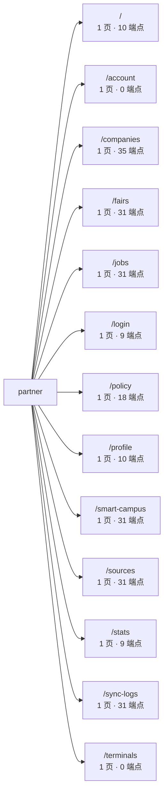

<!-- 本文件由 scripts/generate-project-graph.mjs 自动生成，请勿手改。 -->
<!-- 手改会在下次 `node scripts/generate-project-graph.mjs` 时被覆盖。 -->
# 路由图谱

三端每个路由 → 页面组件文件 → 该页面 import 闭包内触达的 API 端点。

「端点」是 **import 可达性上界**：页面能通过 import 链走到那个 service 模块，
不代表每次渲染都会调用它。用它回答「改这个接口会影响哪些页面」是可靠的；
用它回答「这个页面一定会发这些请求」不可靠。

──────────────────────────────────────────────────────────────────────

## kiosk（apps/kiosk）

路由表：`apps/kiosk/src/routes/index.tsx`　入口：`apps/kiosk/src/main.tsx`

```mermaid
flowchart LR
  app["kiosk"]
  app --> _root_["/<br/>1 页 · 18 端点"]
  app --> _["/*<br/>1 页 · 0 端点"]
  app --> activities["/activities<br/>2 页 · 1 端点"]
  app --> ai["/ai<br/>1 页 · 0 端点"]
  app --> assistant["/assistant<br/>1 页 · 44 端点"]
  app --> campus["/campus<br/>3 页 · 48 端点"]
  app --> companies["/companies<br/>2 页 · 9 端点"]
  app --> contract_review["/contract-review<br/>3 页 · 27 端点"]
  app --> error_offline["/error-offline<br/>1 页 · 0 端点"]
  app --> fairs_service["/fairs-service<br/>1 页 · 0 端点"]
  app --> help["/help<br/>1 页 · 0 端点"]
  app --> interview["/interview<br/>5 页 · 28 端点"]
  app --> interview_service["/interview-service<br/>1 页 · 0 端点"]
  app --> job_fairs["/job-fairs<br/>9 页 · 48 端点"]
  app --> jobs["/jobs<br/>4 页 · 54 端点"]
  app --> jobs_service["/jobs-service<br/>1 页 · 0 端点"]
  app --> legal["/legal<br/>1 页 · 44 端点"]
  app --> login["/login<br/>1 页 · 21 端点"]
  app --> me["/me<br/>12 页 · 46 端点"]
  app --> member["/member<br/>1 页 · 7 端点"]
  app --> notifications["/notifications<br/>1 页 · 3 端点"]
  app --> offline_agencies["/offline-agencies<br/>2 页 · 3 端点"]
  app --> policy_service["/policy-service<br/>1 页 · 0 端点"]
  app --> print["/print<br/>12 页 · 45 端点"]
  app --> print_scan["/print-scan<br/>4 页 · 22 端点"]
  app --> profile["/profile<br/>1 页 · 5 端点"]
  app --> renshi["/renshi<br/>1 页 · 5 端点"]
  app --> resume["/resume<br/>19 页 · 55 端点"]
  app --> resume_service["/resume-service<br/>1 页 · 0 端点"]
  app --> scan["/scan<br/>4 页 · 15 端点"]
  app --> screensaver["/screensaver<br/>1 页 · 16 端点"]
  app --> session_resume["/session-resume<br/>1 页 · 1 端点"]
  app --> session_timeout["/session-timeout<br/>1 页 · 0 端点"]
  app --> smart_campus["/smart-campus<br/>4 页 · 14 端点"]
  app --> toolbox["/toolbox<br/>1 页 · 14 端点"]
  app --> upload["/upload<br/>1 页 · 15 端点"]
```

| 路由 | 页面组件 | 页面文件 | 端点数 | 样式 |
| --- | --- | --- | --- | --- |
| `/` | HomePage | `apps/kiosk/src/pages/home/HomePage.tsx` | 18 | 3 |
| `/*` | KioskRouteErrorPage | `apps/kiosk/src/pages/errors/KioskRouteErrorPage.tsx` | 0 | — |
| `/activities` | BenefitActivitiesPage | `apps/kiosk/src/pages/activities/BenefitActivitiesPage.tsx` | 1 | 1 |
| `/activities/:id` | BenefitActivityDetailPage | `apps/kiosk/src/pages/activities/BenefitActivityDetailPage.tsx` | 1 | 1 |
| `/ai/plan` | AiPlanPage | `apps/kiosk/src/pages/ai-plan/AiPlanPage.tsx` | 0 | 1 |
| `/assistant` | AssistantPage | `apps/kiosk/src/pages/assistant/AssistantPage.tsx` | 44 | 13 |
| `/campus` | CampusPage | `apps/kiosk/src/pages/campus/CampusPage.tsx` | 48 | — |
| `/campus/freshman-insights` | FreshmanInsightsPage | `apps/kiosk/src/pages/placeholders/FreshmanInsightsPage.tsx` | 0 | — |
| `/campus/welcome` | CampusWelcomePage | `apps/kiosk/src/pages/placeholders/CampusWelcomePage.tsx` | 0 | — |
| `/companies` | CompaniesPage | `apps/kiosk/src/pages/companies/CompaniesPage.tsx` | 5 | — |
| `/companies/:id` | CompanyDetailPage | `apps/kiosk/src/pages/companies/CompanyDetailPage.tsx` | 9 | — |
| `/contract-review` | ContractReviewHomePage | `apps/kiosk/src/pages/contract-review/ContractReviewHomePage.tsx` | 24 | 1 |
| `/contract-review/processing` | ContractReviewProcessingPage | `apps/kiosk/src/pages/contract-review/ContractReviewProcessingPage.tsx` | 20 | 1 |
| `/contract-review/result` | ContractReviewResultPage | `apps/kiosk/src/pages/contract-review/ContractReviewResultPage.tsx` | 23 | 1 |
| `/error-offline` | ErrorOfflinePage | `apps/kiosk/src/pages/placeholders/ErrorOfflinePage.tsx` | 0 | 1 |
| `/fairs-service` | FairsServiceHubPage | `apps/kiosk/src/pages/job-fairs/FairsServiceHubPage.tsx` | 0 | 1 |
| `/help` | HelpCenterPage | `apps/kiosk/src/pages/help/HelpCenterPage.tsx` | 0 | 1 |
| `/interview-service` | InterviewServiceHubPage | `apps/kiosk/src/pages/interview/InterviewServiceHubPage.tsx` | 0 | 1 |
| `/interview/report` | InterviewReportPage | `apps/kiosk/src/pages/interview/InterviewReportPage.tsx` | 23 | 7 |
| `/interview/reports` | InterviewReportsPage | `apps/kiosk/src/pages/interview/InterviewReportsPage.tsx` | 23 | 7 |
| `/interview/session` | InterviewSessionPage | `apps/kiosk/src/pages/interview/InterviewSessionPage.tsx` | 23 | 7 |
| `/interview/setup` | InterviewSetupPage | `apps/kiosk/src/pages/interview/InterviewSetupPage.tsx` | 28 | 8 |
| `/interview/tips` | InterviewTipsPage | `apps/kiosk/src/pages/interview/InterviewTipsPage.tsx` | 14 | 7 |
| `/job-fairs` | JobFairsPage | `apps/kiosk/src/pages/job-fairs/JobFairsPage.tsx` | 48 | — |
| `/job-fairs/:id` | JobFairDetailPage | `apps/kiosk/src/pages/job-fairs/JobFairDetailPage.tsx` | 48 | — |
| `/job-fairs/:id/companies` | FairCompaniesPage | `apps/kiosk/src/pages/job-fairs/FairCompaniesPage.tsx` | 44 | — |
| `/job-fairs/:id/companies/:companyId` | FairCompanyDetailPage | `apps/kiosk/src/pages/job-fairs/FairCompanyDetailPage.tsx` | 48 | — |
| `/job-fairs/:id/map` | FairMapPage | `apps/kiosk/src/pages/job-fairs/FairMapPage.tsx` | 44 | — |
| `/job-fairs/:id/materials` | FairMaterialsPage | `apps/kiosk/src/pages/job-fairs/FairMaterialsPage.tsx` | 44 | — |
| `/job-fairs/:id/stats` | FairStatsPage | `apps/kiosk/src/pages/job-fairs/FairStatsPage.tsx` | 44 | — |
| `/job-fairs/:id/visit-plan` | FairVisitPlanPage | `apps/kiosk/src/pages/job-fairs/FairVisitPlanPage.tsx` | 12 | — |
| `/job-fairs/checkin` | JobFairCheckinPage | `apps/kiosk/src/pages/job-fairs/JobFairCheckinPage.tsx` | 48 | — |
| `/jobs` | JobsPage | `apps/kiosk/src/pages/jobs/JobsPage.tsx` | 47 | — |
| `/jobs-service` | JobsServiceHubPage | `apps/kiosk/src/pages/jobs/JobsServiceHubPage.tsx` | 0 | 1 |
| `/jobs/:id` | JobDetailPage | `apps/kiosk/src/pages/jobs/JobDetailPage.tsx` | 51 | — |
| `/jobs/:id/offline` | OfflineJobDetailPage | `apps/kiosk/src/pages/offline-agencies/OfflineJobDetailPage.tsx` | 3 | — |
| `/jobs/online-platforms` | OnlinePlatformsPage | `apps/kiosk/src/pages/jobs/OnlinePlatformsPage.tsx` | 0 | 1 |
| `/legal/:doc` | LegalDocPage | `apps/kiosk/src/pages/legal/LegalDocPage.tsx` | 44 | 1 |
| `/login` | LoginPage | `apps/kiosk/src/pages/auth/LoginPage.tsx` | 21 | 7 |
| `/me/activity` | MyActivityPage | `apps/kiosk/src/pages/profile/me/MyActivityPage.tsx` | 4 | 6 |
| `/me/activity/:id` | MeActivityDetailPage | `apps/kiosk/src/pages/placeholders/MeActivityDetailPage.tsx` | 4 | 6 |
| `/me/ai-records` | MyAiRecordsPage | `apps/kiosk/src/pages/profile/me/MyAiRecordsPage.tsx` | 24 | 6 |
| `/me/benefits` | MyBenefitsPage | `apps/kiosk/src/pages/profile/me/MyBenefitsPage.tsx` | 2 | 6 |
| `/me/documents` | MyDocumentsPage | `apps/kiosk/src/pages/profile/me/MyDocumentsPage.tsx` | 3 | 6 |
| `/me/favorites` | MyFavoritesPage | `apps/kiosk/src/pages/profile/me/MyFavoritesPage.tsx` | 2 | 6 |
| `/me/feedback` | MyFeedbackPage | `apps/kiosk/src/pages/profile/me/MyFeedbackPage.tsx` | 3 | 6 |
| `/me/notifications` | MyNotificationsPage | `apps/kiosk/src/pages/profile/me/MyNotificationsPage.tsx` | 3 | 6 |
| `/me/print-orders` | MyPrintOrdersPage | `apps/kiosk/src/pages/profile/me/MyPrintOrdersPage.tsx` | 1 | 6 |
| `/me/privacy-requests` | MyPrivacyRequestsPage | `apps/kiosk/src/pages/profile/me/MyPrivacyRequestsPage.tsx` | 15 | 6 |
| `/me/resumes` | MyResumesPage | `apps/kiosk/src/pages/profile/me/MyResumesPage.tsx` | 3 | 6 |
| `/me/settings` | MySettingsPage | `apps/kiosk/src/pages/profile/me/MySettingsPage.tsx` | 28 | 6 |
| `/member/qr-login` | MobileQrLoginPage | `apps/kiosk/src/pages/auth/MobileQrLoginPage.tsx` | 7 | 1 |
| `/notifications` | NotificationsPage | `apps/kiosk/src/pages/placeholders/NotificationsPage.tsx` | 3 | 6 |
| `/offline-agencies` | OfflineAgenciesPage | `apps/kiosk/src/pages/offline-agencies/OfflineAgenciesPage.tsx` | 3 | — |
| `/offline-agencies/:id` | OfflineAgencyDetailPage | `apps/kiosk/src/pages/offline-agencies/OfflineAgencyDetailPage.tsx` | 3 | — |
| `/policy-service` | PolicyServiceHubPage | `apps/kiosk/src/pages/policy/PolicyServiceHubPage.tsx` | 0 | 1 |
| `/print-scan` | PrintScanHomePage | `apps/kiosk/src/pages/print-scan/PrintScanHomePage.tsx` | 14 | 2 |
| `/print-scan/convert` | ConvertImagesPage | `apps/kiosk/src/pages/print-scan/ConvertImagesPage.tsx` | 19 | 1 |
| `/print-scan/feature/:key` | PrintScanFeatureInfoPage | `apps/kiosk/src/pages/print-scan/PrintScanFeatureInfoPage.tsx` | 0 | 1 |
| `/print-scan/sign` | SignStampPage | `apps/kiosk/src/pages/print-scan/SignStampPage.tsx` | 20 | 1 |
| `/print/cashier` | PrintCashierPage | `apps/kiosk/src/pages/print/PrintCashierPage.tsx` | 23 | 6 |
| `/print/confirm` | PrintConfirmPage | `apps/kiosk/src/pages/print/PrintConfirmPage.tsx` | 31 | 6 |
| `/print/done` | PrintDonePage | `apps/kiosk/src/pages/print/PrintDonePage.tsx` | 26 | 7 |
| `/print/material-check` | PrintMaterialCheckPage | `apps/kiosk/src/pages/print/PrintMaterialCheckPage.tsx` | 16 | 6 |
| `/print/params` | Navigate | — _(重定向)_ | 0 | — |
| `/print/pickup-claim` | PrintPickupClaimPage | `apps/kiosk/src/pages/print/PrintPickupClaimPage.tsx` | 13 | 7 |
| `/print/preview` | PrintPreviewPage | `apps/kiosk/src/pages/print/PrintPreviewPage.tsx` | 16 | 6 |
| `/print/progress` | PrintProgressPage | `apps/kiosk/src/pages/print/PrintProgressPage.tsx` | 19 | 6 |
| `/print/scan-convert` | Navigate | — _(重定向)_ | 0 | — |
| `/print/scan-feature` | Navigate | — _(重定向)_ | 0 | — |
| `/print/scan-sign` | Navigate | — _(重定向)_ | 0 | — |
| `/print/upload` | PrintUploadPage | `apps/kiosk/src/pages/print/PrintUploadPage.tsx` | 22 | 6 |
| `/profile` | ProfilePage | `apps/kiosk/src/pages/profile/ProfilePage.tsx` | 5 | 4 |
| `/renshi` | RenshiPage | `apps/kiosk/src/pages/renshi/RenshiPage.tsx` | 5 | 1 |
| `/resume` | Navigate | — _(重定向)_ | 0 | — |
| `/resume-service` | ResumeServiceHubPage | `apps/kiosk/src/pages/resume/ResumeServiceHubPage.tsx` | 0 | 1 |
| `/resume/career-plan` | CareerPlanPage | `apps/kiosk/src/pages/resume/CareerPlanPage.tsx` | 16 | 7 |
| `/resume/export` | ResumeExportPage | `apps/kiosk/src/pages/resume/ResumeExportPage.tsx` | 0 | 7 |
| `/resume/generate` | ResumeGeneratePage | `apps/kiosk/src/pages/resume/ResumeGeneratePage.tsx` | 44 | 7 |
| `/resume/generate/preview` | ResumeGeneratePreviewPage | `apps/kiosk/src/pages/resume/ResumeGeneratePreviewPage.tsx` | 44 | 6 |
| `/resume/job-fit` | JobFitPage | `apps/kiosk/src/pages/resume/JobFitPage.tsx` | 49 | 8 |
| `/resume/job-fit/actions` | JobFitActionsPage | `apps/kiosk/src/pages/resume/JobFitActionsPage.tsx` | 15 | 10 |
| `/resume/materials` | JobMaterialLibraryPage | `apps/kiosk/src/pages/resume/JobMaterialLibraryPage.tsx` | 14 | 7 |
| `/resume/optimize` | ResumeOptimizePage | `apps/kiosk/src/pages/resume/ResumeOptimizePage.tsx` | 44 | 6 |
| `/resume/optimize/compare` | ResumeOptimizeComparePage | `apps/kiosk/src/pages/resume/ResumeOptimizeComparePage.tsx` | 44 | 8 |
| `/resume/parse` | ResumeParsePage | `apps/kiosk/src/pages/resume/ResumeParsePage.tsx` | 44 | 8 |
| `/resume/report` | ResumeReportPage | `apps/kiosk/src/pages/resume/ResumeReportPage.tsx` | 44 | 7 |
| `/resume/self-assessment/history` | SelfAssessmentHistoryPage | `apps/kiosk/src/pages/resume/SelfAssessmentFlow.tsx` | 18 | 2 |
| `/resume/self-assessment/intro` | SelfAssessmentIntroPage | `apps/kiosk/src/pages/resume/SelfAssessmentFlow.tsx` | 18 | 2 |
| `/resume/self-assessment/questions` | SelfAssessmentQuizPage | `apps/kiosk/src/pages/resume/SelfAssessmentFlow.tsx` | 18 | 2 |
| `/resume/self-assessment/result` | SelfAssessmentResultPage | `apps/kiosk/src/pages/resume/SelfAssessmentFlow.tsx` | 18 | 2 |
| `/resume/source` | ResumeSourcePage | `apps/kiosk/src/pages/resume/ResumeSourcePage.tsx` | 44 | 7 |
| `/resume/templates` | ResumeTemplateLibraryPage | `apps/kiosk/src/pages/resume/ResumeTemplateLibraryPage.tsx` | 14 | 7 |
| `/resume/upload` | Navigate | — _(重定向)_ | 0 | — |
| `/scan/progress` | ScanProgressPage | `apps/kiosk/src/pages/scan/ScanProgressPage.tsx` | 15 | 1 |
| `/scan/result` | ScanResultPage | `apps/kiosk/src/pages/scan/ScanResultPage.tsx` | 0 | 1 |
| `/scan/settings` | ScanSettingsPage | `apps/kiosk/src/pages/scan/ScanSettingsPage.tsx` | 15 | 1 |
| `/scan/start` | ScanStartPage | `apps/kiosk/src/pages/scan/ScanStartPage.tsx` | 13 | 1 |
| `/screensaver` | ScreensaverPage | `apps/kiosk/src/pages/screensaver/ScreensaverPage.tsx` | 16 | 1 |
| `/session-resume` | SessionResumePage | `apps/kiosk/src/pages/session-resume/SessionResumePage.tsx` | 1 | 1 |
| `/session-timeout` | SessionTimeoutPage | `apps/kiosk/src/pages/placeholders/SessionTimeoutPage.tsx` | 0 | 1 |
| `/smart-campus` | SmartCampusHomePage | `apps/kiosk/src/pages/smart-campus/SmartCampusHomePage.tsx` | 14 | — |
| `/smart-campus/freshman-insights` | SmartCampusGuard | `apps/kiosk/src/pages/smart-campus/SmartCampusGuard.tsx` | 14 | — |
| `/smart-campus/service/:key` | SmartCampusGuard | `apps/kiosk/src/pages/smart-campus/SmartCampusGuard.tsx` | 14 | — |
| `/smart-campus/welcome` | SmartCampusGuard | `apps/kiosk/src/pages/smart-campus/SmartCampusGuard.tsx` | 14 | — |
| `/toolbox` | ToolboxZonePage | `apps/kiosk/src/pages/toolbox/ToolboxZonePage.tsx` | 14 | 2 |
| `/upload/phone` | PhoneUploadPage | `apps/kiosk/src/pages/upload/PhoneUploadPage.tsx` | 15 | 1 |

展开：每个路由触达的端点（85 个路由）

**`/`** → `GET /files/:param`、`GET /files/:param/retention`、`GET /job-fairs`、`GET /job-fairs/:param`、`GET /job-fairs/:param/companies`、`GET /job-fairs/:param/companies/:param`、`GET /job-fairs/:param/map`、`GET /job-fairs/:param/materials`、`GET /job-fairs/:param/stats`、`GET /job-fairs/:param/venue-guide`、`GET /job-fairs/:param/zones`、`GET /local/terminal-identity`、`GET /me/ai-records/:param`、`GET /me/print-orders`、`GET /terminals/:param/config`、`GET /terminals/:param/screensaver`、`POST /job-fairs/:param/companies/:param/print-url`、`POST /job-fairs/:param/materials/:param/print-url`

**`/activities`** → `POST /activities/:param/claim`

**`/activities/:id`** → `POST /activities/:param/claim`

**`/assistant`** → `DELETE /me/job-ai-sessions/:param`、`DELETE /upload-sessions/:param`、`GET /job-fairs`、`GET /job-fairs/:param`、`GET /job-fairs/:param/companies`、`GET /job-fairs/:param/companies/:param`、`GET /job-fairs/:param/map`、`GET /job-fairs/:param/materials`、`GET /job-fairs/:param/stats`、`GET /job-fairs/:param/venue-guide`、`GET /job-fairs/:param/zones`、`GET /job-materials/generate`、`GET /job-materials/templates`、`GET /jobs`、`GET /jobs/:param`、`GET /local/terminal-identity`、`GET /materials/tasks/:param`、`GET /me/ai-consents/status`、`GET /me/job-ai-sessions`、`GET /resume/generate/:param`、`GET /resume/records/:param`、`GET /resume/records/:param/optimize`、`GET /terminals/:param/screensaver`、`POST /assistant/chat`、`POST /files/:param/preview-url`、`POST /files/kiosk-upload`、`POST /job-fairs/:param/companies/:param/print-url`、`POST /job-fairs/:param/materials/:param/print-url`、`POST /jobs/:param/ai/explain`、`POST /jobs/:param/ai/match`、`POST /jobs/ai/recommendations`、`POST /materials/tasks`、`POST /materials/tasks/:param/pii-findings/decisions`、`POST /me/ai-consents`、`POST /me/ai-consents/:param/revoke`、`POST /print`、`POST /resume/generate`、`POST /resume/generate/export`、`POST /resume/parse`、`POST /resume/records/:param/layout-adjust`、`POST /resume/voice/transcribe`、`POST /upload-sessions`、`POST /upload-sessions/:param/confirm`、`POST /upload-sessions/:param/files`

**`/campus`** → `DELETE /me/job-ai-sessions/:param`、`DELETE /upload-sessions/:param`、`GET /job-fairs`、`GET /job-fairs/:param`、`GET /job-fairs/:param/companies`、`GET /job-fairs/:param/companies/:param`、`GET /job-fairs/:param/map`、`GET /job-fairs/:param/materials`、`GET /job-fairs/:param/stats`、`GET /job-fairs/:param/venue-guide`、`GET /job-fairs/:param/zones`、`GET /job-materials/generate`、`GET /job-materials/templates`、`GET /jobs`、`GET /jobs/:param`、`GET /local/terminal-identity`、`GET /materials/tasks/:param`、`GET /me/ai-consents/status`、`GET /me/browse-logs/:param`、`GET /me/external-jump-logs/:param`、`GET /me/job-ai-sessions`、`GET /resume/generate/:param`、`GET /resume/records/:param`、`GET /resume/records/:param/optimize`、`GET /terminals/:param/screensaver`、`POST /activity/browse`、`POST /activity/external-jump`、`POST /assistant/chat`、`POST /files/:param/preview-url`、`POST /files/kiosk-upload`、`POST /job-fairs/:param/companies/:param/print-url`、`POST /job-fairs/:param/materials/:param/print-url`、`POST /jobs/:param/ai/explain`、`POST /jobs/:param/ai/match`、`POST /jobs/ai/recommendations`、`POST /materials/tasks`、`POST /materials/tasks/:param/pii-findings/decisions`、`POST /me/ai-consents`、`POST /me/ai-consents/:param/revoke`、`POST /print`、`POST /resume/generate`、`POST /resume/generate/export`、`POST /resume/parse`、`POST /resume/records/:param/layout-adjust`、`POST /resume/voice/transcribe`、`POST /upload-sessions`、`POST /upload-sessions/:param/confirm`、`POST /upload-sessions/:param/files`

**`/companies`** → `GET /companies`、`GET /companies/:param`、`GET /companies/:param/jobs`、`GET /companies/filters`、`GET /companies/stats`

**`/companies/:id`** → `GET /companies`、`GET /companies/:param`、`GET /companies/:param/jobs`、`GET /companies/filters`、`GET /companies/stats`、`GET /me/browse-logs/:param`、`GET /me/external-jump-logs/:param`、`POST /activity/browse`、`POST /activity/external-jump`

**`/contract-review`** → `DELETE /contract-reviews/:param`、`DELETE /contract-reviews/reports/:param`、`DELETE /upload-sessions/:param`、`GET /job-fairs`、`GET /job-fairs/:param`、`GET /job-fairs/:param/companies`、`GET /job-fairs/:param/companies/:param`、`GET /job-fairs/:param/map`、`GET /job-fairs/:param/materials`、`GET /job-fairs/:param/stats`、`GET /job-fairs/:param/venue-guide`、`GET /job-fairs/:param/zones`、`GET /local/terminal-identity`、`GET /terminals/:param/config`、`GET /terminals/:param/screensaver`、`POST /contract-reviews`、`POST /contract-reviews/:param/confirm`、`POST /contract-reviews/:param/report`、`POST /files/kiosk-upload`、`POST /job-fairs/:param/companies/:param/print-url`、`POST /job-fairs/:param/materials/:param/print-url`、`POST /upload-sessions`、`POST /upload-sessions/:param/confirm`、`POST /upload-sessions/:param/files`

**`/contract-review/processing`** → `DELETE /contract-reviews/:param`、`DELETE /contract-reviews/reports/:param`、`GET /job-fairs`、`GET /job-fairs/:param`、`GET /job-fairs/:param/companies`、`GET /job-fairs/:param/companies/:param`、`GET /job-fairs/:param/map`、`GET /job-fairs/:param/materials`、`GET /job-fairs/:param/stats`、`GET /job-fairs/:param/venue-guide`、`GET /job-fairs/:param/zones`、`GET /local/terminal-identity`、`GET /terminals/:param/config`、`GET /terminals/:param/screensaver`、`POST /contract-reviews`、`POST /contract-reviews/:param/confirm`、`POST /contract-reviews/:param/report`、`POST /files/kiosk-upload`、`POST /job-fairs/:param/companies/:param/print-url`、`POST /job-fairs/:param/materials/:param/print-url`

**`/contract-review/result`** → `DELETE /contract-reviews/:param`、`DELETE /contract-reviews/reports/:param`、`GET /job-fairs`、`GET /job-fairs/:param`、`GET /job-fairs/:param/companies`、`GET /job-fairs/:param/companies/:param`、`GET /job-fairs/:param/map`、`GET /job-fairs/:param/materials`、`GET /job-fairs/:param/stats`、`GET /job-fairs/:param/venue-guide`、`GET /job-fairs/:param/zones`、`GET /local/terminal-identity`、`GET /materials/tasks/:param`、`GET /terminals/:param/config`、`GET /terminals/:param/screensaver`、`POST /contract-reviews`、`POST /contract-reviews/:param/confirm`、`POST /contract-reviews/:param/report`、`POST /files/kiosk-upload`、`POST /job-fairs/:param/companies/:param/print-url`、`POST /job-fairs/:param/materials/:param/print-url`、`POST /materials/tasks`、`POST /materials/tasks/:param/pii-findings/decisions`

**`/interview/report`** → `DELETE /me/mock-interviews/:param`、`GET /job-fairs`、`GET /job-fairs/:param`、`GET /job-fairs/:param/companies`、`GET /job-fairs/:param/companies/:param`、`GET /job-fairs/:param/map`、`GET /job-fairs/:param/materials`、`GET /job-fairs/:param/stats`、`GET /job-fairs/:param/venue-guide`、`GET /job-fairs/:param/zones`、`GET /local/terminal-identity`、`GET /terminals/:param/config`、`GET /terminals/:param/screensaver`、`POST /job-fairs/:param/companies/:param/print-url`、`POST /job-fairs/:param/materials/:param/print-url`、`POST /mock-interviews`、`POST /mock-interviews/:param/answer`、`POST /mock-interviews/:param/end`、`POST /mock-interviews/:param/practice-sheet`、`POST /mock-interviews/:param/report/print`、`POST /mock-interviews/:param/start`、`POST /mock-interviews/:param/transcribe`、`POST /mock-interviews/:param/turns/:param/audio`

**`/interview/reports`** → `DELETE /me/mock-interviews/:param`、`GET /job-fairs`、`GET /job-fairs/:param`、`GET /job-fairs/:param/companies`、`GET /job-fairs/:param/companies/:param`、`GET /job-fairs/:param/map`、`GET /job-fairs/:param/materials`、`GET /job-fairs/:param/stats`、`GET /job-fairs/:param/venue-guide`、`GET /job-fairs/:param/zones`、`GET /local/terminal-identity`、`GET /terminals/:param/config`、`GET /terminals/:param/screensaver`、`POST /job-fairs/:param/companies/:param/print-url`、`POST /job-fairs/:param/materials/:param/print-url`、`POST /mock-interviews`、`POST /mock-interviews/:param/answer`、`POST /mock-interviews/:param/end`、`POST /mock-interviews/:param/practice-sheet`、`POST /mock-interviews/:param/report/print`、`POST /mock-interviews/:param/start`、`POST /mock-interviews/:param/transcribe`、`POST /mock-interviews/:param/turns/:param/audio`

**`/interview/session`** → `DELETE /me/mock-interviews/:param`、`GET /job-fairs`、`GET /job-fairs/:param`、`GET /job-fairs/:param/companies`、`GET /job-fairs/:param/companies/:param`、`GET /job-fairs/:param/map`、`GET /job-fairs/:param/materials`、`GET /job-fairs/:param/stats`、`GET /job-fairs/:param/venue-guide`、`GET /job-fairs/:param/zones`、`GET /local/terminal-identity`、`GET /terminals/:param/config`、`GET /terminals/:param/screensaver`、`POST /job-fairs/:param/companies/:param/print-url`、`POST /job-fairs/:param/materials/:param/print-url`、`POST /mock-interviews`、`POST /mock-interviews/:param/answer`、`POST /mock-interviews/:param/end`、`POST /mock-interviews/:param/practice-sheet`、`POST /mock-interviews/:param/report/print`、`POST /mock-interviews/:param/start`、`POST /mock-interviews/:param/transcribe`、`POST /mock-interviews/:param/turns/:param/audio`

**`/interview/setup`** → `DELETE /me/mock-interviews/:param`、`DELETE /upload-sessions/:param`、`GET /job-fairs`、`GET /job-fairs/:param`、`GET /job-fairs/:param/companies`、`GET /job-fairs/:param/companies/:param`、`GET /job-fairs/:param/map`、`GET /job-fairs/:param/materials`、`GET /job-fairs/:param/stats`、`GET /job-fairs/:param/venue-guide`、`GET /job-fairs/:param/zones`、`GET /local/terminal-identity`、`GET /terminals/:param/config`、`GET /terminals/:param/screensaver`、`POST /files/kiosk-upload`、`POST /job-fairs/:param/companies/:param/print-url`、`POST /job-fairs/:param/materials/:param/print-url`、`POST /mock-interviews`、`POST /mock-interviews/:param/answer`、`POST /mock-interviews/:param/end`、`POST /mock-interviews/:param/practice-sheet`、`POST /mock-interviews/:param/report/print`、`POST /mock-interviews/:param/start`、`POST /mock-interviews/:param/transcribe`、`POST /mock-interviews/:param/turns/:param/audio`、`POST /upload-sessions`、`POST /upload-sessions/:param/confirm`、`POST /upload-sessions/:param/files`

**`/interview/tips`** → `GET /job-fairs`、`GET /job-fairs/:param`、`GET /job-fairs/:param/companies`、`GET /job-fairs/:param/companies/:param`、`GET /job-fairs/:param/map`、`GET /job-fairs/:param/materials`、`GET /job-fairs/:param/stats`、`GET /job-fairs/:param/venue-guide`、`GET /job-fairs/:param/zones`、`GET /local/terminal-identity`、`GET /terminals/:param/config`、`GET /terminals/:param/screensaver`、`POST /job-fairs/:param/companies/:param/print-url`、`POST /job-fairs/:param/materials/:param/print-url`

**`/job-fairs`** → `DELETE /me/job-ai-sessions/:param`、`DELETE /upload-sessions/:param`、`GET /job-fairs`、`GET /job-fairs/:param`、`GET /job-fairs/:param/companies`、`GET /job-fairs/:param/companies/:param`、`GET /job-fairs/:param/map`、`GET /job-fairs/:param/materials`、`GET /job-fairs/:param/stats`、`GET /job-fairs/:param/venue-guide`、`GET /job-fairs/:param/zones`、`GET /job-materials/generate`、`GET /job-materials/templates`、`GET /jobs`、`GET /jobs/:param`、`GET /local/terminal-identity`、`GET /materials/tasks/:param`、`GET /me/ai-consents/status`、`GET /me/browse-logs/:param`、`GET /me/external-jump-logs/:param`、`GET /me/job-ai-sessions`、`GET /resume/generate/:param`、`GET /resume/records/:param`、`GET /resume/records/:param/optimize`、`GET /terminals/:param/screensaver`、`POST /activity/browse`、`POST /activity/external-jump`、`POST /assistant/chat`、`POST /files/:param/preview-url`、`POST /files/kiosk-upload`、`POST /job-fairs/:param/companies/:param/print-url`、`POST /job-fairs/:param/materials/:param/print-url`、`POST /jobs/:param/ai/explain`、`POST /jobs/:param/ai/match`、`POST /jobs/ai/recommendations`、`POST /materials/tasks`、`POST /materials/tasks/:param/pii-findings/decisions`、`POST /me/ai-consents`、`POST /me/ai-consents/:param/revoke`、`POST /print`、`POST /resume/generate`、`POST /resume/generate/export`、`POST /resume/parse`、`POST /resume/records/:param/layout-adjust`、`POST /resume/voice/transcribe`、`POST /upload-sessions`、`POST /upload-sessions/:param/confirm`、`POST /upload-sessions/:param/files`

**`/job-fairs/:id`** → `DELETE /me/job-ai-sessions/:param`、`DELETE /upload-sessions/:param`、`GET /job-fairs`、`GET /job-fairs/:param`、`GET /job-fairs/:param/companies`、`GET /job-fairs/:param/companies/:param`、`GET /job-fairs/:param/map`、`GET /job-fairs/:param/materials`、`GET /job-fairs/:param/stats`、`GET /job-fairs/:param/venue-guide`、`GET /job-fairs/:param/zones`、`GET /job-materials/generate`、`GET /job-materials/templates`、`GET /jobs`、`GET /jobs/:param`、`GET /local/terminal-identity`、`GET /materials/tasks/:param`、`GET /me/ai-consents/status`、`GET /me/browse-logs/:param`、`GET /me/external-jump-logs/:param`、`GET /me/job-ai-sessions`、`GET /resume/generate/:param`、`GET /resume/records/:param`、`GET /resume/records/:param/optimize`、`GET /terminals/:param/screensaver`、`POST /activity/browse`、`POST /activity/external-jump`、`POST /assistant/chat`、`POST /files/:param/preview-url`、`POST /files/kiosk-upload`、`POST /job-fairs/:param/companies/:param/print-url`、`POST /job-fairs/:param/materials/:param/print-url`、`POST /jobs/:param/ai/explain`、`POST /jobs/:param/ai/match`、`POST /jobs/ai/recommendations`、`POST /materials/tasks`、`POST /materials/tasks/:param/pii-findings/decisions`、`POST /me/ai-consents`、`POST /me/ai-consents/:param/revoke`、`POST /print`、`POST /resume/generate`、`POST /resume/generate/export`、`POST /resume/parse`、`POST /resume/records/:param/layout-adjust`、`POST /resume/voice/transcribe`、`POST /upload-sessions`、`POST /upload-sessions/:param/confirm`、`POST /upload-sessions/:param/files`

**`/job-fairs/:id/companies`** → `DELETE /me/job-ai-sessions/:param`、`DELETE /upload-sessions/:param`、`GET /job-fairs`、`GET /job-fairs/:param`、`GET /job-fairs/:param/companies`、`GET /job-fairs/:param/companies/:param`、`GET /job-fairs/:param/map`、`GET /job-fairs/:param/materials`、`GET /job-fairs/:param/stats`、`GET /job-fairs/:param/venue-guide`、`GET /job-fairs/:param/zones`、`GET /job-materials/generate`、`GET /job-materials/templates`、`GET /jobs`、`GET /jobs/:param`、`GET /local/terminal-identity`、`GET /materials/tasks/:param`、`GET /me/ai-consents/status`、`GET /me/job-ai-sessions`、`GET /resume/generate/:param`、`GET /resume/records/:param`、`GET /resume/records/:param/optimize`、`GET /terminals/:param/screensaver`、`POST /assistant/chat`、`POST /files/:param/preview-url`、`POST /files/kiosk-upload`、`POST /job-fairs/:param/companies/:param/print-url`、`POST /job-fairs/:param/materials/:param/print-url`、`POST /jobs/:param/ai/explain`、`POST /jobs/:param/ai/match`、`POST /jobs/ai/recommendations`、`POST /materials/tasks`、`POST /materials/tasks/:param/pii-findings/decisions`、`POST /me/ai-consents`、`POST /me/ai-consents/:param/revoke`、`POST /print`、`POST /resume/generate`、`POST /resume/generate/export`、`POST /resume/parse`、`POST /resume/records/:param/layout-adjust`、`POST /resume/voice/transcribe`、`POST /upload-sessions`、`POST /upload-sessions/:param/confirm`、`POST /upload-sessions/:param/files`

**`/job-fairs/:id/companies/:companyId`** → `DELETE /me/job-ai-sessions/:param`、`DELETE /upload-sessions/:param`、`GET /job-fairs`、`GET /job-fairs/:param`、`GET /job-fairs/:param/companies`、`GET /job-fairs/:param/companies/:param`、`GET /job-fairs/:param/map`、`GET /job-fairs/:param/materials`、`GET /job-fairs/:param/stats`、`GET /job-fairs/:param/venue-guide`、`GET /job-fairs/:param/zones`、`GET /job-materials/generate`、`GET /job-materials/templates`、`GET /jobs`、`GET /jobs/:param`、`GET /local/terminal-identity`、`GET /materials/tasks/:param`、`GET /me/ai-consents/status`、`GET /me/browse-logs/:param`、`GET /me/external-jump-logs/:param`、`GET /me/job-ai-sessions`、`GET /resume/generate/:param`、`GET /resume/records/:param`、`GET /resume/records/:param/optimize`、`GET /terminals/:param/screensaver`、`POST /activity/browse`、`POST /activity/external-jump`、`POST /assistant/chat`、`POST /files/:param/preview-url`、`POST /files/kiosk-upload`、`POST /job-fairs/:param/companies/:param/print-url`、`POST /job-fairs/:param/materials/:param/print-url`、`POST /jobs/:param/ai/explain`、`POST /jobs/:param/ai/match`、`POST /jobs/ai/recommendations`、`POST /materials/tasks`、`POST /materials/tasks/:param/pii-findings/decisions`、`POST /me/ai-consents`、`POST /me/ai-consents/:param/revoke`、`POST /print`、`POST /resume/generate`、`POST /resume/generate/export`、`POST /resume/parse`、`POST /resume/records/:param/layout-adjust`、`POST /resume/voice/transcribe`、`POST /upload-sessions`、`POST /upload-sessions/:param/confirm`、`POST /upload-sessions/:param/files`

**`/job-fairs/:id/map`** → `DELETE /me/job-ai-sessions/:param`、`DELETE /upload-sessions/:param`、`GET /job-fairs`、`GET /job-fairs/:param`、`GET /job-fairs/:param/companies`、`GET /job-fairs/:param/companies/:param`、`GET /job-fairs/:param/map`、`GET /job-fairs/:param/materials`、`GET /job-fairs/:param/stats`、`GET /job-fairs/:param/venue-guide`、`GET /job-fairs/:param/zones`、`GET /job-materials/generate`、`GET /job-materials/templates`、`GET /jobs`、`GET /jobs/:param`、`GET /local/terminal-identity`、`GET /materials/tasks/:param`、`GET /me/ai-consents/status`、`GET /me/job-ai-sessions`、`GET /resume/generate/:param`、`GET /resume/records/:param`、`GET /resume/records/:param/optimize`、`GET /terminals/:param/screensaver`、`POST /assistant/chat`、`POST /files/:param/preview-url`、`POST /files/kiosk-upload`、`POST /job-fairs/:param/companies/:param/print-url`、`POST /job-fairs/:param/materials/:param/print-url`、`POST /jobs/:param/ai/explain`、`POST /jobs/:param/ai/match`、`POST /jobs/ai/recommendations`、`POST /materials/tasks`、`POST /materials/tasks/:param/pii-findings/decisions`、`POST /me/ai-consents`、`POST /me/ai-consents/:param/revoke`、`POST /print`、`POST /resume/generate`、`POST /resume/generate/export`、`POST /resume/parse`、`POST /resume/records/:param/layout-adjust`、`POST /resume/voice/transcribe`、`POST /upload-sessions`、`POST /upload-sessions/:param/confirm`、`POST /upload-sessions/:param/files`

**`/job-fairs/:id/materials`** → `DELETE /me/job-ai-sessions/:param`、`DELETE /upload-sessions/:param`、`GET /job-fairs`、`GET /job-fairs/:param`、`GET /job-fairs/:param/companies`、`GET /job-fairs/:param/companies/:param`、`GET /job-fairs/:param/map`、`GET /job-fairs/:param/materials`、`GET /job-fairs/:param/stats`、`GET /job-fairs/:param/venue-guide`、`GET /job-fairs/:param/zones`、`GET /job-materials/generate`、`GET /job-materials/templates`、`GET /jobs`、`GET /jobs/:param`、`GET /local/terminal-identity`、`GET /materials/tasks/:param`、`GET /me/ai-consents/status`、`GET /me/job-ai-sessions`、`GET /resume/generate/:param`、`GET /resume/records/:param`、`GET /resume/records/:param/optimize`、`GET /terminals/:param/screensaver`、`POST /assistant/chat`、`POST /files/:param/preview-url`、`POST /files/kiosk-upload`、`POST /job-fairs/:param/companies/:param/print-url`、`POST /job-fairs/:param/materials/:param/print-url`、`POST /jobs/:param/ai/explain`、`POST /jobs/:param/ai/match`、`POST /jobs/ai/recommendations`、`POST /materials/tasks`、`POST /materials/tasks/:param/pii-findings/decisions`、`POST /me/ai-consents`、`POST /me/ai-consents/:param/revoke`、`POST /print`、`POST /resume/generate`、`POST /resume/generate/export`、`POST /resume/parse`、`POST /resume/records/:param/layout-adjust`、`POST /resume/voice/transcribe`、`POST /upload-sessions`、`POST /upload-sessions/:param/confirm`、`POST /upload-sessions/:param/files`

**`/job-fairs/:id/stats`** → `DELETE /me/job-ai-sessions/:param`、`DELETE /upload-sessions/:param`、`GET /job-fairs`、`GET /job-fairs/:param`、`GET /job-fairs/:param/companies`、`GET /job-fairs/:param/companies/:param`、`GET /job-fairs/:param/map`、`GET /job-fairs/:param/materials`、`GET /job-fairs/:param/stats`、`GET /job-fairs/:param/venue-guide`、`GET /job-fairs/:param/zones`、`GET /job-materials/generate`、`GET /job-materials/templates`、`GET /jobs`、`GET /jobs/:param`、`GET /local/terminal-identity`、`GET /materials/tasks/:param`、`GET /me/ai-consents/status`、`GET /me/job-ai-sessions`、`GET /resume/generate/:param`、`GET /resume/records/:param`、`GET /resume/records/:param/optimize`、`GET /terminals/:param/screensaver`、`POST /assistant/chat`、`POST /files/:param/preview-url`、`POST /files/kiosk-upload`、`POST /job-fairs/:param/companies/:param/print-url`、`POST /job-fairs/:param/materials/:param/print-url`、`POST /jobs/:param/ai/explain`、`POST /jobs/:param/ai/match`、`POST /jobs/ai/recommendations`、`POST /materials/tasks`、`POST /materials/tasks/:param/pii-findings/decisions`、`POST /me/ai-consents`、`POST /me/ai-consents/:param/revoke`、`POST /print`、`POST /resume/generate`、`POST /resume/generate/export`、`POST /resume/parse`、`POST /resume/records/:param/layout-adjust`、`POST /resume/voice/transcribe`、`POST /upload-sessions`、`POST /upload-sessions/:param/confirm`、`POST /upload-sessions/:param/files`

**`/job-fairs/:id/visit-plan`** → `GET /job-fairs`、`GET /job-fairs/:param`、`GET /job-fairs/:param/companies`、`GET /job-fairs/:param/companies/:param`、`GET /job-fairs/:param/map`、`GET /job-fairs/:param/materials`、`GET /job-fairs/:param/stats`、`GET /job-fairs/:param/venue-guide`、`GET /job-fairs/:param/zones`、`POST /job-fairs/:param/companies/:param/print-url`、`POST /job-fairs/:param/materials/:param/print-url`、`POST /print`

**`/job-fairs/checkin`** → `DELETE /me/job-ai-sessions/:param`、`DELETE /upload-sessions/:param`、`GET /job-fairs`、`GET /job-fairs/:param`、`GET /job-fairs/:param/companies`、`GET /job-fairs/:param/companies/:param`、`GET /job-fairs/:param/map`、`GET /job-fairs/:param/materials`、`GET /job-fairs/:param/stats`、`GET /job-fairs/:param/venue-guide`、`GET /job-fairs/:param/zones`、`GET /job-materials/generate`、`GET /job-materials/templates`、`GET /jobs`、`GET /jobs/:param`、`GET /local/terminal-identity`、`GET /materials/tasks/:param`、`GET /me/ai-consents/status`、`GET /me/browse-logs/:param`、`GET /me/external-jump-logs/:param`、`GET /me/job-ai-sessions`、`GET /resume/generate/:param`、`GET /resume/records/:param`、`GET /resume/records/:param/optimize`、`GET /terminals/:param/screensaver`、`POST /activity/browse`、`POST /activity/external-jump`、`POST /assistant/chat`、`POST /files/:param/preview-url`、`POST /files/kiosk-upload`、`POST /job-fairs/:param/companies/:param/print-url`、`POST /job-fairs/:param/materials/:param/print-url`、`POST /jobs/:param/ai/explain`、`POST /jobs/:param/ai/match`、`POST /jobs/ai/recommendations`、`POST /materials/tasks`、`POST /materials/tasks/:param/pii-findings/decisions`、`POST /me/ai-consents`、`POST /me/ai-consents/:param/revoke`、`POST /print`、`POST /resume/generate`、`POST /resume/generate/export`、`POST /resume/parse`、`POST /resume/records/:param/layout-adjust`、`POST /resume/voice/transcribe`、`POST /upload-sessions`、`POST /upload-sessions/:param/confirm`、`POST /upload-sessions/:param/files`

**`/jobs`** → `DELETE /me/job-ai-sessions/:param`、`DELETE /upload-sessions/:param`、`GET /files/:param`、`GET /files/:param/retention`、`GET /job-fairs`、`GET /job-fairs/:param`、`GET /job-fairs/:param/companies`、`GET /job-fairs/:param/companies/:param`、`GET /job-fairs/:param/map`、`GET /job-fairs/:param/materials`、`GET /job-fairs/:param/stats`、`GET /job-fairs/:param/venue-guide`、`GET /job-fairs/:param/zones`、`GET /job-materials/generate`、`GET /job-materials/templates`、`GET /jobs`、`GET /jobs/:param`、`GET /local/terminal-identity`、`GET /materials/tasks/:param`、`GET /me/ai-consents/status`、`GET /me/ai-records/:param`、`GET /me/job-ai-sessions`、`GET /resume/generate/:param`、`GET /resume/records/:param`、`GET /resume/records/:param/optimize`、`GET /terminals/:param/screensaver`、`POST /assistant/chat`、`POST /files/:param/preview-url`、`POST /files/kiosk-upload`、`POST /job-fairs/:param/companies/:param/print-url`、`POST /job-fairs/:param/materials/:param/print-url`、`POST /jobs/:param/ai/explain`、`POST /jobs/:param/ai/match`、`POST /jobs/ai/recommendations`、`POST /materials/tasks`、`POST /materials/tasks/:param/pii-findings/decisions`、`POST /me/ai-consents`、`POST /me/ai-consents/:param/revoke`、`POST /print`、`POST /resume/generate`、`POST /resume/generate/export`、`POST /resume/parse`、`POST /resume/records/:param/layout-adjust`、`POST /resume/voice/transcribe`、`POST /upload-sessions`、`POST /upload-sessions/:param/confirm`、`POST /upload-sessions/:param/files`

**`/jobs/:id`** → `DELETE /me/job-ai-sessions/:param`、`DELETE /upload-sessions/:param`、`GET /files/:param`、`GET /files/:param/retention`、`GET /job-fairs`、`GET /job-fairs/:param`、`GET /job-fairs/:param/companies`、`GET /job-fairs/:param/companies/:param`、`GET /job-fairs/:param/map`、`GET /job-fairs/:param/materials`、`GET /job-fairs/:param/stats`、`GET /job-fairs/:param/venue-guide`、`GET /job-fairs/:param/zones`、`GET /job-materials/generate`、`GET /job-materials/templates`、`GET /jobs`、`GET /jobs/:param`、`GET /local/terminal-identity`、`GET /materials/tasks/:param`、`GET /me/ai-consents/status`、`GET /me/ai-records/:param`、`GET /me/browse-logs/:param`、`GET /me/external-jump-logs/:param`、`GET /me/job-ai-sessions`、`GET /resume/generate/:param`、`GET /resume/records/:param`、`GET /resume/records/:param/optimize`、`GET /terminals/:param/screensaver`、`POST /activity/browse`、`POST /activity/external-jump`、`POST /assistant/chat`、`POST /files/:param/preview-url`、`POST /files/kiosk-upload`、`POST /job-fairs/:param/companies/:param/print-url`、`POST /job-fairs/:param/materials/:param/print-url`、`POST /jobs/:param/ai/explain`、`POST /jobs/:param/ai/match`、`POST /jobs/ai/recommendations`、`POST /materials/tasks`、`POST /materials/tasks/:param/pii-findings/decisions`、`POST /me/ai-consents`、`POST /me/ai-consents/:param/revoke`、`POST /print`、`POST /resume/generate`、`POST /resume/generate/export`、`POST /resume/parse`、`POST /resume/records/:param/layout-adjust`、`POST /resume/voice/transcribe`、`POST /upload-sessions`、`POST /upload-sessions/:param/confirm`、`POST /upload-sessions/:param/files`

**`/jobs/:id/offline`** → `GET /kiosk/offline-agencies`、`GET /kiosk/offline-agencies/:param`、`GET /kiosk/offline-jobs/:param`

**`/legal/:doc`** → `DELETE /me/job-ai-sessions/:param`、`DELETE /upload-sessions/:param`、`GET /job-fairs`、`GET /job-fairs/:param`、`GET /job-fairs/:param/companies`、`GET /job-fairs/:param/companies/:param`、`GET /job-fairs/:param/map`、`GET /job-fairs/:param/materials`、`GET /job-fairs/:param/stats`、`GET /job-fairs/:param/venue-guide`、`GET /job-fairs/:param/zones`、`GET /job-materials/generate`、`GET /job-materials/templates`、`GET /jobs`、`GET /jobs/:param`、`GET /local/terminal-identity`、`GET /materials/tasks/:param`、`GET /me/ai-consents/status`、`GET /me/job-ai-sessions`、`GET /resume/generate/:param`、`GET /resume/records/:param`、`GET /resume/records/:param/optimize`、`GET /terminals/:param/screensaver`、`POST /assistant/chat`、`POST /files/:param/preview-url`、`POST /files/kiosk-upload`、`POST /job-fairs/:param/companies/:param/print-url`、`POST /job-fairs/:param/materials/:param/print-url`、`POST /jobs/:param/ai/explain`、`POST /jobs/:param/ai/match`、`POST /jobs/ai/recommendations`、`POST /materials/tasks`、`POST /materials/tasks/:param/pii-findings/decisions`、`POST /me/ai-consents`、`POST /me/ai-consents/:param/revoke`、`POST /print`、`POST /resume/generate`、`POST /resume/generate/export`、`POST /resume/parse`、`POST /resume/records/:param/layout-adjust`、`POST /resume/voice/transcribe`、`POST /upload-sessions`、`POST /upload-sessions/:param/confirm`、`POST /upload-sessions/:param/files`

**`/login`** → `GET /job-fairs`、`GET /job-fairs/:param`、`GET /job-fairs/:param/companies`、`GET /job-fairs/:param/companies/:param`、`GET /job-fairs/:param/map`、`GET /job-fairs/:param/materials`、`GET /job-fairs/:param/stats`、`GET /job-fairs/:param/venue-guide`、`GET /job-fairs/:param/zones`、`GET /kiosk/legal/:param`、`GET /local/terminal-identity`、`GET /member/auth/login`、`GET /member/auth/logout`、`GET /member/auth/sms-code`、`GET /member/auth/step-up/sms-code`、`GET /member/auth/step-up/verify`、`GET /member/me`、`GET /member/phone/rebind`、`GET /terminals/:param/screensaver`、`POST /job-fairs/:param/companies/:param/print-url`、`POST /job-fairs/:param/materials/:param/print-url`

**`/me/activity`** → `GET /me/browse-logs/:param`、`GET /me/external-jump-logs/:param`、`POST /activity/browse`、`POST /activity/external-jump`

**`/me/activity/:id`** → `GET /me/browse-logs/:param`、`GET /me/external-jump-logs/:param`、`POST /activity/browse`、`POST /activity/external-jump`

**`/me/ai-records`** → `DELETE /me/job-ai-sessions/:param`、`GET /files/:param`、`GET /files/:param/retention`、`GET /job-fairs`、`GET /job-fairs/:param`、`GET /job-fairs/:param/companies`、`GET /job-fairs/:param/companies/:param`、`GET /job-fairs/:param/map`、`GET /job-fairs/:param/materials`、`GET /job-fairs/:param/stats`、`GET /job-fairs/:param/venue-guide`、`GET /job-fairs/:param/zones`、`GET /local/terminal-identity`、`GET /me/ai-consents/status`、`GET /me/ai-records/:param`、`GET /me/job-ai-sessions`、`GET /terminals/:param/screensaver`、`POST /job-fairs/:param/companies/:param/print-url`、`POST /job-fairs/:param/materials/:param/print-url`、`POST /jobs/:param/ai/explain`、`POST /jobs/:param/ai/match`、`POST /jobs/ai/recommendations`、`POST /me/ai-consents`、`POST /me/ai-consents/:param/revoke`

**`/me/benefits`** → `DELETE /me/favorites/:param/:param`、`POST /me/favorites`

**`/me/documents`** → `GET /files/:param`、`GET /files/:param/retention`、`GET /me/ai-records/:param`

**`/me/favorites`** → `DELETE /me/favorites/:param/:param`、`POST /me/favorites`

**`/me/feedback`** → `PATCH /me/feedback/:param/close`、`POST /me/feedback`、`POST /me/feedback/:param/replies`

**`/me/notifications`** → `DELETE /me/notifications/:param/:param`、`PATCH /me/notifications/:param/:param/read`、`PATCH /me/notifications/read-all`

**`/me/print-orders`** → `GET /me/print-orders`

**`/me/privacy-requests`** → `GET /job-fairs`、`GET /job-fairs/:param`、`GET /job-fairs/:param/companies`、`GET /job-fairs/:param/companies/:param`、`GET /job-fairs/:param/map`、`GET /job-fairs/:param/materials`、`GET /job-fairs/:param/stats`、`GET /job-fairs/:param/venue-guide`、`GET /job-fairs/:param/zones`、`GET /local/terminal-identity`、`GET /me/data-requests`、`GET /terminals/:param/screensaver`、`POST /job-fairs/:param/companies/:param/print-url`、`POST /job-fairs/:param/materials/:param/print-url`、`POST /me/data-requests`

**`/me/resumes`** → `GET /files/:param`、`GET /files/:param/retention`、`GET /me/ai-records/:param`

**`/me/settings`** → `DELETE /me/job-ai-sessions/:param`、`GET /job-fairs`、`GET /job-fairs/:param`、`GET /job-fairs/:param/companies`、`GET /job-fairs/:param/companies/:param`、`GET /job-fairs/:param/map`、`GET /job-fairs/:param/materials`、`GET /job-fairs/:param/stats`、`GET /job-fairs/:param/venue-guide`、`GET /job-fairs/:param/zones`、`GET /local/terminal-identity`、`GET /me/ai-consents/status`、`GET /me/job-ai-sessions`、`GET /member/auth/login`、`GET /member/auth/logout`、`GET /member/auth/sms-code`、`GET /member/auth/step-up/sms-code`、`GET /member/auth/step-up/verify`、`GET /member/me`、`GET /member/phone/rebind`、`GET /terminals/:param/screensaver`、`POST /job-fairs/:param/companies/:param/print-url`、`POST /job-fairs/:param/materials/:param/print-url`、`POST /jobs/:param/ai/explain`、`POST /jobs/:param/ai/match`、`POST /jobs/ai/recommendations`、`POST /me/ai-consents`、`POST /me/ai-consents/:param/revoke`

**`/member/qr-login`** → `GET /member/auth/login`、`GET /member/auth/logout`、`GET /member/auth/sms-code`、`GET /member/auth/step-up/sms-code`、`GET /member/auth/step-up/verify`、`GET /member/me`、`GET /member/phone/rebind`

**`/notifications`** → `DELETE /me/notifications/:param/:param`、`PATCH /me/notifications/:param/:param/read`、`PATCH /me/notifications/read-all`

**`/offline-agencies`** → `GET /kiosk/offline-agencies`、`GET /kiosk/offline-agencies/:param`、`GET /kiosk/offline-jobs/:param`

**`/offline-agencies/:id`** → `GET /kiosk/offline-agencies`、`GET /kiosk/offline-agencies/:param`、`GET /kiosk/offline-jobs/:param`

**`/print-scan`** → `GET /job-fairs`、`GET /job-fairs/:param`、`GET /job-fairs/:param/companies`、`GET /job-fairs/:param/companies/:param`、`GET /job-fairs/:param/map`、`GET /job-fairs/:param/materials`、`GET /job-fairs/:param/stats`、`GET /job-fairs/:param/venue-guide`、`GET /job-fairs/:param/zones`、`GET /local/terminal-identity`、`GET /terminals/:param/screensaver`、`POST /job-fairs/:param/companies/:param/print-url`、`POST /job-fairs/:param/materials/:param/print-url`、`POST /kiosk/feedback`

**`/print-scan/convert`** → `DELETE /upload-sessions/:param`、`GET /job-fairs`、`GET /job-fairs/:param`、`GET /job-fairs/:param/companies`、`GET /job-fairs/:param/companies/:param`、`GET /job-fairs/:param/map`、`GET /job-fairs/:param/materials`、`GET /job-fairs/:param/stats`、`GET /job-fairs/:param/venue-guide`、`GET /job-fairs/:param/zones`、`GET /local/terminal-identity`、`GET /terminals/:param/screensaver`、`POST /files/kiosk-upload`、`POST /job-fairs/:param/companies/:param/print-url`、`POST /job-fairs/:param/materials/:param/print-url`、`POST /print/convert/images-to-pdf`、`POST /upload-sessions`、`POST /upload-sessions/:param/confirm`、`POST /upload-sessions/:param/files`

**`/print-scan/sign`** → `DELETE /upload-sessions/:param`、`GET /job-fairs`、`GET /job-fairs/:param`、`GET /job-fairs/:param/companies`、`GET /job-fairs/:param/companies/:param`、`GET /job-fairs/:param/map`、`GET /job-fairs/:param/materials`、`GET /job-fairs/:param/stats`、`GET /job-fairs/:param/venue-guide`、`GET /job-fairs/:param/zones`、`GET /local/terminal-identity`、`GET /terminals/:param/screensaver`、`POST /files/kiosk-upload`、`POST /job-fairs/:param/companies/:param/print-url`、`POST /job-fairs/:param/materials/:param/print-url`、`POST /print/sign/compose`、`POST /print/sign/inspect`、`POST /upload-sessions`、`POST /upload-sessions/:param/confirm`、`POST /upload-sessions/:param/files`

**`/print/cashier`** → `GET /job-fairs`、`GET /job-fairs/:param`、`GET /job-fairs/:param/companies`、`GET /job-fairs/:param/companies/:param`、`GET /job-fairs/:param/map`、`GET /job-fairs/:param/materials`、`GET /job-fairs/:param/stats`、`GET /job-fairs/:param/venue-guide`、`GET /job-fairs/:param/zones`、`GET /local/terminal-identity`、`GET /materials/tasks/:param`、`GET /orders/:param/pay-status`、`GET /payment/channels`、`GET /terminals/:param/screensaver`、`POST /job-fairs/:param/companies/:param/print-url`、`POST /job-fairs/:param/materials/:param/print-url`、`POST /materials/tasks`、`POST /materials/tasks/:param/pii-findings/decisions`、`POST /orders/:param/code-pay`、`POST /orders/:param/pay`、`POST /orders/:param/pay/reconcile`、`POST /payment/sandbox/simulate`、`POST /print/jobs/:param/release`

**`/print/confirm`** → `DELETE /contract-reviews/:param`、`DELETE /contract-reviews/reports/:param`、`DELETE /me/favorites/:param/:param`、`DELETE /resume/self-assessment/:param`、`GET /job-fairs`、`GET /job-fairs/:param`、`GET /job-fairs/:param/companies`、`GET /job-fairs/:param/companies/:param`、`GET /job-fairs/:param/map`、`GET /job-fairs/:param/materials`、`GET /job-fairs/:param/stats`、`GET /job-fairs/:param/venue-guide`、`GET /job-fairs/:param/zones`、`GET /local/terminal-identity`、`GET /materials/tasks/:param`、`GET /print/price-config`、`GET /terminals/:param/screensaver`、`POST /contract-reviews`、`POST /contract-reviews/:param/confirm`、`POST /contract-reviews/:param/report`、`POST /files/kiosk-upload`、`POST /job-fairs/:param/companies/:param/print-url`、`POST /job-fairs/:param/materials/:param/print-url`、`POST /materials/tasks`、`POST /materials/tasks/:param/pii-findings/decisions`、`POST /me/favorites`、`POST /orders/quote`、`POST /print/jobs`、`POST /resume/self-assessment`、`POST /resume/self-assessment/:param/append`、`POST /resume/self-assessment/:param/print`

**`/print/done`** → `GET /job-fairs`、`GET /job-fairs/:param`、`GET /job-fairs/:param/companies`、`GET /job-fairs/:param/companies/:param`、`GET /job-fairs/:param/map`、`GET /job-fairs/:param/materials`、`GET /job-fairs/:param/stats`、`GET /job-fairs/:param/venue-guide`、`GET /job-fairs/:param/zones`、`GET /local/terminal-identity`、`GET /materials/tasks/:param`、`GET /orders/:param/pay-status`、`GET /payment/channels`、`GET /terminals/:param/screensaver`、`POST /job-fairs/:param/companies/:param/print-url`、`POST /job-fairs/:param/materials/:param/print-url`、`POST /kiosk/feedback`、`POST /materials/tasks`、`POST /materials/tasks/:param/pii-findings/decisions`、`POST /orders/:param/code-pay`、`POST /orders/:param/pay`、`POST /orders/:param/pay/reconcile`、`POST /orders/quote`、`POST /payment/sandbox/simulate`、`POST /print/jobs`、`POST /print/jobs/:param/release`

**`/print/material-check`** → `GET /job-fairs`、`GET /job-fairs/:param`、`GET /job-fairs/:param/companies`、`GET /job-fairs/:param/companies/:param`、`GET /job-fairs/:param/map`、`GET /job-fairs/:param/materials`、`GET /job-fairs/:param/stats`、`GET /job-fairs/:param/venue-guide`、`GET /job-fairs/:param/zones`、`GET /local/terminal-identity`、`GET /materials/tasks/:param`、`GET /terminals/:param/screensaver`、`POST /job-fairs/:param/companies/:param/print-url`、`POST /job-fairs/:param/materials/:param/print-url`、`POST /materials/tasks`、`POST /materials/tasks/:param/pii-findings/decisions`

**`/print/pickup-claim`** → `GET /job-fairs`、`GET /job-fairs/:param`、`GET /job-fairs/:param/companies`、`GET /job-fairs/:param/companies/:param`、`GET /job-fairs/:param/map`、`GET /job-fairs/:param/materials`、`GET /job-fairs/:param/stats`、`GET /job-fairs/:param/venue-guide`、`GET /job-fairs/:param/zones`、`GET /local/terminal-identity`、`GET /terminals/:param/screensaver`、`POST /job-fairs/:param/companies/:param/print-url`、`POST /job-fairs/:param/materials/:param/print-url`

**`/print/preview`** → `GET /job-fairs`、`GET /job-fairs/:param`、`GET /job-fairs/:param/companies`、`GET /job-fairs/:param/companies/:param`、`GET /job-fairs/:param/map`、`GET /job-fairs/:param/materials`、`GET /job-fairs/:param/stats`、`GET /job-fairs/:param/venue-guide`、`GET /job-fairs/:param/zones`、`GET /local/terminal-identity`、`GET /materials/tasks/:param`、`GET /terminals/:param/screensaver`、`POST /job-fairs/:param/companies/:param/print-url`、`POST /job-fairs/:param/materials/:param/print-url`、`POST /materials/tasks`、`POST /materials/tasks/:param/pii-findings/decisions`

**`/print/progress`** → `GET /job-fairs`、`GET /job-fairs/:param`、`GET /job-fairs/:param/companies`、`GET /job-fairs/:param/companies/:param`、`GET /job-fairs/:param/map`、`GET /job-fairs/:param/materials`、`GET /job-fairs/:param/stats`、`GET /job-fairs/:param/venue-guide`、`GET /job-fairs/:param/zones`、`GET /local/terminal-identity`、`GET /materials/tasks/:param`、`GET /terminals/:param/screensaver`、`POST /job-fairs/:param/companies/:param/print-url`、`POST /job-fairs/:param/materials/:param/print-url`、`POST /local/print/wake`、`POST /materials/tasks`、`POST /materials/tasks/:param/pii-findings/decisions`、`POST /orders/quote`、`POST /print/jobs`

**`/print/upload`** → `DELETE /upload-sessions/:param`、`GET /job-fairs`、`GET /job-fairs/:param`、`GET /job-fairs/:param/companies`、`GET /job-fairs/:param/companies/:param`、`GET /job-fairs/:param/map`、`GET /job-fairs/:param/materials`、`GET /job-fairs/:param/stats`、`GET /job-fairs/:param/venue-guide`、`GET /job-fairs/:param/zones`、`GET /local/terminal-identity`、`GET /materials/tasks/:param`、`GET /me/print-orders`、`GET /terminals/:param/screensaver`、`POST /files/kiosk-upload`、`POST /job-fairs/:param/companies/:param/print-url`、`POST /job-fairs/:param/materials/:param/print-url`、`POST /materials/tasks`、`POST /materials/tasks/:param/pii-findings/decisions`、`POST /upload-sessions`、`POST /upload-sessions/:param/confirm`、`POST /upload-sessions/:param/files`

**`/profile`** → `DELETE /me/favorites/:param/:param`、`GET /files/:param`、`GET /files/:param/retention`、`GET /me/ai-records/:param`、`POST /me/favorites`

**`/renshi`** → `GET /me/browse-logs/:param`、`GET /me/external-jump-logs/:param`、`POST /activity/browse`、`POST /activity/external-jump`、`POST /policies/eligibility-check`

**`/resume/career-plan`** → `GET /job-fairs`、`GET /job-fairs/:param`、`GET /job-fairs/:param/companies`、`GET /job-fairs/:param/companies/:param`、`GET /job-fairs/:param/map`、`GET /job-fairs/:param/materials`、`GET /job-fairs/:param/stats`、`GET /job-fairs/:param/venue-guide`、`GET /job-fairs/:param/zones`、`GET /local/terminal-identity`、`GET /terminals/:param/config`、`GET /terminals/:param/screensaver`、`POST /job-fairs/:param/companies/:param/print-url`、`POST /job-fairs/:param/materials/:param/print-url`、`POST /resume/career-plan/:param`、`POST /resume/career-plan/:param/print`

**`/resume/generate`** → `DELETE /me/job-ai-sessions/:param`、`DELETE /upload-sessions/:param`、`GET /job-fairs`、`GET /job-fairs/:param`、`GET /job-fairs/:param/companies`、`GET /job-fairs/:param/companies/:param`、`GET /job-fairs/:param/map`、`GET /job-fairs/:param/materials`、`GET /job-fairs/:param/stats`、`GET /job-fairs/:param/venue-guide`、`GET /job-fairs/:param/zones`、`GET /job-materials/generate`、`GET /job-materials/templates`、`GET /jobs`、`GET /jobs/:param`、`GET /local/terminal-identity`、`GET /materials/tasks/:param`、`GET /me/ai-consents/status`、`GET /me/job-ai-sessions`、`GET /resume/generate/:param`、`GET /resume/records/:param`、`GET /resume/records/:param/optimize`、`GET /terminals/:param/screensaver`、`POST /assistant/chat`、`POST /files/:param/preview-url`、`POST /files/kiosk-upload`、`POST /job-fairs/:param/companies/:param/print-url`、`POST /job-fairs/:param/materials/:param/print-url`、`POST /jobs/:param/ai/explain`、`POST /jobs/:param/ai/match`、`POST /jobs/ai/recommendations`、`POST /materials/tasks`、`POST /materials/tasks/:param/pii-findings/decisions`、`POST /me/ai-consents`、`POST /me/ai-consents/:param/revoke`、`POST /print`、`POST /resume/generate`、`POST /resume/generate/export`、`POST /resume/parse`、`POST /resume/records/:param/layout-adjust`、`POST /resume/voice/transcribe`、`POST /upload-sessions`、`POST /upload-sessions/:param/confirm`、`POST /upload-sessions/:param/files`

**`/resume/generate/preview`** → `DELETE /me/job-ai-sessions/:param`、`DELETE /upload-sessions/:param`、`GET /job-fairs`、`GET /job-fairs/:param`、`GET /job-fairs/:param/companies`、`GET /job-fairs/:param/companies/:param`、`GET /job-fairs/:param/map`、`GET /job-fairs/:param/materials`、`GET /job-fairs/:param/stats`、`GET /job-fairs/:param/venue-guide`、`GET /job-fairs/:param/zones`、`GET /job-materials/generate`、`GET /job-materials/templates`、`GET /jobs`、`GET /jobs/:param`、`GET /local/terminal-identity`、`GET /materials/tasks/:param`、`GET /me/ai-consents/status`、`GET /me/job-ai-sessions`、`GET /resume/generate/:param`、`GET /resume/records/:param`、`GET /resume/records/:param/optimize`、`GET /terminals/:param/screensaver`、`POST /assistant/chat`、`POST /files/:param/preview-url`、`POST /files/kiosk-upload`、`POST /job-fairs/:param/companies/:param/print-url`、`POST /job-fairs/:param/materials/:param/print-url`、`POST /jobs/:param/ai/explain`、`POST /jobs/:param/ai/match`、`POST /jobs/ai/recommendations`、`POST /materials/tasks`、`POST /materials/tasks/:param/pii-findings/decisions`、`POST /me/ai-consents`、`POST /me/ai-consents/:param/revoke`、`POST /print`、`POST /resume/generate`、`POST /resume/generate/export`、`POST /resume/parse`、`POST /resume/records/:param/layout-adjust`、`POST /resume/voice/transcribe`、`POST /upload-sessions`、`POST /upload-sessions/:param/confirm`、`POST /upload-sessions/:param/files`

**`/resume/job-fit`** → `DELETE /me/job-ai-sessions/:param`、`DELETE /resume/job-fit/consent/:param`、`DELETE /upload-sessions/:param`、`GET /job-fairs`、`GET /job-fairs/:param`、`GET /job-fairs/:param/companies`、`GET /job-fairs/:param/companies/:param`、`GET /job-fairs/:param/map`、`GET /job-fairs/:param/materials`、`GET /job-fairs/:param/stats`、`GET /job-fairs/:param/venue-guide`、`GET /job-fairs/:param/zones`、`GET /job-materials/generate`、`GET /job-materials/templates`、`GET /jobs`、`GET /jobs/:param`、`GET /local/terminal-identity`、`GET /materials/tasks/:param`、`GET /me/ai-consents/status`、`GET /me/job-ai-sessions`、`GET /resume/generate/:param`、`GET /resume/records/:param`、`GET /resume/records/:param/optimize`、`GET /terminals/:param/config`、`GET /terminals/:param/screensaver`、`POST /assistant/chat`、`POST /files/:param/preview-url`、`POST /files/kiosk-upload`、`POST /job-fairs/:param/companies/:param/print-url`、`POST /job-fairs/:param/materials/:param/print-url`、`POST /jobs/:param/ai/explain`、`POST /jobs/:param/ai/match`、`POST /jobs/ai/recommendations`、`POST /materials/tasks`、`POST /materials/tasks/:param/pii-findings/decisions`、`POST /me/ai-consents`、`POST /me/ai-consents/:param/revoke`、`POST /print`、`POST /resume/generate`、`POST /resume/generate/export`、`POST /resume/job-fit`、`POST /resume/job-fit/:param/print`、`POST /resume/job-fit/consent`、`POST /resume/parse`、`POST /resume/records/:param/layout-adjust`、`POST /resume/voice/transcribe`、`POST /upload-sessions`、`POST /upload-sessions/:param/confirm`、`POST /upload-sessions/:param/files`

**`/resume/job-fit/actions`** → `DELETE /resume/job-fit/consent/:param`、`GET /job-fairs`、`GET /job-fairs/:param`、`GET /job-fairs/:param/companies`、`GET /job-fairs/:param/companies/:param`、`GET /job-fairs/:param/map`、`GET /job-fairs/:param/materials`、`GET /job-fairs/:param/stats`、`GET /job-fairs/:param/venue-guide`、`GET /job-fairs/:param/zones`、`POST /job-fairs/:param/companies/:param/print-url`、`POST /job-fairs/:param/materials/:param/print-url`、`POST /resume/job-fit`、`POST /resume/job-fit/:param/print`、`POST /resume/job-fit/consent`

**`/resume/materials`** → `GET /job-fairs`、`GET /job-fairs/:param`、`GET /job-fairs/:param/companies`、`GET /job-fairs/:param/companies/:param`、`GET /job-fairs/:param/map`、`GET /job-fairs/:param/materials`、`GET /job-fairs/:param/stats`、`GET /job-fairs/:param/venue-guide`、`GET /job-fairs/:param/zones`、`GET /job-materials/generate`、`GET /job-materials/templates`、`POST /files/:param/preview-url`、`POST /job-fairs/:param/companies/:param/print-url`、`POST /job-fairs/:param/materials/:param/print-url`

**`/resume/optimize`** → `DELETE /me/job-ai-sessions/:param`、`DELETE /upload-sessions/:param`、`GET /job-fairs`、`GET /job-fairs/:param`、`GET /job-fairs/:param/companies`、`GET /job-fairs/:param/companies/:param`、`GET /job-fairs/:param/map`、`GET /job-fairs/:param/materials`、`GET /job-fairs/:param/stats`、`GET /job-fairs/:param/venue-guide`、`GET /job-fairs/:param/zones`、`GET /job-materials/generate`、`GET /job-materials/templates`、`GET /jobs`、`GET /jobs/:param`、`GET /local/terminal-identity`、`GET /materials/tasks/:param`、`GET /me/ai-consents/status`、`GET /me/job-ai-sessions`、`GET /resume/generate/:param`、`GET /resume/records/:param`、`GET /resume/records/:param/optimize`、`GET /terminals/:param/screensaver`、`POST /assistant/chat`、`POST /files/:param/preview-url`、`POST /files/kiosk-upload`、`POST /job-fairs/:param/companies/:param/print-url`、`POST /job-fairs/:param/materials/:param/print-url`、`POST /jobs/:param/ai/explain`、`POST /jobs/:param/ai/match`、`POST /jobs/ai/recommendations`、`POST /materials/tasks`、`POST /materials/tasks/:param/pii-findings/decisions`、`POST /me/ai-consents`、`POST /me/ai-consents/:param/revoke`、`POST /print`、`POST /resume/generate`、`POST /resume/generate/export`、`POST /resume/parse`、`POST /resume/records/:param/layout-adjust`、`POST /resume/voice/transcribe`、`POST /upload-sessions`、`POST /upload-sessions/:param/confirm`、`POST /upload-sessions/:param/files`

**`/resume/optimize/compare`** → `DELETE /me/job-ai-sessions/:param`、`DELETE /upload-sessions/:param`、`GET /job-fairs`、`GET /job-fairs/:param`、`GET /job-fairs/:param/companies`、`GET /job-fairs/:param/companies/:param`、`GET /job-fairs/:param/map`、`GET /job-fairs/:param/materials`、`GET /job-fairs/:param/stats`、`GET /job-fairs/:param/venue-guide`、`GET /job-fairs/:param/zones`、`GET /job-materials/generate`、`GET /job-materials/templates`、`GET /jobs`、`GET /jobs/:param`、`GET /local/terminal-identity`、`GET /materials/tasks/:param`、`GET /me/ai-consents/status`、`GET /me/job-ai-sessions`、`GET /resume/generate/:param`、`GET /resume/records/:param`、`GET /resume/records/:param/optimize`、`GET /terminals/:param/screensaver`、`POST /assistant/chat`、`POST /files/:param/preview-url`、`POST /files/kiosk-upload`、`POST /job-fairs/:param/companies/:param/print-url`、`POST /job-fairs/:param/materials/:param/print-url`、`POST /jobs/:param/ai/explain`、`POST /jobs/:param/ai/match`、`POST /jobs/ai/recommendations`、`POST /materials/tasks`、`POST /materials/tasks/:param/pii-findings/decisions`、`POST /me/ai-consents`、`POST /me/ai-consents/:param/revoke`、`POST /print`、`POST /resume/generate`、`POST /resume/generate/export`、`POST /resume/parse`、`POST /resume/records/:param/layout-adjust`、`POST /resume/voice/transcribe`、`POST /upload-sessions`、`POST /upload-sessions/:param/confirm`、`POST /upload-sessions/:param/files`

**`/resume/parse`** → `DELETE /me/job-ai-sessions/:param`、`DELETE /upload-sessions/:param`、`GET /job-fairs`、`GET /job-fairs/:param`、`GET /job-fairs/:param/companies`、`GET /job-fairs/:param/companies/:param`、`GET /job-fairs/:param/map`、`GET /job-fairs/:param/materials`、`GET /job-fairs/:param/stats`、`GET /job-fairs/:param/venue-guide`、`GET /job-fairs/:param/zones`、`GET /job-materials/generate`、`GET /job-materials/templates`、`GET /jobs`、`GET /jobs/:param`、`GET /local/terminal-identity`、`GET /materials/tasks/:param`、`GET /me/ai-consents/status`、`GET /me/job-ai-sessions`、`GET /resume/generate/:param`、`GET /resume/records/:param`、`GET /resume/records/:param/optimize`、`GET /terminals/:param/screensaver`、`POST /assistant/chat`、`POST /files/:param/preview-url`、`POST /files/kiosk-upload`、`POST /job-fairs/:param/companies/:param/print-url`、`POST /job-fairs/:param/materials/:param/print-url`、`POST /jobs/:param/ai/explain`、`POST /jobs/:param/ai/match`、`POST /jobs/ai/recommendations`、`POST /materials/tasks`、`POST /materials/tasks/:param/pii-findings/decisions`、`POST /me/ai-consents`、`POST /me/ai-consents/:param/revoke`、`POST /print`、`POST /resume/generate`、`POST /resume/generate/export`、`POST /resume/parse`、`POST /resume/records/:param/layout-adjust`、`POST /resume/voice/transcribe`、`POST /upload-sessions`、`POST /upload-sessions/:param/confirm`、`POST /upload-sessions/:param/files`

**`/resume/report`** → `DELETE /me/job-ai-sessions/:param`、`DELETE /upload-sessions/:param`、`GET /job-fairs`、`GET /job-fairs/:param`、`GET /job-fairs/:param/companies`、`GET /job-fairs/:param/companies/:param`、`GET /job-fairs/:param/map`、`GET /job-fairs/:param/materials`、`GET /job-fairs/:param/stats`、`GET /job-fairs/:param/venue-guide`、`GET /job-fairs/:param/zones`、`GET /job-materials/generate`、`GET /job-materials/templates`、`GET /jobs`、`GET /jobs/:param`、`GET /local/terminal-identity`、`GET /materials/tasks/:param`、`GET /me/ai-consents/status`、`GET /me/job-ai-sessions`、`GET /resume/generate/:param`、`GET /resume/records/:param`、`GET /resume/records/:param/optimize`、`GET /terminals/:param/screensaver`、`POST /assistant/chat`、`POST /files/:param/preview-url`、`POST /files/kiosk-upload`、`POST /job-fairs/:param/companies/:param/print-url`、`POST /job-fairs/:param/materials/:param/print-url`、`POST /jobs/:param/ai/explain`、`POST /jobs/:param/ai/match`、`POST /jobs/ai/recommendations`、`POST /materials/tasks`、`POST /materials/tasks/:param/pii-findings/decisions`、`POST /me/ai-consents`、`POST /me/ai-consents/:param/revoke`、`POST /print`、`POST /resume/generate`、`POST /resume/generate/export`、`POST /resume/parse`、`POST /resume/records/:param/layout-adjust`、`POST /resume/voice/transcribe`、`POST /upload-sessions`、`POST /upload-sessions/:param/confirm`、`POST /upload-sessions/:param/files`

**`/resume/self-assessment/history`** → `DELETE /resume/self-assessment/:param`、`GET /job-fairs`、`GET /job-fairs/:param`、`GET /job-fairs/:param/companies`、`GET /job-fairs/:param/companies/:param`、`GET /job-fairs/:param/map`、`GET /job-fairs/:param/materials`、`GET /job-fairs/:param/stats`、`GET /job-fairs/:param/venue-guide`、`GET /job-fairs/:param/zones`、`GET /local/terminal-identity`、`GET /terminals/:param/config`、`GET /terminals/:param/screensaver`、`POST /job-fairs/:param/companies/:param/print-url`、`POST /job-fairs/:param/materials/:param/print-url`、`POST /resume/self-assessment`、`POST /resume/self-assessment/:param/append`、`POST /resume/self-assessment/:param/print`

**`/resume/self-assessment/intro`** → `DELETE /resume/self-assessment/:param`、`GET /job-fairs`、`GET /job-fairs/:param`、`GET /job-fairs/:param/companies`、`GET /job-fairs/:param/companies/:param`、`GET /job-fairs/:param/map`、`GET /job-fairs/:param/materials`、`GET /job-fairs/:param/stats`、`GET /job-fairs/:param/venue-guide`、`GET /job-fairs/:param/zones`、`GET /local/terminal-identity`、`GET /terminals/:param/config`、`GET /terminals/:param/screensaver`、`POST /job-fairs/:param/companies/:param/print-url`、`POST /job-fairs/:param/materials/:param/print-url`、`POST /resume/self-assessment`、`POST /resume/self-assessment/:param/append`、`POST /resume/self-assessment/:param/print`

**`/resume/self-assessment/questions`** → `DELETE /resume/self-assessment/:param`、`GET /job-fairs`、`GET /job-fairs/:param`、`GET /job-fairs/:param/companies`、`GET /job-fairs/:param/companies/:param`、`GET /job-fairs/:param/map`、`GET /job-fairs/:param/materials`、`GET /job-fairs/:param/stats`、`GET /job-fairs/:param/venue-guide`、`GET /job-fairs/:param/zones`、`GET /local/terminal-identity`、`GET /terminals/:param/config`、`GET /terminals/:param/screensaver`、`POST /job-fairs/:param/companies/:param/print-url`、`POST /job-fairs/:param/materials/:param/print-url`、`POST /resume/self-assessment`、`POST /resume/self-assessment/:param/append`、`POST /resume/self-assessment/:param/print`

**`/resume/self-assessment/result`** → `DELETE /resume/self-assessment/:param`、`GET /job-fairs`、`GET /job-fairs/:param`、`GET /job-fairs/:param/companies`、`GET /job-fairs/:param/companies/:param`、`GET /job-fairs/:param/map`、`GET /job-fairs/:param/materials`、`GET /job-fairs/:param/stats`、`GET /job-fairs/:param/venue-guide`、`GET /job-fairs/:param/zones`、`GET /local/terminal-identity`、`GET /terminals/:param/config`、`GET /terminals/:param/screensaver`、`POST /job-fairs/:param/companies/:param/print-url`、`POST /job-fairs/:param/materials/:param/print-url`、`POST /resume/self-assessment`、`POST /resume/self-assessment/:param/append`、`POST /resume/self-assessment/:param/print`

**`/resume/source`** → `DELETE /me/job-ai-sessions/:param`、`DELETE /upload-sessions/:param`、`GET /job-fairs`、`GET /job-fairs/:param`、`GET /job-fairs/:param/companies`、`GET /job-fairs/:param/companies/:param`、`GET /job-fairs/:param/map`、`GET /job-fairs/:param/materials`、`GET /job-fairs/:param/stats`、`GET /job-fairs/:param/venue-guide`、`GET /job-fairs/:param/zones`、`GET /job-materials/generate`、`GET /job-materials/templates`、`GET /jobs`、`GET /jobs/:param`、`GET /local/terminal-identity`、`GET /materials/tasks/:param`、`GET /me/ai-consents/status`、`GET /me/job-ai-sessions`、`GET /resume/generate/:param`、`GET /resume/records/:param`、`GET /resume/records/:param/optimize`、`GET /terminals/:param/screensaver`、`POST /assistant/chat`、`POST /files/:param/preview-url`、`POST /files/kiosk-upload`、`POST /job-fairs/:param/companies/:param/print-url`、`POST /job-fairs/:param/materials/:param/print-url`、`POST /jobs/:param/ai/explain`、`POST /jobs/:param/ai/match`、`POST /jobs/ai/recommendations`、`POST /materials/tasks`、`POST /materials/tasks/:param/pii-findings/decisions`、`POST /me/ai-consents`、`POST /me/ai-consents/:param/revoke`、`POST /print`、`POST /resume/generate`、`POST /resume/generate/export`、`POST /resume/parse`、`POST /resume/records/:param/layout-adjust`、`POST /resume/voice/transcribe`、`POST /upload-sessions`、`POST /upload-sessions/:param/confirm`、`POST /upload-sessions/:param/files`

**`/resume/templates`** → `GET /job-fairs`、`GET /job-fairs/:param`、`GET /job-fairs/:param/companies`、`GET /job-fairs/:param/companies/:param`、`GET /job-fairs/:param/map`、`GET /job-fairs/:param/materials`、`GET /job-fairs/:param/stats`、`GET /job-fairs/:param/venue-guide`、`GET /job-fairs/:param/zones`、`GET /job-materials/generate`、`GET /job-materials/templates`、`POST /files/:param/preview-url`、`POST /job-fairs/:param/companies/:param/print-url`、`POST /job-fairs/:param/materials/:param/print-url`

**`/scan/progress`** → `DELETE /scan/sessions/:param`、`GET /job-fairs`、`GET /job-fairs/:param`、`GET /job-fairs/:param/companies`、`GET /job-fairs/:param/companies/:param`、`GET /job-fairs/:param/map`、`GET /job-fairs/:param/materials`、`GET /job-fairs/:param/stats`、`GET /job-fairs/:param/venue-guide`、`GET /job-fairs/:param/zones`、`GET /local/terminal-identity`、`GET /terminals/:param/screensaver`、`POST /job-fairs/:param/companies/:param/print-url`、`POST /job-fairs/:param/materials/:param/print-url`、`POST /scan/sessions`

**`/scan/settings`** → `DELETE /scan/sessions/:param`、`GET /job-fairs`、`GET /job-fairs/:param`、`GET /job-fairs/:param/companies`、`GET /job-fairs/:param/companies/:param`、`GET /job-fairs/:param/map`、`GET /job-fairs/:param/materials`、`GET /job-fairs/:param/stats`、`GET /job-fairs/:param/venue-guide`、`GET /job-fairs/:param/zones`、`GET /local/terminal-identity`、`GET /terminals/:param/screensaver`、`POST /job-fairs/:param/companies/:param/print-url`、`POST /job-fairs/:param/materials/:param/print-url`、`POST /scan/sessions`

**`/scan/start`** → `GET /job-fairs`、`GET /job-fairs/:param`、`GET /job-fairs/:param/companies`、`GET /job-fairs/:param/companies/:param`、`GET /job-fairs/:param/map`、`GET /job-fairs/:param/materials`、`GET /job-fairs/:param/stats`、`GET /job-fairs/:param/venue-guide`、`GET /job-fairs/:param/zones`、`GET /local/terminal-identity`、`GET /terminals/:param/screensaver`、`POST /job-fairs/:param/companies/:param/print-url`、`POST /job-fairs/:param/materials/:param/print-url`

**`/screensaver`** → `GET /job-fairs`、`GET /job-fairs/:param`、`GET /job-fairs/:param/companies`、`GET /job-fairs/:param/companies/:param`、`GET /job-fairs/:param/map`、`GET /job-fairs/:param/materials`、`GET /job-fairs/:param/stats`、`GET /job-fairs/:param/venue-guide`、`GET /job-fairs/:param/zones`、`GET /local/terminal-identity`、`GET /materials/tasks/:param`、`GET /terminals/:param/screensaver`、`POST /job-fairs/:param/companies/:param/print-url`、`POST /job-fairs/:param/materials/:param/print-url`、`POST /materials/tasks`、`POST /materials/tasks/:param/pii-findings/decisions`

**`/session-resume`** → `GET /me/pending-tasks`

**`/smart-campus`** → `GET /job-fairs`、`GET /job-fairs/:param`、`GET /job-fairs/:param/companies`、`GET /job-fairs/:param/companies/:param`、`GET /job-fairs/:param/map`、`GET /job-fairs/:param/materials`、`GET /job-fairs/:param/stats`、`GET /job-fairs/:param/venue-guide`、`GET /job-fairs/:param/zones`、`GET /local/terminal-identity`、`GET /terminals/:param/config`、`GET /terminals/:param/screensaver`、`POST /job-fairs/:param/companies/:param/print-url`、`POST /job-fairs/:param/materials/:param/print-url`

**`/smart-campus/freshman-insights`** → `GET /job-fairs`、`GET /job-fairs/:param`、`GET /job-fairs/:param/companies`、`GET /job-fairs/:param/companies/:param`、`GET /job-fairs/:param/map`、`GET /job-fairs/:param/materials`、`GET /job-fairs/:param/stats`、`GET /job-fairs/:param/venue-guide`、`GET /job-fairs/:param/zones`、`GET /local/terminal-identity`、`GET /terminals/:param/config`、`GET /terminals/:param/screensaver`、`POST /job-fairs/:param/companies/:param/print-url`、`POST /job-fairs/:param/materials/:param/print-url`

**`/smart-campus/service/:key`** → `GET /job-fairs`、`GET /job-fairs/:param`、`GET /job-fairs/:param/companies`、`GET /job-fairs/:param/companies/:param`、`GET /job-fairs/:param/map`、`GET /job-fairs/:param/materials`、`GET /job-fairs/:param/stats`、`GET /job-fairs/:param/venue-guide`、`GET /job-fairs/:param/zones`、`GET /local/terminal-identity`、`GET /terminals/:param/config`、`GET /terminals/:param/screensaver`、`POST /job-fairs/:param/companies/:param/print-url`、`POST /job-fairs/:param/materials/:param/print-url`

**`/smart-campus/welcome`** → `GET /job-fairs`、`GET /job-fairs/:param`、`GET /job-fairs/:param/companies`、`GET /job-fairs/:param/companies/:param`、`GET /job-fairs/:param/map`、`GET /job-fairs/:param/materials`、`GET /job-fairs/:param/stats`、`GET /job-fairs/:param/venue-guide`、`GET /job-fairs/:param/zones`、`GET /local/terminal-identity`、`GET /terminals/:param/config`、`GET /terminals/:param/screensaver`、`POST /job-fairs/:param/companies/:param/print-url`、`POST /job-fairs/:param/materials/:param/print-url`

**`/toolbox`** → `GET /job-fairs`、`GET /job-fairs/:param`、`GET /job-fairs/:param/companies`、`GET /job-fairs/:param/companies/:param`、`GET /job-fairs/:param/map`、`GET /job-fairs/:param/materials`、`GET /job-fairs/:param/stats`、`GET /job-fairs/:param/venue-guide`、`GET /job-fairs/:param/zones`、`GET /local/terminal-identity`、`GET /terminals/:param/config`、`GET /terminals/:param/screensaver`、`POST /job-fairs/:param/companies/:param/print-url`、`POST /job-fairs/:param/materials/:param/print-url`

**`/upload/phone`** → `DELETE /upload-sessions/:param`、`GET /job-fairs`、`GET /job-fairs/:param`、`GET /job-fairs/:param/companies`、`GET /job-fairs/:param/companies/:param`、`GET /job-fairs/:param/map`、`GET /job-fairs/:param/materials`、`GET /job-fairs/:param/stats`、`GET /job-fairs/:param/venue-guide`、`GET /job-fairs/:param/zones`、`POST /job-fairs/:param/companies/:param/print-url`、`POST /job-fairs/:param/materials/:param/print-url`、`POST /upload-sessions`、`POST /upload-sessions/:param/confirm`、`POST /upload-sessions/:param/files`

──────────────────────────────────────────────────────────────────────

## admin（apps/admin）

路由表：`apps/admin/src/routes/index.tsx`　入口：`apps/admin/src/main.tsx`

```mermaid
flowchart LR
  app["admin"]
  app --> _root_["/<br/>1 页 · 47 端点"]
  app --> account_settings["/account-settings<br/>1 页 · 37 端点"]
  app --> ai_config["/ai-config<br/>1 页 · 20 端点"]
  app --> ai_services["/ai-services<br/>1 页 · 45 端点"]
  app --> alerts["/alerts<br/>1 页 · 22 端点"]
  app --> audit["/audit<br/>1 页 · 37 端点"]
  app --> benefit_activities["/benefit-activities<br/>1 页 · 24 端点"]
  app --> billing["/billing<br/>1 页 · 21 端点"]
  app --> companies["/companies<br/>1 页 · 49 端点"]
  app --> devices["/devices<br/>1 页 · 37 端点"]
  app --> fair_sources["/fair-sources<br/>1 页 · 47 端点"]
  app --> fairs["/fairs<br/>1 页 · 37 端点"]
  app --> files["/files<br/>1 页 · 45 端点"]
  app --> import_batches["/import-batches<br/>1 页 · 45 端点"]
  app --> job_materials["/job-materials<br/>1 页 · 22 端点"]
  app --> job_sources["/job-sources<br/>1 页 · 47 端点"]
  app --> legal_docs["/legal-docs<br/>1 页 · 22 端点"]
  app --> login["/login<br/>1 页 · 20 端点"]
  app --> member_benefits["/member-benefits<br/>1 页 · 22 端点"]
  app --> member_feedback["/member-feedback<br/>1 页 · 22 端点"]
  app --> member_notifications["/member-notifications<br/>1 页 · 22 端点"]
  app --> member_privacy["/member-privacy<br/>1 页 · 22 端点"]
  app --> offline_agencies["/offline-agencies<br/>1 页 · 20 端点"]
  app --> orders["/orders<br/>1 页 · 25 端点"]
  app --> partners["/partners<br/>1 页 · 40 端点"]
  app --> peripherals["/peripherals<br/>1 页 · 0 端点"]
  app --> permissions["/permissions<br/>1 页 · 0 端点"]
  app --> policy_sources["/policy-sources<br/>1 页 · 25 端点"]
  app --> print_scan["/print-scan<br/>1 页 · 46 端点"]
  app --> printers["/printers<br/>1 页 · 0 端点"]
  app --> privacy_requests["/privacy-requests<br/>1 页 · 23 端点"]
  app --> screensaver["/screensaver<br/>1 页 · 32 端点"]
  app --> smart_campus["/smart-campus<br/>1 页 · 22 端点"]
  app --> sync_sources["/sync-sources<br/>1 页 · 20 端点"]
  app --> terminals["/terminals<br/>1 页 · 0 端点"]
  app --> toolbox["/toolbox<br/>1 页 · 35 端点"]
  app --> users["/users<br/>1 页 · 22 端点"]
```

| 路由 | 页面组件 | 页面文件 | 端点数 | 样式 |
| --- | --- | --- | --- | --- |
| `/` | DashboardPage | `apps/admin/src/routes/dashboard/index.tsx` | 47 | — |
| `/account-settings` | AccountSettingsPage | `apps/admin/src/routes/account-settings/index.tsx` | 37 | — |
| `/ai-config` | AiConfigPage | `apps/admin/src/routes/ai-config/index.tsx` | 20 | — |
| `/ai-services` | AiServicesPage | `apps/admin/src/routes/ai-services/index.tsx` | 45 | — |
| `/alerts` | AlertsPage | `apps/admin/src/routes/alerts/index.tsx` | 22 | — |
| `/audit` | AuditPage | `apps/admin/src/routes/audit/index.tsx` | 37 | — |
| `/benefit-activities` | BenefitActivitiesPage | `apps/admin/src/routes/benefit-activities/index.tsx` | 24 | — |
| `/billing` | BillingPage | `apps/admin/src/routes/billing/index.tsx` | 21 | — |
| `/companies` | CompaniesPage | `apps/admin/src/routes/companies/index.tsx` | 49 | — |
| `/devices` | DevicesPage | `apps/admin/src/routes/devices/index.tsx` | 37 | — |
| `/fair-sources` | FairSourcesPage | `apps/admin/src/routes/fair-sources/index.tsx` | 47 | — |
| `/fairs` | FairsPage | `apps/admin/src/routes/fairs/index.tsx` | 37 | — |
| `/files` | FilesPage | `apps/admin/src/routes/files/index.tsx` | 45 | — |
| `/import-batches` | ImportBatchesPage | `apps/admin/src/routes/import-batches/index.tsx` | 45 | — |
| `/job-materials` | JobMaterialsPage | `apps/admin/src/routes/job-materials/index.tsx` | 22 | — |
| `/job-sources` | JobSourcesPage | `apps/admin/src/routes/job-sources/index.tsx` | 47 | — |
| `/legal-docs` | LegalDocsPage | `apps/admin/src/routes/legal-docs/index.tsx` | 22 | — |
| `/login` | LoginPage | `apps/admin/src/routes/login/index.tsx` | 20 | 1 |
| `/member-benefits` | MemberBenefitsPage | `apps/admin/src/routes/member-benefits/index.tsx` | 22 | — |
| `/member-feedback` | MemberFeedbackPage | `apps/admin/src/routes/member-feedback/index.tsx` | 22 | — |
| `/member-notifications` | MemberNotificationsPage | `apps/admin/src/routes/member-notifications/index.tsx` | 22 | — |
| `/member-privacy` | MemberPrivacyPage | `apps/admin/src/routes/member-privacy/index.tsx` | 22 | — |
| `/offline-agencies` | OfflineAgenciesPage | `apps/admin/src/routes/offline-agencies/index.tsx` | 20 | — |
| `/orders` | OrdersPage | `apps/admin/src/routes/orders/index.tsx` | 25 | — |
| `/partners` | PartnersPage | `apps/admin/src/routes/partners/index.tsx` | 40 | — |
| `/peripherals` | Navigate | — _(重定向)_ | 0 | — |
| `/permissions` | PermissionsPage | `apps/admin/src/routes/permissions/index.tsx` | 0 | — |
| `/policy-sources` | PolicySourcesPage | `apps/admin/src/routes/policy-sources/index.tsx` | 25 | — |
| `/print-scan` | PrintScanOpsPage | `apps/admin/src/routes/print-scan/index.tsx` | 46 | — |
| `/printers` | Navigate | — _(重定向)_ | 0 | — |
| `/privacy-requests` | PrivacyRequestsPage | `apps/admin/src/routes/privacy-requests/index.tsx` | 23 | — |
| `/screensaver` | ScreensaverPage | `apps/admin/src/routes/screensaver/index.tsx` | 32 | — |
| `/smart-campus` | SmartCampusPage | `apps/admin/src/routes/smart-campus/index.tsx` | 22 | — |
| `/sync-sources` | SyncSourcesPage | `apps/admin/src/routes/sync-sources/index.tsx` | 20 | — |
| `/terminals` | Navigate | — _(重定向)_ | 0 | — |
| `/toolbox` | ToolboxPage | `apps/admin/src/routes/toolbox/index.tsx` | 35 | — |
| `/users` | UsersPage | `apps/admin/src/routes/users/index.tsx` | 22 | — |

展开：每个路由触达的端点（33 个路由）

**`/`** → `DELETE /files/:param`、`GET /admin/ai/logs`、`GET /admin/ai/usage`、`GET /admin/alerts`、`GET /admin/fair-sources`、`GET /admin/import-batches`、`GET /admin/job-sources`、`GET /admin/jobs/quality-summary`、`GET /admin/print-tasks`、`GET /auth/me`、`GET /files`、`GET /files/:param/url`、`GET /files/lifecycle-summary`、`PATCH /admin/audit-logs`、`PATCH /admin/device-fleet/overview`、`PATCH /admin/fair-sources/:param/publish`、`PATCH /admin/fair-sources/:param/review`、`PATCH /admin/job-sources/:param/publish`、`PATCH /admin/job-sources/:param/review`、`PATCH /admin/printers`、`PATCH /admin/release-observation-plans`、`PATCH /admin/terminals`、`PATCH /admin/terminals/org-options`、`POST /admin/release-observation-plans/:param`、`POST /admin/terminals/:param/lifecycle`、`POST /admin/terminals/:param/org`、`POST /admin/terminals/:param/profile`、`POST /auth/admin/phone/initial-bind/cancel`、`POST /auth/admin/phone/initial-bind/start`、`POST /auth/admin/phone/initial-bind/verify`、`POST /auth/admin/phone/transfer/cancel`、`POST /auth/admin/phone/transfer/start`、`POST /auth/admin/phone/transfer/verify`、`POST /auth/login`、`POST /auth/login/sms`、`POST /auth/logout`、`POST /auth/password/change`、`POST /auth/password/first-admin-change`、`POST /auth/password/reset/complete`、`POST /auth/password/reset/start`、`POST /auth/password/reset/verify`、`POST /auth/phone/code`、`POST /auth/phone/initial-bind/start`、`POST /auth/phone/initial-bind/verify`、`POST /auth/phone/verify`、`POST /auth/sms-code`、`POST /files/cleanup-expired`

**`/account-settings`** → `GET /admin/fair-sources`、`GET /admin/import-batches`、`GET /admin/job-sources`、`GET /auth/me`、`PATCH /admin/audit-logs`、`PATCH /admin/device-fleet/overview`、`PATCH /admin/fair-sources/:param/publish`、`PATCH /admin/fair-sources/:param/review`、`PATCH /admin/job-sources/:param/publish`、`PATCH /admin/job-sources/:param/review`、`PATCH /admin/printers`、`PATCH /admin/release-observation-plans`、`PATCH /admin/terminals`、`PATCH /admin/terminals/org-options`、`POST /admin/release-observation-plans/:param`、`POST /admin/terminals/:param/lifecycle`、`POST /admin/terminals/:param/org`、`POST /admin/terminals/:param/profile`、`POST /auth/admin/phone/initial-bind/cancel`、`POST /auth/admin/phone/initial-bind/start`、`POST /auth/admin/phone/initial-bind/verify`、`POST /auth/admin/phone/transfer/cancel`、`POST /auth/admin/phone/transfer/start`、`POST /auth/admin/phone/transfer/verify`、`POST /auth/login`、`POST /auth/login/sms`、`POST /auth/logout`、`POST /auth/password/change`、`POST /auth/password/first-admin-change`、`POST /auth/password/reset/complete`、`POST /auth/password/reset/start`、`POST /auth/password/reset/verify`、`POST /auth/phone/code`、`POST /auth/phone/initial-bind/start`、`POST /auth/phone/initial-bind/verify`、`POST /auth/phone/verify`、`POST /auth/sms-code`

**`/ai-config`** → `GET /auth/me`、`POST /auth/admin/phone/initial-bind/cancel`、`POST /auth/admin/phone/initial-bind/start`、`POST /auth/admin/phone/initial-bind/verify`、`POST /auth/admin/phone/transfer/cancel`、`POST /auth/admin/phone/transfer/start`、`POST /auth/admin/phone/transfer/verify`、`POST /auth/login`、`POST /auth/login/sms`、`POST /auth/logout`、`POST /auth/password/change`、`POST /auth/password/first-admin-change`、`POST /auth/password/reset/complete`、`POST /auth/password/reset/start`、`POST /auth/password/reset/verify`、`POST /auth/phone/code`、`POST /auth/phone/initial-bind/start`、`POST /auth/phone/initial-bind/verify`、`POST /auth/phone/verify`、`POST /auth/sms-code`

**`/ai-services`** → `DELETE /files/:param`、`GET /admin/ai/logs`、`GET /admin/ai/usage`、`GET /admin/fair-sources`、`GET /admin/import-batches`、`GET /admin/job-sources`、`GET /admin/jobs/quality-summary`、`GET /auth/me`、`GET /files`、`GET /files/:param/url`、`GET /files/lifecycle-summary`、`PATCH /admin/audit-logs`、`PATCH /admin/device-fleet/overview`、`PATCH /admin/fair-sources/:param/publish`、`PATCH /admin/fair-sources/:param/review`、`PATCH /admin/job-sources/:param/publish`、`PATCH /admin/job-sources/:param/review`、`PATCH /admin/printers`、`PATCH /admin/release-observation-plans`、`PATCH /admin/terminals`、`PATCH /admin/terminals/org-options`、`POST /admin/release-observation-plans/:param`、`POST /admin/terminals/:param/lifecycle`、`POST /admin/terminals/:param/org`、`POST /admin/terminals/:param/profile`、`POST /auth/admin/phone/initial-bind/cancel`、`POST /auth/admin/phone/initial-bind/start`、`POST /auth/admin/phone/initial-bind/verify`、`POST /auth/admin/phone/transfer/cancel`、`POST /auth/admin/phone/transfer/start`、`POST /auth/admin/phone/transfer/verify`、`POST /auth/login`、`POST /auth/login/sms`、`POST /auth/logout`、`POST /auth/password/change`、`POST /auth/password/first-admin-change`、`POST /auth/password/reset/complete`、`POST /auth/password/reset/start`、`POST /auth/password/reset/verify`、`POST /auth/phone/code`、`POST /auth/phone/initial-bind/start`、`POST /auth/phone/initial-bind/verify`、`POST /auth/phone/verify`、`POST /auth/sms-code`、`POST /files/cleanup-expired`

**`/alerts`** → `GET /admin/alerts`、`GET /admin/print-tasks`、`GET /auth/me`、`POST /auth/admin/phone/initial-bind/cancel`、`POST /auth/admin/phone/initial-bind/start`、`POST /auth/admin/phone/initial-bind/verify`、`POST /auth/admin/phone/transfer/cancel`、`POST /auth/admin/phone/transfer/start`、`POST /auth/admin/phone/transfer/verify`、`POST /auth/login`、`POST /auth/login/sms`、`POST /auth/logout`、`POST /auth/password/change`、`POST /auth/password/first-admin-change`、`POST /auth/password/reset/complete`、`POST /auth/password/reset/start`、`POST /auth/password/reset/verify`、`POST /auth/phone/code`、`POST /auth/phone/initial-bind/start`、`POST /auth/phone/initial-bind/verify`、`POST /auth/phone/verify`、`POST /auth/sms-code`

**`/audit`** → `GET /admin/fair-sources`、`GET /admin/import-batches`、`GET /admin/job-sources`、`GET /auth/me`、`PATCH /admin/audit-logs`、`PATCH /admin/device-fleet/overview`、`PATCH /admin/fair-sources/:param/publish`、`PATCH /admin/fair-sources/:param/review`、`PATCH /admin/job-sources/:param/publish`、`PATCH /admin/job-sources/:param/review`、`PATCH /admin/printers`、`PATCH /admin/release-observation-plans`、`PATCH /admin/terminals`、`PATCH /admin/terminals/org-options`、`POST /admin/release-observation-plans/:param`、`POST /admin/terminals/:param/lifecycle`、`POST /admin/terminals/:param/org`、`POST /admin/terminals/:param/profile`、`POST /auth/admin/phone/initial-bind/cancel`、`POST /auth/admin/phone/initial-bind/start`、`POST /auth/admin/phone/initial-bind/verify`、`POST /auth/admin/phone/transfer/cancel`、`POST /auth/admin/phone/transfer/start`、`POST /auth/admin/phone/transfer/verify`、`POST /auth/login`、`POST /auth/login/sms`、`POST /auth/logout`、`POST /auth/password/change`、`POST /auth/password/first-admin-change`、`POST /auth/password/reset/complete`、`POST /auth/password/reset/start`、`POST /auth/password/reset/verify`、`POST /auth/phone/code`、`POST /auth/phone/initial-bind/start`、`POST /auth/phone/initial-bind/verify`、`POST /auth/phone/verify`、`POST /auth/sms-code`

**`/benefit-activities`** → `GET /auth/me`、`PATCH /admin/benefit-activities/:param`、`PATCH /admin/benefit-activities/:param/end`、`PATCH /admin/benefit-activities/:param/publish`、`POST /admin/benefit-activities`、`POST /auth/admin/phone/initial-bind/cancel`、`POST /auth/admin/phone/initial-bind/start`、`POST /auth/admin/phone/initial-bind/verify`、`POST /auth/admin/phone/transfer/cancel`、`POST /auth/admin/phone/transfer/start`、`POST /auth/admin/phone/transfer/verify`、`POST /auth/login`、`POST /auth/login/sms`、`POST /auth/logout`、`POST /auth/password/change`、`POST /auth/password/first-admin-change`、`POST /auth/password/reset/complete`、`POST /auth/password/reset/start`、`POST /auth/password/reset/verify`、`POST /auth/phone/code`、`POST /auth/phone/initial-bind/start`、`POST /auth/phone/initial-bind/verify`、`POST /auth/phone/verify`、`POST /auth/sms-code`

**`/billing`** → `GET /auth/me`、`POST /auth/admin/phone/initial-bind/cancel`、`POST /auth/admin/phone/initial-bind/start`、`POST /auth/admin/phone/initial-bind/verify`、`POST /auth/admin/phone/transfer/cancel`、`POST /auth/admin/phone/transfer/start`、`POST /auth/admin/phone/transfer/verify`、`POST /auth/login`、`POST /auth/login/sms`、`POST /auth/logout`、`POST /auth/password/change`、`POST /auth/password/first-admin-change`、`POST /auth/password/reset/complete`、`POST /auth/password/reset/start`、`POST /auth/password/reset/verify`、`POST /auth/phone/code`、`POST /auth/phone/initial-bind/start`、`POST /auth/phone/initial-bind/verify`、`POST /auth/phone/verify`、`POST /auth/sms-code`、`PUT /admin/billing/price-config`

**`/companies`** → `DELETE /admin/companies/:param/jobs/:param`、`DELETE /admin/orgs/:param/accounts/:param`、`DELETE /admin/orgs/:param/accounts/:param/action-challenges/:param`、`DELETE /admin/orgs/:param/accounts/:param/action-tickets/current`、`DELETE /admin/orgs/:param/accounts/:param/phone-rebind/current`、`GET /admin/companies`、`GET /admin/companies/:param`、`GET /admin/companies/:param/linkable-jobs`、`GET /admin/orgs`、`GET /admin/orgs/:param`、`GET /admin/orgs/:param/content-trust`、`GET /auth/me`、`PATCH /admin/companies/:param`、`PATCH /admin/companies/:param/publish`、`PATCH /admin/companies/:param/review`、`PATCH /admin/orgs/:param`、`PATCH /admin/orgs/:param/accounts/:param/password`、`PATCH /admin/orgs/:param/accounts/:param/status`、`PATCH /admin/orgs/:param/content-trust`、`PATCH /admin/orgs/:param/status`、`POST /admin/companies`、`POST /admin/companies/:param/jobs`、`POST /admin/orgs`、`POST /admin/orgs/:param/accounts`、`POST /admin/orgs/:param/accounts/:param/action-challenges`、`POST /admin/orgs/:param/accounts/:param/action-challenges/:param/verify`、`POST /admin/orgs/:param/accounts/:param/phone-rebind/resend-new`、`POST /admin/orgs/:param/accounts/:param/phone-rebind/start`、`POST /admin/orgs/:param/accounts/:param/phone-rebind/verify`、`POST /auth/admin/phone/initial-bind/cancel`、`POST /auth/admin/phone/initial-bind/start`、`POST /auth/admin/phone/initial-bind/verify`、`POST /auth/admin/phone/transfer/cancel`、`POST /auth/admin/phone/transfer/start`、`POST /auth/admin/phone/transfer/verify`、`POST /auth/login`、`POST /auth/login/sms`、`POST /auth/logout`、`POST /auth/password/change`、`POST /auth/password/first-admin-change`、`POST /auth/password/reset/complete`、`POST /auth/password/reset/start`、`POST /auth/password/reset/verify`、`POST /auth/phone/code`、`POST /auth/phone/initial-bind/start`、`POST /auth/phone/initial-bind/verify`、`POST /auth/phone/verify`、`POST /auth/sms-code`、`PUT /admin/orgs/:param/accounts/:param/email`

**`/devices`** → `GET /admin/fair-sources`、`GET /admin/import-batches`、`GET /admin/job-sources`、`GET /auth/me`、`PATCH /admin/audit-logs`、`PATCH /admin/device-fleet/overview`、`PATCH /admin/fair-sources/:param/publish`、`PATCH /admin/fair-sources/:param/review`、`PATCH /admin/job-sources/:param/publish`、`PATCH /admin/job-sources/:param/review`、`PATCH /admin/printers`、`PATCH /admin/release-observation-plans`、`PATCH /admin/terminals`、`PATCH /admin/terminals/org-options`、`POST /admin/release-observation-plans/:param`、`POST /admin/terminals/:param/lifecycle`、`POST /admin/terminals/:param/org`、`POST /admin/terminals/:param/profile`、`POST /auth/admin/phone/initial-bind/cancel`、`POST /auth/admin/phone/initial-bind/start`、`POST /auth/admin/phone/initial-bind/verify`、`POST /auth/admin/phone/transfer/cancel`、`POST /auth/admin/phone/transfer/start`、`POST /auth/admin/phone/transfer/verify`、`POST /auth/login`、`POST /auth/login/sms`、`POST /auth/logout`、`POST /auth/password/change`、`POST /auth/password/first-admin-change`、`POST /auth/password/reset/complete`、`POST /auth/password/reset/start`、`POST /auth/password/reset/verify`、`POST /auth/phone/code`、`POST /auth/phone/initial-bind/start`、`POST /auth/phone/initial-bind/verify`、`POST /auth/phone/verify`、`POST /auth/sms-code`

**`/fair-sources`** → `DELETE /files/:param`、`GET /admin/ai/logs`、`GET /admin/ai/usage`、`GET /admin/fair-sources`、`GET /admin/import-batches`、`GET /admin/job-sources`、`GET /admin/jobs/quality-summary`、`GET /auth/me`、`GET /files`、`GET /files/:param/url`、`GET /files/lifecycle-summary`、`PATCH /admin/audit-logs`、`PATCH /admin/device-fleet/overview`、`PATCH /admin/fair-sources/:param/publish`、`PATCH /admin/fair-sources/:param/review`、`PATCH /admin/job-sources/:param/publish`、`PATCH /admin/job-sources/:param/review`、`PATCH /admin/printers`、`PATCH /admin/release-observation-plans`、`PATCH /admin/terminals`、`PATCH /admin/terminals/org-options`、`POST /admin/bulk-publish/execute`、`POST /admin/bulk-publish/preview`、`POST /admin/release-observation-plans/:param`、`POST /admin/terminals/:param/lifecycle`、`POST /admin/terminals/:param/org`、`POST /admin/terminals/:param/profile`、`POST /auth/admin/phone/initial-bind/cancel`、`POST /auth/admin/phone/initial-bind/start`、`POST /auth/admin/phone/initial-bind/verify`、`POST /auth/admin/phone/transfer/cancel`、`POST /auth/admin/phone/transfer/start`、`POST /auth/admin/phone/transfer/verify`、`POST /auth/login`、`POST /auth/login/sms`、`POST /auth/logout`、`POST /auth/password/change`、`POST /auth/password/first-admin-change`、`POST /auth/password/reset/complete`、`POST /auth/password/reset/start`、`POST /auth/password/reset/verify`、`POST /auth/phone/code`、`POST /auth/phone/initial-bind/start`、`POST /auth/phone/initial-bind/verify`、`POST /auth/phone/verify`、`POST /auth/sms-code`、`POST /files/cleanup-expired`

**`/fairs`** → `DELETE /admin/fairs/:param/companies/:param`、`DELETE /admin/fairs/:param/materials/:param`、`DELETE /admin/fairs/:param/venue-guide`、`DELETE /admin/fairs/:param/zones/:param`、`GET /admin/fairs`、`GET /admin/fairs/:param`、`GET /admin/fairs/:param/stats`、`GET /admin/fairs/:param/venue-guide`、`GET /auth/me`、`PATCH /admin/fairs/:param`、`PATCH /admin/fairs/:param/companies/:param`、`PATCH /admin/fairs/:param/materials/:param`、`PATCH /admin/fairs/:param/materials/:param/publish`、`PATCH /admin/fairs/:param/zones/:param`、`POST /admin/fairs/:param/companies`、`POST /admin/fairs/:param/materials`、`POST /admin/fairs/:param/zones`、`POST /auth/admin/phone/initial-bind/cancel`、`POST /auth/admin/phone/initial-bind/start`、`POST /auth/admin/phone/initial-bind/verify`、`POST /auth/admin/phone/transfer/cancel`、`POST /auth/admin/phone/transfer/start`、`POST /auth/admin/phone/transfer/verify`、`POST /auth/login`、`POST /auth/login/sms`、`POST /auth/logout`、`POST /auth/password/change`、`POST /auth/password/first-admin-change`、`POST /auth/password/reset/complete`、`POST /auth/password/reset/start`、`POST /auth/password/reset/verify`、`POST /auth/phone/code`、`POST /auth/phone/initial-bind/start`、`POST /auth/phone/initial-bind/verify`、`POST /auth/phone/verify`、`POST /auth/sms-code`、`PUT /admin/fairs/:param/venue-guide`

**`/files`** → `DELETE /files/:param`、`GET /admin/ai/logs`、`GET /admin/ai/usage`、`GET /admin/fair-sources`、`GET /admin/import-batches`、`GET /admin/job-sources`、`GET /admin/jobs/quality-summary`、`GET /auth/me`、`GET /files`、`GET /files/:param/url`、`GET /files/lifecycle-summary`、`PATCH /admin/audit-logs`、`PATCH /admin/device-fleet/overview`、`PATCH /admin/fair-sources/:param/publish`、`PATCH /admin/fair-sources/:param/review`、`PATCH /admin/job-sources/:param/publish`、`PATCH /admin/job-sources/:param/review`、`PATCH /admin/printers`、`PATCH /admin/release-observation-plans`、`PATCH /admin/terminals`、`PATCH /admin/terminals/org-options`、`POST /admin/release-observation-plans/:param`、`POST /admin/terminals/:param/lifecycle`、`POST /admin/terminals/:param/org`、`POST /admin/terminals/:param/profile`、`POST /auth/admin/phone/initial-bind/cancel`、`POST /auth/admin/phone/initial-bind/start`、`POST /auth/admin/phone/initial-bind/verify`、`POST /auth/admin/phone/transfer/cancel`、`POST /auth/admin/phone/transfer/start`、`POST /auth/admin/phone/transfer/verify`、`POST /auth/login`、`POST /auth/login/sms`、`POST /auth/logout`、`POST /auth/password/change`、`POST /auth/password/first-admin-change`、`POST /auth/password/reset/complete`、`POST /auth/password/reset/start`、`POST /auth/password/reset/verify`、`POST /auth/phone/code`、`POST /auth/phone/initial-bind/start`、`POST /auth/phone/initial-bind/verify`、`POST /auth/phone/verify`、`POST /auth/sms-code`、`POST /files/cleanup-expired`

**`/import-batches`** → `DELETE /files/:param`、`GET /admin/ai/logs`、`GET /admin/ai/usage`、`GET /admin/fair-sources`、`GET /admin/import-batches`、`GET /admin/job-sources`、`GET /admin/jobs/quality-summary`、`GET /auth/me`、`GET /files`、`GET /files/:param/url`、`GET /files/lifecycle-summary`、`PATCH /admin/audit-logs`、`PATCH /admin/device-fleet/overview`、`PATCH /admin/fair-sources/:param/publish`、`PATCH /admin/fair-sources/:param/review`、`PATCH /admin/job-sources/:param/publish`、`PATCH /admin/job-sources/:param/review`、`PATCH /admin/printers`、`PATCH /admin/release-observation-plans`、`PATCH /admin/terminals`、`PATCH /admin/terminals/org-options`、`POST /admin/release-observation-plans/:param`、`POST /admin/terminals/:param/lifecycle`、`POST /admin/terminals/:param/org`、`POST /admin/terminals/:param/profile`、`POST /auth/admin/phone/initial-bind/cancel`、`POST /auth/admin/phone/initial-bind/start`、`POST /auth/admin/phone/initial-bind/verify`、`POST /auth/admin/phone/transfer/cancel`、`POST /auth/admin/phone/transfer/start`、`POST /auth/admin/phone/transfer/verify`、`POST /auth/login`、`POST /auth/login/sms`、`POST /auth/logout`、`POST /auth/password/change`、`POST /auth/password/first-admin-change`、`POST /auth/password/reset/complete`、`POST /auth/password/reset/start`、`POST /auth/password/reset/verify`、`POST /auth/phone/code`、`POST /auth/phone/initial-bind/start`、`POST /auth/phone/initial-bind/verify`、`POST /auth/phone/verify`、`POST /auth/sms-code`、`POST /files/cleanup-expired`

**`/job-materials`** → `GET /admin/job-materials/summary`、`GET /auth/me`、`GET /job-materials/templates`、`POST /auth/admin/phone/initial-bind/cancel`、`POST /auth/admin/phone/initial-bind/start`、`POST /auth/admin/phone/initial-bind/verify`、`POST /auth/admin/phone/transfer/cancel`、`POST /auth/admin/phone/transfer/start`、`POST /auth/admin/phone/transfer/verify`、`POST /auth/login`、`POST /auth/login/sms`、`POST /auth/logout`、`POST /auth/password/change`、`POST /auth/password/first-admin-change`、`POST /auth/password/reset/complete`、`POST /auth/password/reset/start`、`POST /auth/password/reset/verify`、`POST /auth/phone/code`、`POST /auth/phone/initial-bind/start`、`POST /auth/phone/initial-bind/verify`、`POST /auth/phone/verify`、`POST /auth/sms-code`

**`/job-sources`** → `DELETE /files/:param`、`GET /admin/ai/logs`、`GET /admin/ai/usage`、`GET /admin/fair-sources`、`GET /admin/import-batches`、`GET /admin/job-sources`、`GET /admin/jobs/quality-summary`、`GET /auth/me`、`GET /files`、`GET /files/:param/url`、`GET /files/lifecycle-summary`、`PATCH /admin/audit-logs`、`PATCH /admin/device-fleet/overview`、`PATCH /admin/fair-sources/:param/publish`、`PATCH /admin/fair-sources/:param/review`、`PATCH /admin/job-sources/:param/publish`、`PATCH /admin/job-sources/:param/review`、`PATCH /admin/printers`、`PATCH /admin/release-observation-plans`、`PATCH /admin/terminals`、`PATCH /admin/terminals/org-options`、`POST /admin/bulk-publish/execute`、`POST /admin/bulk-publish/preview`、`POST /admin/release-observation-plans/:param`、`POST /admin/terminals/:param/lifecycle`、`POST /admin/terminals/:param/org`、`POST /admin/terminals/:param/profile`、`POST /auth/admin/phone/initial-bind/cancel`、`POST /auth/admin/phone/initial-bind/start`、`POST /auth/admin/phone/initial-bind/verify`、`POST /auth/admin/phone/transfer/cancel`、`POST /auth/admin/phone/transfer/start`、`POST /auth/admin/phone/transfer/verify`、`POST /auth/login`、`POST /auth/login/sms`、`POST /auth/logout`、`POST /auth/password/change`、`POST /auth/password/first-admin-change`、`POST /auth/password/reset/complete`、`POST /auth/password/reset/start`、`POST /auth/password/reset/verify`、`POST /auth/phone/code`、`POST /auth/phone/initial-bind/start`、`POST /auth/phone/initial-bind/verify`、`POST /auth/phone/verify`、`POST /auth/sms-code`、`POST /files/cleanup-expired`

**`/legal-docs`** → `GET /auth/me`、`PATCH /admin/legal-doc-versions/:param/activate`、`POST /admin/legal-doc-versions`、`POST /auth/admin/phone/initial-bind/cancel`、`POST /auth/admin/phone/initial-bind/start`、`POST /auth/admin/phone/initial-bind/verify`、`POST /auth/admin/phone/transfer/cancel`、`POST /auth/admin/phone/transfer/start`、`POST /auth/admin/phone/transfer/verify`、`POST /auth/login`、`POST /auth/login/sms`、`POST /auth/logout`、`POST /auth/password/change`、`POST /auth/password/first-admin-change`、`POST /auth/password/reset/complete`、`POST /auth/password/reset/start`、`POST /auth/password/reset/verify`、`POST /auth/phone/code`、`POST /auth/phone/initial-bind/start`、`POST /auth/phone/initial-bind/verify`、`POST /auth/phone/verify`、`POST /auth/sms-code`

**`/login`** → `GET /auth/me`、`POST /auth/admin/phone/initial-bind/cancel`、`POST /auth/admin/phone/initial-bind/start`、`POST /auth/admin/phone/initial-bind/verify`、`POST /auth/admin/phone/transfer/cancel`、`POST /auth/admin/phone/transfer/start`、`POST /auth/admin/phone/transfer/verify`、`POST /auth/login`、`POST /auth/login/sms`、`POST /auth/logout`、`POST /auth/password/change`、`POST /auth/password/first-admin-change`、`POST /auth/password/reset/complete`、`POST /auth/password/reset/start`、`POST /auth/password/reset/verify`、`POST /auth/phone/code`、`POST /auth/phone/initial-bind/start`、`POST /auth/phone/initial-bind/verify`、`POST /auth/phone/verify`、`POST /auth/sms-code`

**`/member-benefits`** → `GET /auth/me`、`PATCH /admin/member-benefits/:param/revoke`、`POST /admin/member-benefits`、`POST /auth/admin/phone/initial-bind/cancel`、`POST /auth/admin/phone/initial-bind/start`、`POST /auth/admin/phone/initial-bind/verify`、`POST /auth/admin/phone/transfer/cancel`、`POST /auth/admin/phone/transfer/start`、`POST /auth/admin/phone/transfer/verify`、`POST /auth/login`、`POST /auth/login/sms`、`POST /auth/logout`、`POST /auth/password/change`、`POST /auth/password/first-admin-change`、`POST /auth/password/reset/complete`、`POST /auth/password/reset/start`、`POST /auth/password/reset/verify`、`POST /auth/phone/code`、`POST /auth/phone/initial-bind/start`、`POST /auth/phone/initial-bind/verify`、`POST /auth/phone/verify`、`POST /auth/sms-code`

**`/member-feedback`** → `GET /auth/me`、`PATCH /admin/feedback/:param/status`、`POST /admin/feedback/:param/replies`、`POST /auth/admin/phone/initial-bind/cancel`、`POST /auth/admin/phone/initial-bind/start`、`POST /auth/admin/phone/initial-bind/verify`、`POST /auth/admin/phone/transfer/cancel`、`POST /auth/admin/phone/transfer/start`、`POST /auth/admin/phone/transfer/verify`、`POST /auth/login`、`POST /auth/login/sms`、`POST /auth/logout`、`POST /auth/password/change`、`POST /auth/password/first-admin-change`、`POST /auth/password/reset/complete`、`POST /auth/password/reset/start`、`POST /auth/password/reset/verify`、`POST /auth/phone/code`、`POST /auth/phone/initial-bind/start`、`POST /auth/phone/initial-bind/verify`、`POST /auth/phone/verify`、`POST /auth/sms-code`

**`/member-notifications`** → `DELETE /admin/notifications/broadcasts/:param`、`GET /auth/me`、`POST /admin/notifications/broadcasts`、`POST /auth/admin/phone/initial-bind/cancel`、`POST /auth/admin/phone/initial-bind/start`、`POST /auth/admin/phone/initial-bind/verify`、`POST /auth/admin/phone/transfer/cancel`、`POST /auth/admin/phone/transfer/start`、`POST /auth/admin/phone/transfer/verify`、`POST /auth/login`、`POST /auth/login/sms`、`POST /auth/logout`、`POST /auth/password/change`、`POST /auth/password/first-admin-change`、`POST /auth/password/reset/complete`、`POST /auth/password/reset/start`、`POST /auth/password/reset/verify`、`POST /auth/phone/code`、`POST /auth/phone/initial-bind/start`、`POST /auth/phone/initial-bind/verify`、`POST /auth/phone/verify`、`POST /auth/sms-code`

**`/member-privacy`** → `GET /auth/me`、`POST /admin/member-privacy/data-requests/:param/reject`、`POST /admin/member-privacy/data-requests/:param/retry`、`POST /auth/admin/phone/initial-bind/cancel`、`POST /auth/admin/phone/initial-bind/start`、`POST /auth/admin/phone/initial-bind/verify`、`POST /auth/admin/phone/transfer/cancel`、`POST /auth/admin/phone/transfer/start`、`POST /auth/admin/phone/transfer/verify`、`POST /auth/login`、`POST /auth/login/sms`、`POST /auth/logout`、`POST /auth/password/change`、`POST /auth/password/first-admin-change`、`POST /auth/password/reset/complete`、`POST /auth/password/reset/start`、`POST /auth/password/reset/verify`、`POST /auth/phone/code`、`POST /auth/phone/initial-bind/start`、`POST /auth/phone/initial-bind/verify`、`POST /auth/phone/verify`、`POST /auth/sms-code`

**`/offline-agencies`** → `GET /auth/me`、`POST /auth/admin/phone/initial-bind/cancel`、`POST /auth/admin/phone/initial-bind/start`、`POST /auth/admin/phone/initial-bind/verify`、`POST /auth/admin/phone/transfer/cancel`、`POST /auth/admin/phone/transfer/start`、`POST /auth/admin/phone/transfer/verify`、`POST /auth/login`、`POST /auth/login/sms`、`POST /auth/logout`、`POST /auth/password/change`、`POST /auth/password/first-admin-change`、`POST /auth/password/reset/complete`、`POST /auth/password/reset/start`、`POST /auth/password/reset/verify`、`POST /auth/phone/code`、`POST /auth/phone/initial-bind/start`、`POST /auth/phone/initial-bind/verify`、`POST /auth/phone/verify`、`POST /auth/sms-code`

**`/orders`** → `GET /admin/orders`、`GET /admin/orders/:param`、`GET /auth/me`、`POST /admin/orders/:param/refund`、`POST /admin/print-jobs/:param/abandon`、`POST /admin/print-jobs/:param/verify-outcome`、`POST /auth/admin/phone/initial-bind/cancel`、`POST /auth/admin/phone/initial-bind/start`、`POST /auth/admin/phone/initial-bind/verify`、`POST /auth/admin/phone/transfer/cancel`、`POST /auth/admin/phone/transfer/start`、`POST /auth/admin/phone/transfer/verify`、`POST /auth/login`、`POST /auth/login/sms`、`POST /auth/logout`、`POST /auth/password/change`、`POST /auth/password/first-admin-change`、`POST /auth/password/reset/complete`、`POST /auth/password/reset/start`、`POST /auth/password/reset/verify`、`POST /auth/phone/code`、`POST /auth/phone/initial-bind/start`、`POST /auth/phone/initial-bind/verify`、`POST /auth/phone/verify`、`POST /auth/sms-code`

**`/partners`** → `DELETE /admin/orgs/:param/accounts/:param`、`DELETE /admin/orgs/:param/accounts/:param/action-challenges/:param`、`DELETE /admin/orgs/:param/accounts/:param/action-tickets/current`、`DELETE /admin/orgs/:param/accounts/:param/phone-rebind/current`、`GET /admin/orgs`、`GET /admin/orgs/:param`、`GET /admin/orgs/:param/content-trust`、`GET /auth/me`、`PATCH /admin/orgs/:param`、`PATCH /admin/orgs/:param/accounts/:param/password`、`PATCH /admin/orgs/:param/accounts/:param/status`、`PATCH /admin/orgs/:param/content-trust`、`PATCH /admin/orgs/:param/status`、`POST /admin/orgs`、`POST /admin/orgs/:param/accounts`、`POST /admin/orgs/:param/accounts/:param/action-challenges`、`POST /admin/orgs/:param/accounts/:param/action-challenges/:param/verify`、`POST /admin/orgs/:param/accounts/:param/phone-rebind/resend-new`、`POST /admin/orgs/:param/accounts/:param/phone-rebind/start`、`POST /admin/orgs/:param/accounts/:param/phone-rebind/verify`、`POST /auth/admin/phone/initial-bind/cancel`、`POST /auth/admin/phone/initial-bind/start`、`POST /auth/admin/phone/initial-bind/verify`、`POST /auth/admin/phone/transfer/cancel`、`POST /auth/admin/phone/transfer/start`、`POST /auth/admin/phone/transfer/verify`、`POST /auth/login`、`POST /auth/login/sms`、`POST /auth/logout`、`POST /auth/password/change`、`POST /auth/password/first-admin-change`、`POST /auth/password/reset/complete`、`POST /auth/password/reset/start`、`POST /auth/password/reset/verify`、`POST /auth/phone/code`、`POST /auth/phone/initial-bind/start`、`POST /auth/phone/initial-bind/verify`、`POST /auth/phone/verify`、`POST /auth/sms-code`、`PUT /admin/orgs/:param/accounts/:param/email`

**`/policy-sources`** → `GET /admin/policy-sources`、`GET /auth/me`、`PATCH /admin/policy-sources/:param/publish`、`PATCH /admin/policy-sources/:param/review`、`POST /admin/bulk-publish/execute`、`POST /admin/bulk-publish/preview`、`POST /auth/admin/phone/initial-bind/cancel`、`POST /auth/admin/phone/initial-bind/start`、`POST /auth/admin/phone/initial-bind/verify`、`POST /auth/admin/phone/transfer/cancel`、`POST /auth/admin/phone/transfer/start`、`POST /auth/admin/phone/transfer/verify`、`POST /auth/login`、`POST /auth/login/sms`、`POST /auth/logout`、`POST /auth/password/change`、`POST /auth/password/first-admin-change`、`POST /auth/password/reset/complete`、`POST /auth/password/reset/start`、`POST /auth/password/reset/verify`、`POST /auth/phone/code`、`POST /auth/phone/initial-bind/start`、`POST /auth/phone/initial-bind/verify`、`POST /auth/phone/verify`、`POST /auth/sms-code`

**`/print-scan`** → `GET /admin/fair-sources`、`GET /admin/import-batches`、`GET /admin/job-sources`、`GET /admin/print-scan/tasks`、`GET /admin/print-scan/tasks/:param/:param`、`GET /admin/print-scan/tasks/:param/:param/actions`、`GET /admin/print-scan/tasks/print/:param/close-unpaid`、`GET /admin/terminals/:param/capabilities`、`GET /admin/terminals/:param/capabilities/:param`、`GET /auth/me`、`PATCH /admin/audit-logs`、`PATCH /admin/device-fleet/overview`、`PATCH /admin/fair-sources/:param/publish`、`PATCH /admin/fair-sources/:param/review`、`PATCH /admin/job-sources/:param/publish`、`PATCH /admin/job-sources/:param/review`、`PATCH /admin/printers`、`PATCH /admin/release-observation-plans`、`PATCH /admin/terminals`、`PATCH /admin/terminals/org-options`、`POST /admin/print-scan/tasks/:param/:param/actions`、`POST /admin/print-scan/tasks/print/:param/close-unpaid`、`POST /admin/release-observation-plans/:param`、`POST /admin/terminals/:param/lifecycle`、`POST /admin/terminals/:param/org`、`POST /admin/terminals/:param/profile`、`POST /auth/admin/phone/initial-bind/cancel`、`POST /auth/admin/phone/initial-bind/start`、`POST /auth/admin/phone/initial-bind/verify`、`POST /auth/admin/phone/transfer/cancel`、`POST /auth/admin/phone/transfer/start`、`POST /auth/admin/phone/transfer/verify`、`POST /auth/login`、`POST /auth/login/sms`、`POST /auth/logout`、`POST /auth/password/change`、`POST /auth/password/first-admin-change`、`POST /auth/password/reset/complete`、`POST /auth/password/reset/start`、`POST /auth/password/reset/verify`、`POST /auth/phone/code`、`POST /auth/phone/initial-bind/start`、`POST /auth/phone/initial-bind/verify`、`POST /auth/phone/verify`、`POST /auth/sms-code`、`PUT /admin/terminals/:param/capabilities/:param`

**`/privacy-requests`** → `GET /auth/me`、`POST /admin/member-privacy/data-requests`、`POST /admin/member-privacy/data-requests/:param/reject`、`POST /admin/member-privacy/data-requests/:param/retry`、`POST /auth/admin/phone/initial-bind/cancel`、`POST /auth/admin/phone/initial-bind/start`、`POST /auth/admin/phone/initial-bind/verify`、`POST /auth/admin/phone/transfer/cancel`、`POST /auth/admin/phone/transfer/start`、`POST /auth/admin/phone/transfer/verify`、`POST /auth/login`、`POST /auth/login/sms`、`POST /auth/logout`、`POST /auth/password/change`、`POST /auth/password/first-admin-change`、`POST /auth/password/reset/complete`、`POST /auth/password/reset/start`、`POST /auth/password/reset/verify`、`POST /auth/phone/code`、`POST /auth/phone/initial-bind/start`、`POST /auth/phone/initial-bind/verify`、`POST /auth/phone/verify`、`POST /auth/sms-code`

**`/screensaver`** → `DELETE /admin/ad-assets/:param`、`DELETE /admin/ad-playlists/:param`、`GET /admin/ad-assets`、`GET /admin/ad-playlists`、`GET /admin/ai-posters/status`、`GET /admin/screensaver/terminals`、`GET /auth/me`、`PATCH /admin/ad-assets/:param`、`POST /admin/ad-assets`、`POST /admin/ad-assets/external-video`、`POST /admin/ad-playlists`、`POST /auth/admin/phone/initial-bind/cancel`、`POST /auth/admin/phone/initial-bind/start`、`POST /auth/admin/phone/initial-bind/verify`、`POST /auth/admin/phone/transfer/cancel`、`POST /auth/admin/phone/transfer/start`、`POST /auth/admin/phone/transfer/verify`、`POST /auth/login`、`POST /auth/login/sms`、`POST /auth/logout`、`POST /auth/password/change`、`POST /auth/password/first-admin-change`、`POST /auth/password/reset/complete`、`POST /auth/password/reset/start`、`POST /auth/password/reset/verify`、`POST /auth/phone/code`、`POST /auth/phone/initial-bind/start`、`POST /auth/phone/initial-bind/verify`、`POST /auth/phone/verify`、`POST /auth/sms-code`、`PUT /admin/ad-playlists/:param`、`PUT /admin/terminals/:param/screensaver-config`

**`/smart-campus`** → `GET /admin/smart-campus/terminals`、`GET /auth/me`、`POST /auth/admin/phone/initial-bind/cancel`、`POST /auth/admin/phone/initial-bind/start`、`POST /auth/admin/phone/initial-bind/verify`、`POST /auth/admin/phone/transfer/cancel`、`POST /auth/admin/phone/transfer/start`、`POST /auth/admin/phone/transfer/verify`、`POST /auth/login`、`POST /auth/login/sms`、`POST /auth/logout`、`POST /auth/password/change`、`POST /auth/password/first-admin-change`、`POST /auth/password/reset/complete`、`POST /auth/password/reset/start`、`POST /auth/password/reset/verify`、`POST /auth/phone/code`、`POST /auth/phone/initial-bind/start`、`POST /auth/phone/initial-bind/verify`、`POST /auth/phone/verify`、`POST /auth/sms-code`、`PUT /admin/terminals/:param/smart-campus-config`

**`/sync-sources`** → `GET /auth/me`、`POST /auth/admin/phone/initial-bind/cancel`、`POST /auth/admin/phone/initial-bind/start`、`POST /auth/admin/phone/initial-bind/verify`、`POST /auth/admin/phone/transfer/cancel`、`POST /auth/admin/phone/transfer/start`、`POST /auth/admin/phone/transfer/verify`、`POST /auth/login`、`POST /auth/login/sms`、`POST /auth/logout`、`POST /auth/password/change`、`POST /auth/password/first-admin-change`、`POST /auth/password/reset/complete`、`POST /auth/password/reset/start`、`POST /auth/password/reset/verify`、`POST /auth/phone/code`、`POST /auth/phone/initial-bind/start`、`POST /auth/phone/initial-bind/verify`、`POST /auth/phone/verify`、`POST /auth/sms-code`

**`/toolbox`** → `GET /admin/toolbox/allowed-hosts`、`GET /admin/toolbox/apps`、`GET /admin/toolbox/apps/:param/versions`、`GET /admin/toolbox/launch-summary`、`GET /admin/toolbox/terminals`、`GET /auth/me`、`POST /admin/toolbox/allowed-hosts`、`POST /admin/toolbox/allowed-hosts/:param/review`、`POST /admin/toolbox/apps`、`POST /admin/toolbox/apps/:param/suspend`、`POST /admin/toolbox/apps/:param/versions`、`POST /admin/toolbox/apps/:param/versions/:param/approve`、`POST /admin/toolbox/apps/:param/versions/:param/publish`、`POST /admin/toolbox/apps/:param/versions/:param/reject`、`POST /admin/toolbox/apps/:param/versions/:param/submit`、`POST /auth/admin/phone/initial-bind/cancel`、`POST /auth/admin/phone/initial-bind/start`、`POST /auth/admin/phone/initial-bind/verify`、`POST /auth/admin/phone/transfer/cancel`、`POST /auth/admin/phone/transfer/start`、`POST /auth/admin/phone/transfer/verify`、`POST /auth/login`、`POST /auth/login/sms`、`POST /auth/logout`、`POST /auth/password/change`、`POST /auth/password/first-admin-change`、`POST /auth/password/reset/complete`、`POST /auth/password/reset/start`、`POST /auth/password/reset/verify`、`POST /auth/phone/code`、`POST /auth/phone/initial-bind/start`、`POST /auth/phone/initial-bind/verify`、`POST /auth/phone/verify`、`POST /auth/sms-code`、`PUT /admin/terminals/:param/toolbox-config`

**`/users`** → `GET /admin/users`、`GET /admin/users/:param`、`GET /auth/me`、`POST /auth/admin/phone/initial-bind/cancel`、`POST /auth/admin/phone/initial-bind/start`、`POST /auth/admin/phone/initial-bind/verify`、`POST /auth/admin/phone/transfer/cancel`、`POST /auth/admin/phone/transfer/start`、`POST /auth/admin/phone/transfer/verify`、`POST /auth/login`、`POST /auth/login/sms`、`POST /auth/logout`、`POST /auth/password/change`、`POST /auth/password/first-admin-change`、`POST /auth/password/reset/complete`、`POST /auth/password/reset/start`、`POST /auth/password/reset/verify`、`POST /auth/phone/code`、`POST /auth/phone/initial-bind/start`、`POST /auth/phone/initial-bind/verify`、`POST /auth/phone/verify`、`POST /auth/sms-code`

──────────────────────────────────────────────────────────────────────

## partner（apps/partner）

路由表：`apps/partner/src/routes/index.tsx`　入口：`apps/partner/src/main.tsx`

| 路由 | 页面组件 | 页面文件 | 端点数 | 样式 |
| --- | --- | --- | --- | --- |
| `/` | DashboardPage | `apps/partner/src/routes/dashboard/index.tsx` | 10 | — |
| `/account` | AccountPage | `apps/partner/src/routes/account/index.tsx` | 0 | — |
| `/companies` | CompaniesPage | `apps/partner/src/routes/companies/index.tsx` | 35 | — |
| `/fairs` | FairsPage | `apps/partner/src/routes/fairs/index.tsx` | 31 | — |
| `/jobs` | JobsPage | `apps/partner/src/routes/jobs/index.tsx` | 31 | — |
| `/login` | LoginPage | `apps/partner/src/routes/login/index.tsx` | 9 | 1 |
| `/policy` | PolicyPage | `apps/partner/src/routes/policy/index.tsx` | 18 | — |
| `/profile` | ProfilePage | `apps/partner/src/routes/profile/index.tsx` | 10 | — |
| `/smart-campus` | SmartCampusPage | `apps/partner/src/routes/smart-campus/index.tsx` | 31 | — |
| `/sources` | SourcesPage | `apps/partner/src/routes/sources/index.tsx` | 31 | — |
| `/stats` | StatsPage | `apps/partner/src/routes/stats/index.tsx` | 9 | — |
| `/sync-logs` | SyncLogsPage | `apps/partner/src/routes/sync-logs/index.tsx` | 31 | — |
| `/terminals` | TerminalsPage | `apps/partner/src/routes/terminals/index.tsx` | 0 | — |

展开：每个路由触达的端点（11 个路由）

**`/`** → `GET /auth/me`、`POST /auth/login`、`POST /auth/login/sms`、`POST /auth/password/reset/complete`、`POST /auth/password/reset/start`、`POST /auth/password/reset/verify`、`POST /auth/phone/code`、`POST /auth/phone/verify`、`POST /auth/sms-code`、`PUT /partner/profile`

**`/companies`** → `DELETE /partner/excel/:param/confirm`、`GET /auth/me`、`GET /partner/companies`、`GET /partner/data-sources`、`GET /partner/data-sources/capabilities`、`GET /partner/excel/mapping-rule`、`GET /partner/excel/template`、`GET /partner/fairs`、`GET /partner/jobs`、`GET /partner/jobs/quality-summary`、`GET /partner/smart-campus/terminals`、`GET /partner/sync-logs`、`PATCH /partner/companies/:param`、`PATCH /partner/companies/:param/publish`、`PATCH /partner/data-sources/:param/toggle`、`PATCH /partner/fairs/:param`、`PATCH /partner/fairs/:param/publish`、`PATCH /partner/jobs/:param`、`PATCH /partner/jobs/:param/publish`、`POST /auth/login`、`POST /auth/login/sms`、`POST /auth/password/reset/complete`、`POST /auth/password/reset/start`、`POST /auth/password/reset/verify`、`POST /auth/phone/code`、`POST /auth/phone/verify`、`POST /auth/sms-code`、`POST /partner/companies/import`、`POST /partner/data-sources`、`POST /partner/excel/:param/confirm`、`POST /partner/excel/parse`、`POST /partner/excel/preview`、`POST /partner/fairs/import`、`POST /partner/jobs/import`、`PUT /partner/smart-campus/terminals/:param/config`

**`/fairs`** → `DELETE /partner/excel/:param/confirm`、`GET /auth/me`、`GET /partner/data-sources`、`GET /partner/data-sources/capabilities`、`GET /partner/excel/mapping-rule`、`GET /partner/excel/template`、`GET /partner/fairs`、`GET /partner/jobs`、`GET /partner/jobs/quality-summary`、`GET /partner/smart-campus/terminals`、`GET /partner/sync-logs`、`PATCH /partner/data-sources/:param/toggle`、`PATCH /partner/fairs/:param`、`PATCH /partner/fairs/:param/publish`、`PATCH /partner/jobs/:param`、`PATCH /partner/jobs/:param/publish`、`POST /auth/login`、`POST /auth/login/sms`、`POST /auth/password/reset/complete`、`POST /auth/password/reset/start`、`POST /auth/password/reset/verify`、`POST /auth/phone/code`、`POST /auth/phone/verify`、`POST /auth/sms-code`、`POST /partner/data-sources`、`POST /partner/excel/:param/confirm`、`POST /partner/excel/parse`、`POST /partner/excel/preview`、`POST /partner/fairs/import`、`POST /partner/jobs/import`、`PUT /partner/smart-campus/terminals/:param/config`

**`/jobs`** → `DELETE /partner/excel/:param/confirm`、`GET /auth/me`、`GET /partner/data-sources`、`GET /partner/data-sources/capabilities`、`GET /partner/excel/mapping-rule`、`GET /partner/excel/template`、`GET /partner/fairs`、`GET /partner/jobs`、`GET /partner/jobs/quality-summary`、`GET /partner/smart-campus/terminals`、`GET /partner/sync-logs`、`PATCH /partner/data-sources/:param/toggle`、`PATCH /partner/fairs/:param`、`PATCH /partner/fairs/:param/publish`、`PATCH /partner/jobs/:param`、`PATCH /partner/jobs/:param/publish`、`POST /auth/login`、`POST /auth/login/sms`、`POST /auth/password/reset/complete`、`POST /auth/password/reset/start`、`POST /auth/password/reset/verify`、`POST /auth/phone/code`、`POST /auth/phone/verify`、`POST /auth/sms-code`、`POST /partner/data-sources`、`POST /partner/excel/:param/confirm`、`POST /partner/excel/parse`、`POST /partner/excel/preview`、`POST /partner/fairs/import`、`POST /partner/jobs/import`、`PUT /partner/smart-campus/terminals/:param/config`

**`/login`** → `GET /auth/me`、`POST /auth/login`、`POST /auth/login/sms`、`POST /auth/password/reset/complete`、`POST /auth/password/reset/start`、`POST /auth/password/reset/verify`、`POST /auth/phone/code`、`POST /auth/phone/verify`、`POST /auth/sms-code`

**`/policy`** → `DELETE /partner/policies/:param`、`GET /auth/me`、`GET /partner/policies`、`GET /partner/policies/:param/eligibility-rules`、`GET /policies/eligibility-questions`、`PATCH /partner/policies/:param`、`PATCH /partner/policies/:param/publish`、`POST /auth/login`、`POST /auth/login/sms`、`POST /auth/password/reset/complete`、`POST /auth/password/reset/start`、`POST /auth/password/reset/verify`、`POST /auth/phone/code`、`POST /auth/phone/verify`、`POST /auth/sms-code`、`POST /partner/policies`、`POST /partner/policies/:param/eligibility-preview`、`PUT /partner/policies/:param/eligibility-rules`

**`/profile`** → `GET /auth/me`、`POST /auth/login`、`POST /auth/login/sms`、`POST /auth/password/reset/complete`、`POST /auth/password/reset/start`、`POST /auth/password/reset/verify`、`POST /auth/phone/code`、`POST /auth/phone/verify`、`POST /auth/sms-code`、`PUT /partner/profile`

**`/smart-campus`** → `DELETE /partner/excel/:param/confirm`、`GET /auth/me`、`GET /partner/data-sources`、`GET /partner/data-sources/capabilities`、`GET /partner/excel/mapping-rule`、`GET /partner/excel/template`、`GET /partner/fairs`、`GET /partner/jobs`、`GET /partner/jobs/quality-summary`、`GET /partner/smart-campus/terminals`、`GET /partner/sync-logs`、`PATCH /partner/data-sources/:param/toggle`、`PATCH /partner/fairs/:param`、`PATCH /partner/fairs/:param/publish`、`PATCH /partner/jobs/:param`、`PATCH /partner/jobs/:param/publish`、`POST /auth/login`、`POST /auth/login/sms`、`POST /auth/password/reset/complete`、`POST /auth/password/reset/start`、`POST /auth/password/reset/verify`、`POST /auth/phone/code`、`POST /auth/phone/verify`、`POST /auth/sms-code`、`POST /partner/data-sources`、`POST /partner/excel/:param/confirm`、`POST /partner/excel/parse`、`POST /partner/excel/preview`、`POST /partner/fairs/import`、`POST /partner/jobs/import`、`PUT /partner/smart-campus/terminals/:param/config`

**`/sources`** → `DELETE /partner/excel/:param/confirm`、`GET /auth/me`、`GET /partner/data-sources`、`GET /partner/data-sources/capabilities`、`GET /partner/excel/mapping-rule`、`GET /partner/excel/template`、`GET /partner/fairs`、`GET /partner/jobs`、`GET /partner/jobs/quality-summary`、`GET /partner/smart-campus/terminals`、`GET /partner/sync-logs`、`PATCH /partner/data-sources/:param/toggle`、`PATCH /partner/fairs/:param`、`PATCH /partner/fairs/:param/publish`、`PATCH /partner/jobs/:param`、`PATCH /partner/jobs/:param/publish`、`POST /auth/login`、`POST /auth/login/sms`、`POST /auth/password/reset/complete`、`POST /auth/password/reset/start`、`POST /auth/password/reset/verify`、`POST /auth/phone/code`、`POST /auth/phone/verify`、`POST /auth/sms-code`、`POST /partner/data-sources`、`POST /partner/excel/:param/confirm`、`POST /partner/excel/parse`、`POST /partner/excel/preview`、`POST /partner/fairs/import`、`POST /partner/jobs/import`、`PUT /partner/smart-campus/terminals/:param/config`

**`/stats`** → `GET /auth/me`、`POST /auth/login`、`POST /auth/login/sms`、`POST /auth/password/reset/complete`、`POST /auth/password/reset/start`、`POST /auth/password/reset/verify`、`POST /auth/phone/code`、`POST /auth/phone/verify`、`POST /auth/sms-code`

**`/sync-logs`** → `DELETE /partner/excel/:param/confirm`、`GET /auth/me`、`GET /partner/data-sources`、`GET /partner/data-sources/capabilities`、`GET /partner/excel/mapping-rule`、`GET /partner/excel/template`、`GET /partner/fairs`、`GET /partner/jobs`、`GET /partner/jobs/quality-summary`、`GET /partner/smart-campus/terminals`、`GET /partner/sync-logs`、`PATCH /partner/data-sources/:param/toggle`、`PATCH /partner/fairs/:param`、`PATCH /partner/fairs/:param/publish`、`PATCH /partner/jobs/:param`、`PATCH /partner/jobs/:param/publish`、`POST /auth/login`、`POST /auth/login/sms`、`POST /auth/password/reset/complete`、`POST /auth/password/reset/start`、`POST /auth/password/reset/verify`、`POST /auth/phone/code`、`POST /auth/phone/verify`、`POST /auth/sms-code`、`POST /partner/data-sources`、`POST /partner/excel/:param/confirm`、`POST /partner/excel/parse`、`POST /partner/excel/preview`、`POST /partner/fairs/import`、`POST /partner/jobs/import`、`PUT /partner/smart-campus/terminals/:param/config`

