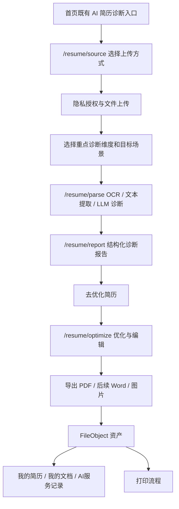

# AI 简历诊断完整闭环设计方案

> 日期：2026-06-29
> 状态：设计方案，未改运行时代码
> 范围：Kiosk 首页既有「AI简历诊断」入口的上传、诊断、报告、优化、导出、保存、后台审计和后续扫码 / U 盘 / 扫描接入规划。
> 依据：子代理前端 / 后端 / 设备后台三路研究、Claude 架构审查、Antigravity 触控交互审查。

## 1. 结论

当前项目不是从零开始。AI 简历诊断已有基础闭环：

```text
/resume/source -> /files/kiosk-upload -> /resume/parse
-> OCR/文本提取 -> LLM 结构化诊断 -> AiResumeResult
-> /resume/report -> /resume/optimize -> PDF 导出 -> 打印流程
```

但它还不是完整商用闭环。当前缺口集中在：

- `selectedDimensions` 没有前后端契约。
- `targetContext` 只在前端 state / 展示层存在，没有进入 `/resume/parse` 和 LLM prompt。
- 手机扫码上传、U 盘 Agent、纸质扫描真机链路未闭环。
- 诊断报告 PDF / Word / 图片导出未闭环；当前真实导出主要是优化版简历 PDF。
- 后台没有诊断维度模板、上传方式开关、导出格式开关和上传会话监控。

最优策略不是重写 AI 简历服务，而是按闭环拆小阶段：

1. 先做诊断契约端到端。
2. 再补低保真诊断会话 UI。
3. 再做扫码上传。
4. 再做导出增强。
5. 最后做 U 盘 / 扫描真机链路和后台配置化。

第一批必须先做 `selectedDimensions + targetContext`。这一步成本小、风险低、能立即提升诊断质量，并为后续 UI、扫码、导出打基础。

## 2. 目标与非目标

### 2.1 目标

- 保留现有首页入口，不新增同义入口。
- 让用户选择的诊断维度和目标场景真实影响 AI 诊断建议。
- 让报告、优化、导出、保存、打印能形成可验收链路。
- 所有文件继续复用 `FileObject`、`resume_upload` / `resume_scan`、签名 URL、留存策略和审计体系。
- 所有 AI 结果继续复用 `AiResumeResult`，不新建第二套 AI 结果表。
- 手机扫码、U 盘、纸质扫描按统一上传会话和文件资产模型接入。
- 后台只做配置、监控、审计，不查看或编辑简历正文。

### 2.2 非目标

- 不开发平台内投递。
- 不把求职者简历传给企业、合作机构或岗位来源方。
- 不做企业候选人筛选、面试邀约、Offer 管理。
- 不输出录用概率、企业匹配百分比、保面试等承诺性结论。
- 不用 mock 文件、假扫描、假导出伪装真实闭环。
- 不在首页新增“扫码诊断”“U盘诊断”“目标岗位诊断”等重复入口。

## 3. 当前能力分层

| 能力 | 当前状态 | 处理策略 |
| --- | --- | --- |
| 本机文件上传 | 已有 `/files/kiosk-upload` | 保留，作为第一批可用上传方式 |
| 默认 AI 诊断 | 已有 `/resume/parse` + OCR/LLM + `AiResumeResult` | 保留并扩展契约 |
| 报告展示 | 已有 `/resume/report` | 增加后端回显的维度 / 目标场景摘要 |
| AI 优化 | 已有 `/resume/optimize` | 保留，接收诊断上下文 |
| 优化版 PDF 导出 | 已有真实 `FileObject` 导出 | 保留为第一批真实导出 |
| 会员 AI 记录 | 已有 `/me/ai-records` 元数据 | 保留，不展示正文 |
| 后台 AI 配置 / 审计 | 已有 `resume_diagnosis`、`resume.parse_submitted` | 扩展元数据，不记录正文 |
| 诊断维度选择 | 未接后端 | 第一批补齐 |
| 目标岗位 / 场景 | 未接后端 | 第一批补齐 |
| 手机扫码上传 | 只有设计基础 | 第二批实现 |
| U 盘 Agent | 设计有边界，运行时未接 | 真机阶段实现 |
| 纸质扫描诊断 | OCR 底座有，扫描硬件未闭环 | 真机阶段实现 |
| Word / 图片导出 | 未闭环 | PDF 稳定后再做 |

## 4. 推荐业务流程



触控终端页面建议：

- 上传页只解决“从哪里拿简历”和“是否授权分析”。
- 目标页只解决“按什么方向诊断”。
- 处理中页面只展示真实阶段或诚实的等待状态，不假装实时进度。
- 报告页只展示结构化诊断和下一步动作。
- 优化页承接编辑、导出、打印。

当前进度文档已把硬件口径更新为 27 寸竖屏触控显示器；若实际部署仍有 21.5 寸设备，交互下限保持一致：主按钮高度不少于 56px，核心触控区域不少于 64px，避免小字、小按钮和多级菜单。

## 5. 诊断契约设计

### 5.1 维度字段

`selectedDimensions` 不应该裁剪 LLM 输出结构。后端仍应输出完整 6 个 section，前端选择只作为“重点关注”和排序权重。

原因：

- 当前 `LlmResumeService` 已强校验固定维度。
- 雷达图、报告页、历史记录都依赖稳定结构。
- 只输出用户选中的维度会导致旧页面、导出和回看不稳定。

推荐把“评分维度”和“报告辅助块”拆开，避免把风险提醒 / 优先级误当成雷达图评分维度：

```ts
export type ResumeScoringDimensionKey =
  | 'basic'
  | 'objective'
  | 'experience'
  | 'quantification'
  | 'keyword'
  | 'readability'

export type ResumeReportBlockKey =
  | 'risk_notes'
  | 'priorities'

export type ResumeDiagnosisDimensionKey =
  | ResumeScoringDimensionKey
  | ResumeReportBlockKey
```

服务端规则：

- `basic/objective/experience/quantification/keyword/readability` 是固定评分维度。
- `risk_notes/priorities` 是报告辅助块，不进入雷达评分。
- `selectedDimensions` 只接受 6 个评分维度；风险提醒和修改优先级由报告固定输出，不让用户关闭。
- 用户可选择重点关注项，但服务端仍诊断全量 6 个评分维度。
- `selectedDimensions` 只影响 prompt 中的重点提示、建议排序和报告高亮，不裁剪输出结构。

### 5.2 目标场景字段

`targetContext` 只用于求职准备建议，不用于岗位撮合或投递闭环。

```ts
export interface ResumeTargetContext {
  industry?: string
  targetJob?: string
  experience?: string
  scene?: string
  skipped?: boolean
}
```

服务端规则：

- 所有自由文本限长，例如 80 字以内。
- `scene`、`experience` 优先用枚举。
- `skipped=true` 表示通用诊断。
- 审计日志只记录 `targetContextProvided: boolean`，不记录完整目标岗位自由文本。
- prompt 必须加入合规约束：目标方向仅用于调整简历建议重点，不得输出录用概率、企业推荐、平台投递或候选人筛选结论。

### 5.3 `/resume/parse` 请求草案

```ts
export interface ResumeParseRequest {
  fileId: string
  fileName: string
  fileFormat: string
  source: 'upload' | 'scan' | 'manual'
  selectedDimensions?: ResumeScoringDimensionKey[]
  targetContext?: ResumeTargetContext
  uploadSource?: {
    channel: 'browser_file' | 'mobile_qr' | 'terminal_usb' | 'terminal_scan' | 'account_file'
    filePurpose: 'resume_upload' | 'resume_scan'
    terminalId?: string
    uploadSessionId?: string
  }
  consent?: {
    version: 'ai-resume-diagnosis-v1'
    acceptedAt: string
  }
  reportSchemaVersion?: 'resume-diagnosis-v1' | 'resume-diagnosis-v2'
}
```

兼容策略：

- 所有新增字段 optional。
- 旧客户端只传四个字段时，行为保持当前通用诊断。
- 后端 DTO 必须先扩展；当前全局校验会拒绝未声明字段。
- Kiosk 再开始传新字段。

### 5.4 报告版本协商

`reportSchemaVersion` 只用于客户端声明希望读取的报告结构，不允许客户端强迫服务端跳过校验或改变模型输出。

建议规则：

- 缺省时服务端返回当前默认版本。
- 第一批可仍返回兼容 v1 的 `ResumeReport`，并在 payload 中附加可选 `schemaVersion`。
- 服务端升级到 v2 后，应同时保留 `suggestions/riskNotes/priorities` 兼容字段。
- 客户端请求服务端暂不支持的版本时，返回明确错误或降级到默认版本，并在响应元数据中说明实际版本。
- `verify:resume-diagnosis-context` 必须覆盖缺省版本、显式 v1、显式 v2 和非法版本。

## 6. 报告结构设计

短期内保留现有 `ResumeReport`，新增 v2 结构时必须可向下兼容。

推荐 v2：

```ts
export interface ResumeReportV2 {
  schemaVersion: 'resume-diagnosis-v2'
  overall: {
    score: number
    maxScore: number
    level: 'excellent' | 'good' | 'needs_work' | 'risky'
    summary: string
  }
  sections: Array<{
    key: 'basic' | 'objective' | 'experience' | 'quantification' | 'keyword' | 'readability'
    label: string
    score: number
    maxScore: 10
    findings: Array<{
      type: 'strength' | 'gap' | 'risk'
      title: string
      detail: string
      evidenceHint?: string
    }>
  }>
  suggestionItems: Array<{
    sectionKey: string
    priority: 'high' | 'medium' | 'low'
    title: string
    detail: string
    actionItems: string[]
  }>
  riskNoteItems: Array<{
    severity: 'high' | 'medium' | 'low'
    type: 'missing_info' | 'vague_claim' | 'timeline' | 'overclaim' | 'format' | 'other'
    message: string
    suggestedFix?: string
  }>
  priorityItems: Array<{
    rank: number
    focus: string
    reason: string
    sectionKeys: ResumeScoringDimensionKey[]
  }>
  requestContext: {
    selectedDimensions: ResumeScoringDimensionKey[]
    targetContext?: ResumeTargetContext
  }
}
```

关键要求：

- LLM 输出仍必须是 JSON。
- 服务端强校验 key、score、maxScore、数组长度和合规词。
- `label` 以服务端 canonical 值为准，不信任模型自造 label。
- `suggestions/riskNotes/priorities` 可以由 v2 派生，兼容旧页面。
- 简历原文、OCR 文本、prompt、LLM 响应正文不落库、不写日志。

## 7. 手机扫码上传设计

扫码上传优先级高于 U 盘和纸质扫描，因为它不依赖 Windows 本地硬件，能最快补齐真实用户上传场景。

推荐流程：

```text
Kiosk 创建 UploadSession
-> 后端生成一次性二维码
-> 手机 H5 上传文件
-> 后端校验格式 / 大小 / token / TTL
-> 写 FileObject(purpose=resume_upload)
-> Kiosk 轮询会话状态
-> Kiosk 二次确认
-> 回填 fileId
-> 进入 /resume/parse
```

`UploadSession` 草案：

```ts
type UploadSessionStatus =
  | 'pending'
  | 'uploading'
  | 'uploaded'
  | 'confirmed'
  | 'consumed'
  | 'expired'
  | 'cancelled'
  | 'failed'

interface UploadSession {
  id: string
  terminalId: string
  purpose: 'resume_upload' | 'resume_scan' | 'print_doc'
  mode: 'temporary' | 'member'
  channel: 'phone_h5' | 'browser_file' | 'terminal_usb' | 'terminal_scan'
  pendingEndUserId: string | null
  confirmedEndUserId: string | null
  status: UploadSessionStatus
  fileId: string | null
  uploadTokenHash: string
  expiresAt: string
  createdAt: string
  updatedAt: string
}
```

安全规则：

- H5 不直接调用普通 `/files/kiosk-upload` 绕过会话。
- H5 不持有会员 token。
- 会员扫码上传必须 Kiosk 二次确认后才归户。
- 默认 10 分钟过期，单次使用。
- token 只存 hash。
- Kiosk 只看到文件名、大小、格式、状态，不看到 COS key、长期 URL、正文。

## 8. U 盘与纸质扫描设计

### 8.1 U 盘

U 盘应由 Terminal Agent 读取，不依赖浏览器系统文件选择器作为生产方案。

推荐流程：

```text
Kiosk -> Agent 列出白名单文件
-> 用户选择文件
-> Kiosk 向后端申请 actionToken
-> Agent 读取文件并上传到 UploadSession
-> 后端写 FileObject
-> Kiosk 确认并进入诊断
```

约束：

- Agent 只返回展示名、大小、格式、最近修改时间和 opaque id。
- 不返回 Windows 完整路径、用户名、盘符内部结构。
- 本地接口必须有 `localAuthToken`。
- 上传动作必须有一次性 `actionToken`，防重放。
- U 盘拔出、文件丢失、权限不足、Agent 离线都要有明确错误态。

### 8.2 纸质扫描

纸质扫描是 P1 真机能力。未接真机前不能把 mock 扫描文件送入 AI 诊断或会员资产。

真实流程：

```text
Kiosk 发起扫描
-> Terminal Agent 调 TWAIN/WIA 或监听扫描目录
-> 生成 PDF / 图片
-> 上传为 FileObject(purpose=resume_scan)
-> /resume/parse(source=scan)
-> OCR / 文本提取
-> 诊断报告
```

约束：

- `resume_scan` 与 `resume_upload` 一样是高敏文件。
- OCR disabled 时必须诚实失败。
- 不假设奔图设备有云端远程扫描 API。

## 9. 导出与保存设计

### 9.1 优化版简历 PDF

当前已有真实链路，应作为第一批导出能力：

```text
/resume/optimize -> exportGeneratedResume -> FileObject(assetCategory=optimized)
-> signedUrl -> /print/confirm
```

建议补强：

- 导出响应增加 `mimeType`、`sha256`、`assetCategory`、`sourceFileId`。
- 打印流程携带 sha256，避免跳过完整性校验。

### 9.2 诊断报告导出

建议新增独立接口，不挤占优化版简历导出：

```http
POST /api/v1/resume/records/:taskId/export
```

请求：

```ts
{
  format: 'pdf' | 'docx' | 'png'
  includeSections?: Array<ResumeScoringDimensionKey | ResumeReportBlockKey>
  renderPreset?: 'a4_report' | 'mobile_long_image'
}
```

响应：

```ts
{
  fileId: string
  filename: string
  mimeType: string
  sizeBytes: number
  sha256: string
  signedUrl: string
  expiresAt: string
  taskId: string
  exportKind: 'diagnosis_report'
  format: 'pdf' | 'docx' | 'png'
  assetCategory: 'derived'
  sourceFileId?: string | null
}
```

规则：

- 只导出结构化报告，不重新调用 LLM。
- 导出结果落 `FileObject`。
- 匿名导出短期可用，不进入账号。
- 会员导出进入「我的文档」和「我的简历」动作链。
- Word / 图片必须由服务端生成真实文件，不允许前端截图假下载。

## 10. 后台配置与监控

后台应补的是运营配置和监控，不是人工处理简历。

建议模块：

| 模块 | 第一批 | 后续 |
| --- | --- | --- |
| AI 模型配置 | 复用现有 `resume_diagnosis` | 保持 API Key 加密、不回显 |
| 维度模板 | 只读固定 6 维 + 版本 | 后续可配置展示名和开关，但不破坏输出契约 |
| 上传方式开关 | 本机 / 扫码开关 | U 盘 / 扫描按终端维度开关 |
| 导出格式开关 | PDF | Word / 图片 |
| OCR 状态 | provider、是否配置、最近验证 | 错误码、调用量、耗时 |
| 上传会话监控 | session 状态、终端、purpose、失败码 | 不展示正文、路径、token、COS key |
| 审计 | 扩展动作标签 | 支持过滤上传会话 / 诊断 / 导出 |

不建议第一批开放 Admin 任意编辑 prompt 或维度结构。当前诊断结构依赖服务端强契约，后台任意编辑容易破坏 JSON 输出和合规边界。

## 11. 分阶段实施计划

### Phase 1：诊断契约端到端

目标：让维度和目标场景真实进入后端和 LLM。

范围：

- `packages/shared/src/types/ai.ts` 增加 `selectedDimensions`、`targetContext`、`uploadSource`、`consent`。
- `services/api/src/ai/dto/resume-parse.dto.ts` 增加 DTO 校验。
- `services/api/src/ai/interfaces/ai-provider.interface.ts` 增加 provider input。
- `services/api/src/ai/resume/llm-resume.service.ts` prompt 消费维度和目标场景。
- `apps/kiosk/src/pages/resume/ResumeSourcePage.tsx` / `ResumeParsePage.tsx` 传参。
- `ResumeReportPage` 展示后端回显的诊断上下文。
- 审计增加脱敏元数据。

验收：

- 不传新字段时旧链路不变。
- 传目标岗位时报告建议能体现目标方向。
- 传部分维度时仍返回完整 6 维报告，只调整重点和排序。
- 非法 `selectedDimensions`、非法 `targetContext` 和非法 `reportSchemaVersion` 有明确校验结果。
- 日志 / 审计 / payload 不含简历原文、prompt、完整自由文本目标岗位。

### Phase 2：低保真诊断会话 UI

目标：让页面流程先完整，不追求高保真视觉。

这属于既有 AI 简历诊断流程的真实化，不改变首页入口结构，不重做已定版视觉风格，也不把高保真 UI 放在接口契约之前。

范围：

- `/resume/source` 增加隐私授权状态。
- 增加目标场景 / 重点维度 step，可以先在同页分段完成。
- 增加取消、失败、超时、重试状态。
- 未接入扫码 / U 盘 / 扫描保持禁用或“待接入”，不做假入口。

验收：

- 用户能完成上传、选择维度 / 场景、诊断、报告、优化、导出 PDF。
- 断网、文件错误、OCR 未配置、LLM 失败都有明确处理。

### Phase 3：手机扫码上传

目标：补齐最现实的手机文件上传方式。

范围：

- `UploadSession` API 和存储。
- 手机 H5 上传页。
- Kiosk 二维码等待和轮询。
- Kiosk 二次确认。
- 文件回填到 AI 诊断和打印上传页。

验收：

- 二维码 10 分钟过期。
- 单次使用。
- 会员扫码必须二次确认。
- 取消 / 过期 / 误扫不会污染会员资产。

### Phase 4：导出增强

目标：补齐报告导出和多格式成果。

范围：

- 诊断报告 PDF 导出。
- Word / 图片导出服务端生成。
- 导出成果落 `FileObject(assetCategory=derived|optimized)`。
- 我的文档 / 我的简历动作链展示导出成果。

验收：

- 不出现假下载。
- 导出文件有 `sha256`、`mimeType`、短期签名 URL。
- 可进入打印流程。

### Phase 5：U 盘 Agent 与纸质扫描

目标：真机能力闭环。

范围：

- Terminal Agent U 盘列文件。
- actionToken 文件上传。
- 真机扫描上传为 `resume_scan`。
- OCR 进入诊断。
- Admin 外设状态。

验收：

- 真机 U 盘选择文件不暴露本地路径。
- 扫描件真实进入 `resume_scan`。
- OCR disabled 时诚实失败。
- mock 扫描不进 AI 诊断和会员资产。

### Phase 6：后台配置化

目标：把运营开关和监控补齐。

范围：

- 诊断维度模板版本。
- 上传方式开关。
- 导出格式开关。
- 上传会话监控。
- OCR 状态。
- 审计过滤和标签。

验收：

- 后台开关能控制 Kiosk 展示。
- 未接入能力自动禁用并显示真实原因。
- 管理员不能查看简历正文或 token。

## 12. 验证建议

### API / 后端

- `pnpm --filter @ai-job-print/api typecheck`
- `pnpm --filter @ai-job-print/api lint`
- `pnpm --filter @ai-job-print/api verify-real-resume-diagnosis`
- `pnpm --filter @ai-job-print/api verify:resume-extraction`
- `pnpm --filter @ai-job-print/api verify:ai-result-ownership`
- 新增 `verify:resume-diagnosis-context`：覆盖维度、目标场景、合规词、旧请求兼容、非法字段、报告版本协商。
- 新增 `verify:upload-sessions`：覆盖扫码会话、过期、单次使用、二次确认。

### Kiosk

- `pnpm --filter @ai-job-print/kiosk typecheck`
- `pnpm --filter @ai-job-print/kiosk lint`
- `pnpm --filter @ai-job-print/kiosk build`
- 新增 Playwright：上传 -> 选择维度/场景 -> 诊断 -> 报告 -> 优化 -> PDF 导出 -> 打印确认。

### 合规

- 全仓搜索禁止文案：一键投递、立即投递、企业收简历、候选人管理。
- 审计 payload 检查：不含简历正文、OCR 文本、prompt、LLM 响应正文、明文 token。
- `targetContext` 不出现在企业、岗位来源、Partner 查询接口。

### 真机

- U 盘插拔、文件选择、拔出中断、权限失败。
- 扫描生成文件、OCR、诊断失败兜底。
- Windows Agent 离线时 Kiosk 禁用对应入口。

## 13. 风险与处理

| 风险 | 处理 |
| --- | --- |
| 用户选维度后后端只返回部分维度，破坏报告结构 | 维度只做重点关注，不裁剪 6 维输出 |
| 目标岗位变成岗位匹配或录用预测 | prompt 和合规校验明确禁止匹配率、录用概率、推荐给企业 |
| H5 直接走普通上传绕过会话 | 扫码上传必须走 UploadSession 专用接口 |
| U 盘暴露 Windows 路径 | Agent 只返回 opaque id 和安全元数据 |
| 扫描 mock 进入诊断 | 真机前保持禁用或演示，不写 FileObject |
| Word / 图片假导出 | 只允许服务端真实生成并落 FileObject |
| Admin 任意编辑 prompt 破坏结构 | 第一批后台只做开关和只读模板，不开放任意 prompt |
| 脏工作区叠加大改动 | 后续实现必须新建独立分支，分阶段提交和验证 |

## 14. 推荐下一步

下一步建议只启动 Phase 1：

```text
AI 简历诊断契约端到端
```

明确只改：

- shared 类型
- API DTO / provider input
- LLM prompt 消费
- Kiosk 传参
- 报告页回显
- verify 脚本

暂不改：

- 手机扫码上传
- U 盘 Agent
- 纸质扫描
- Word / 图片导出
- Admin 配置化
- 首页入口结构

Phase 1 通过后，再进入 Phase 2 低保真 UI 和 Phase 3 扫码上传。
