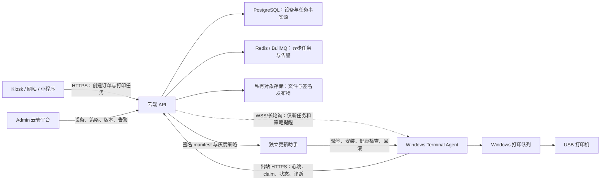

# 多终端云管与 Windows Agent 商业化部署方案

> 日期：2026-07-24
> 状态：商业实施基线；复审结论记录在正式进度文档。尚未完成 Gate 0 运行时代码、安装包、云管升级或规模化验收
> 适用范围：Windows 一体机主机、USB 打印机、Terminal Agent、Admin 管理后台、云端 API 与运维体系
> 关联文档：[Windows Terminal Agent 设计](../device/windows-terminal-agent-design.md) | [生产 Agent 上线指引](../device/production-agent-onboarding.md) | [打印扫描商业方案](./print-scan-commercial-plan.md) | [上线验收清单](../device/production-deployment-and-windows-host-checklist.md)

## 一、执行结论

本项目最合适的商业化形态是：**一个中心化云端管理平台 + 每台 Windows 主机一个签名安装的 Terminal Agent + 每台主机本地连接和控制打印机**。

- Admin 管理后台只部署在服务器，运营人员通过浏览器统一管理，不安装到每台终端。
- 每台 Windows 主机只安装打印机驱动、Terminal Agent、必要运行时和受控更新组件。
- 网站、小程序与 Kiosk 只向云端创建经过鉴权、计费和风控的打印任务，不直接连接主机或 USB 打印机。
- Agent 只主动向云端发起 HTTPS/WSS 出站连接；门店、学校或园区网络无需开放入站端口。
- 打印任务以数据库状态机为事实源；实时通道只能用于“有新任务”的提醒，不能代替原子 claim、幂等和状态回传。
- 远程运维采用白名单指令，不提供任意 PowerShell、命令行、文件浏览或默认远程桌面能力。

**每台设备需要绑定，但不需要每次开机输入注册码。**正式产品应把三类概念分开：

1. 一次性设备激活码：只用于首次安装、受控换机或灾备恢复，短时有效、明文只显示一次、使用后立即作废。
2. 每设备凭证：激活成功后由 Agent 安全保存，用于日常心跳、领取任务和状态回传；必须可到期、轮换和吊销。
3. 商业授权（entitlement）：决定某机构/设备在什么服务周期内可使用哪些付费能力和服务等级；不能复用激活码或设备 Token 充当许可证。

MAC、主机指纹和打印机序列号只能用于资产识别、异常检测和人工复核，不能宣传为“硬件级防克隆”。镜像只能预装无身份 Agent，设备凭证必须在首次开机后逐机激活生成。

本方案的批准是有条件的：Gate 0 必须先关闭共享注册秘密、明文长期 Token、伪到期时间、无 drain 换机和 Windows 凭证文件 ACL 等已知风险；多实例或真实支付启用前必须把防重放从进程内存迁移到 Redis。未通过门禁前，不得把规划能力写成已交付能力或 SLA 承诺。

推荐产品名可统一为：

- 云端：**终端云管平台 / Fleet Console**
- 本地：**AI 求职打印终端 Agent**
- 安装产物：**AI 求职打印终端安装助手**

## 二、当前项目真实能力审计

### 2.1 已经具备，可以复用

| 能力 | 当前实现 | 商业化判断 |
| --- | --- | --- |
| 终端身份 | `Terminal`、独立 `terminalId` / `terminalCode`、一次性绑定码 | 已有正确骨架 |
| 本地服务 | `node-windows` 注册 Windows 服务，Automatic 启动，SCM 恢复策略 | 已有服务骨架，待可靠性修复合入与 Windows 真机验收 |
| 设备激活 | Admin 可预创建 `planned` 设备并生成一次性绑定码，Agent 换取独立 Token，首次认证心跳后从 `commissioning` 进入 `active`，Windows DPAPI 保存 | Gate 0 第 2 批代码已完成；仍待 PostgreSQL CI、生产部署与 Windows 真机验收 |
| 在线状态 | Agent 心跳上报版本、打印机状态、磁盘、本地任务库状态 | 可支持基础在线/离线判断 |
| 任务调度 | 按 `terminalId` 原子 claim，任务状态回传，本地 SQLite 幂等与离线补报 | 核心打印路径可复用 |
| 打印执行 | Windows 打印机配置项、WMI 预检、PDF/图片打印、失败不伪造成功 | 已有真机出纸证据 |
| 后台管理 | 终端列表、机构归属、档案、启停、绑定码、打印机状态、任务详情与受控重试 | 已有云管控制台雏形 |
| 能力门控 | 每台终端能力状态可配置，只有 `available` 对普通用户开放 | 符合分批上线要求 |
| 安装加固 | PowerShell 脚本校验打印机、写配置、DPAPI Token、安装服务、验证心跳 | 适合技术人员部署首批机器 |

### 2.2 已有但仍需生产/现场复验

- Windows 服务可靠性修复、真实重启恢复、断网恢复和 Agent 降级恢复仍须按正式 runbook 验收。
- 扫描、U 盘、外设、耗材和打印机细粒度错误码的覆盖度低于打印主链路。
- 后台当前的打印机数据主要来自心跳；型号、序列号、驱动版本、耗材和纸盒数据未上报时会如实显示“未上报”。
- `printerName` 必须继续由配置指定，不能把任何打印机型号写死；彩色 mode 未经厂家确认不得猜测。

### 2.3 规模化部署缺口

| 缺口 | 当前状态 | 风险 |
| --- | --- | --- |
| 正式安装包 | 依赖仓库构建产物、Node PATH 和 PowerShell 脚本 | 非技术人员难安装，环境容易漂移 |
| 软件签名 | 未形成 Authenticode 签名安装包与发布链 | Windows 告警、供应链风险、政企交付受阻 |
| 安装/修复/卸载 | 尚无完整 MSI repair、升级和回滚闭环 | 批量维护成本高 |
| Agent 升级 | 只上报版本，没有 Agent 发布物、灰度策略、升级确认和自动回滚 | 多机器版本碎片化 |
| 设备分组策略 | 有机构和位置，但没有标签、设备组、策略版本和继承关系 | 无法批量配置 |
| 远程诊断 | 有本地诊断脚本，但没有脱敏诊断包上传和后台查看 | 故障仍依赖现场人员 |
| 凭证生命周期 | Agent Token 当前服务端明文存储，返回一年到期时间但模型无到期字段 | 泄露后吊销、轮换和审计不足 |
| 注册面收口 | 旧注册仅在 `TERMINAL_LEGACY_REGISTER_ENABLED=true` 时开放，生产启动门禁强制为 `false` | 代码已收口；仍须按两阶段 runbook 部署并证明无旧 binary |
| 设备预创建 | 复用 Admin 设备管理页创建 `planned` 资产，首次绑定进入 `commissioning` | 代码已完成；仍待生产 PostgreSQL 与真机验收 |
| 换机与重绑 | 绑定码兑换会立即覆盖旧 Token，未检查 `claimed` / `printing` 在途任务 | 可能出现旧机已出纸但未回传、任务再次执行 |
| Windows 凭证保护 | Agent 使用 DPAPI LocalMachine，但 DPAPI 不能代替 `%ProgramData%` 目录和文件 ACL | 本机低权限账户仍需最小读取权限隔离 |
| 多实例防重放 | Webhook/支付 nonce 守卫仍为进程内存实现 | 多 worker、多实例或重启后防重放语义不成立 |
| 商业授权 | 当前没有独立 entitlement、授权周期、功能包和宽限期模型 | 无法安全支撑按设备/年度授权和合同续费 |
| 权限与租户 | Admin 写接口主要为单一 `admin` 角色，机构归属不等于完整租户隔离 | 商业客户分权、跨机构越权验证和审批链不足 |
| 配置回执 | 心跳支持少量配置覆盖，但缺配置版本、签名、应用结果和回滚 | 后台无法证明配置已生效 |
| 指标与 SLA | 有状态和日志基础，缺在线率、成功率、版本覆盖、MTTR、告警升级 | 无法形成可承诺的运维服务 |

## 三、目标架构

### 3.1 五条架构原则

1. **云端管状态，本地管硬件**：云端不直接操作 USB；Agent 不自行决定价格、支付或用户权限。
2. **设备主动出站**：不要求终端有公网 IP，不暴露本地管理端口。
3. **任务状态持久化**：通知可丢，任务不能丢；Agent 收到通知后仍须从 API 原子领取。
4. **最小远程权限**：所有远程动作枚举化、带版本前置条件、超时、结果回执和 Admin 审计。
5. **先小批验证再扩容**：1 台、5 台、20 台、100 台逐级放量，每一级都有退出条件。

### 3.2 设备身份与商业授权模型

| 对象 | 用途 | 建议生命周期 | 安全要求 |
| --- | --- | --- | --- |
| `ActivationCode` | 首装、受控换机、灾备恢复 | 5–10 分钟、单次使用 | DB 只存 hash；绑定机构、设备和用途；生成/使用/撤销均审计 |
| `DeviceCredential` | Agent 日常认证 | 建议 30–90 天轮换，可配置短宽限 | 每设备唯一；服务端只存 hash/公钥；记录 `credentialId`、到期、吊销、轮换代次 |
| `DeviceAsset` | 资产、场地和生命周期管理 | 从 planned 到 retired | `terminalCode` 稳定；指纹/MAC 只作风险信号，不作唯一认证因子 |
| `Entitlement` | 商业许可、能力包、服务期和 SLA 档位 | 按合同起止日期 | 与设备凭证分表、分权限、分审计；续费不更换设备身份 |

授权到期时，Agent 仍应允许心跳、诊断、升级和退役处置；云端停止创建或领取新的受限商业任务。已经 `claimed` / `printing` 的任务不能因授权到期被静默重派，应按任务事实和人工处置规则完成或关闭。

推荐生命周期：`planned → commissioning → active → maintenance → suspended → retired`。`maintenance` / `suspended` 必须停止领取新任务，但不能抹除历史任务或审计。

## 四、Windows 安装包设计

### 4.1 推荐交付物

面向现场人员提供一个带代码签名的 `AIJobPrintTerminalSetup.exe`，内部使用 WiX Toolset Burn 引导 MSI；面向政企批量部署同时提供独立 MSI 和静默参数。

安装包内应固定携带：

- 编译后的 Terminal Agent 与私有 Node.js runtime，不能依赖目标机器预装 Node 或仓库源码。
- 经许可随包分发的 PDF 打印组件；不能默认把打印机厂商驱动打进安装包。
- Windows 服务包装与独立更新助手。
- 配置模板、诊断工具、卸载程序和版本清单。
- 发布方 Authenticode 签名、SHA-256、SBOM 和构建来源信息。

安装包不应携带：生产 `agentToken`、共享管理员密钥、数据库连接串、云存储密钥、用户文件和硬编码打印机型号。

### 4.2 安装流程

1. 管理员在云管平台预创建终端，设置机构、场地、终端编号和能力模板。
2. 后台生成 10 分钟有效的一次性绑定码或二维码，明文只显示一次。
3. 现场人员以管理员权限运行安装助手；安装助手检查 Windows 版本、磁盘、网络、打印服务和已安装打印机。
4. 操作员从 Windows 真实打印机列表选择 `printerName`，安装程序不得自行猜测型号。
5. 安装助手使用绑定码换取设备凭证，以 DPAPI/证书存储保存，并使绑定码立即失效。
6. 安装 Windows 服务，设置 Automatic、失败恢复、目录 ACL、防火墙仅本机规则和日志轮转。
7. 执行“无出纸体检”：服务状态、云端心跳、打印机状态、版本、磁盘、本地任务库和配置回执。
8. 由授权人员单独执行一张测试页；成功后后台将终端从 `commissioning` 切为 `active`。

注意：第 1 步是目标能力，当前代码尚无完整 Admin 预创建口，不能在关闭旧注册前假定它已经存在。

### 4.3 安装模式

| 模式 | 场景 | 输入方式 |
| --- | --- | --- |
| 交互安装 | 1–20 台现场交付 | 安装向导 + 一次性绑定码 |
| 静默安装 | 学校/园区批量装机 | MSI 参数 + 短时设备激活文件 |
| 镜像预装 | 同型号批量生产 | 只预装无身份软件，首次开机再激活；禁止克隆 Token |
| 修复安装 | 文件损坏或服务异常 | MSI repair，默认保留设备身份与日志 |
| 卸载/退役 | 更换或报废主机 | 云端先吊销凭证，再卸载；按策略保留或清理日志 |

## 五、Admin 终端云管平台

现有“设备管理”和“打印扫描运维”继续作为唯一入口，不再新建并列后台。建议在其内部逐步补齐下列模块。

### 5.1 设备总览

- 总设备、在线、离线、降级、维护中、待安装、待升级数量。
- 按机构、区域、场地、设备组、Agent 版本和打印机状态筛选。
- 在线率、打印成功率、失败任务、积压任务、版本覆盖率趋势。
- 设备详情时间线：激活、心跳、配置变更、升级、重启、故障、退役。

### 5.2 设备资产

- 终端编号、机构、地址、负责人、主机指纹、Windows 版本、Agent 版本。
- 打印机名称、驱动、端口、序列号和能力；未知字段保持未知，不编造。
- 生命周期：`planned → commissioning → active → maintenance → retired`。
- 设备标签和设备组；机构负责归属，标签负责灵活批量选择。

### 5.3 策略中心

- 心跳和 claim 周期、日志级别、能力开关、维护窗口、更新通道、最低支持版本。
- 策略采用“平台默认 → 机构 → 设备组 → 单机例外”继承，单机例外必须可追溯。
- 每份策略有 `policyVersion`、签名/哈希、生效时间、目标数量、成功/失败回执和回滚版本。

### 5.4 受控远程操作

第一批只允许：刷新状态、重新加载配置、重启 Agent 服务、上传脱敏诊断包、暂停/恢复领取任务、开始受控升级、撤销未执行指令。

以下能力默认禁止：任意 shell、任意文件下载、屏幕监控、键盘控制、静默远程桌面、绕过支付直接打印、远程发起扫描。确需远程协助时使用独立的企业远程支持产品，并要求现场知情、一次性授权和完整审计，不把它嵌入 Agent。

### 5.5 告警与工单

建议首批告警：终端离线、Agent 降级、服务重启过多、打印机离线/错误、磁盘不足、任务积压、连续打印失败、版本低于最低线、配置应用失败、Token 即将到期。

告警应包含终端、机构、首次/最近发生时间、持续时长、错误码、关联任务和建议 SOP；支持认领、备注、关闭和升级，不自动伪造“已修复”。

## 六、安全与可靠性基线

### 6.1 上规模前必须关闭的 P0

- 生产环境关闭共享 `adminSecret` 注册，只允许后台预创建 + 一次性绑定码/设备证书激活。
- 先补 Admin 预创建设备接口和 additive 数据模型，再通过生产门禁关闭共享 `adminSecret` 注册；不得先关旧入口造成新设备无法安装。
- 两阶段发布：第一阶段全量升级 reader-aware API，保持 `TERMINAL_LEGACY_REGISTER_ENABLED=false`、`TERMINAL_PLANNED_PROVISIONING_ENABLED=false`；确认所有旧 binary 已退出并保存版本证明后，第二阶段只把 planned writer 切为 `true`。开启后禁止回滚旧 binary；确需回滚先关闭 writer。
- 服务端不再保存可直接使用的 Agent Token 明文；至少存带 `credentialId` 的 Token hash，长期方案采用每设备客户端证书或公私钥。
- 增加数据库真实到期字段并在每次认证时检查，补轮换、吊销、换机和丢失设备处置；不能只在响应中返回一年后的 `expiresAt`。
- 换机/重绑前强制进入 maintenance + drain；存在 `claimed` / `printing` 任务时默认拒绝换绑，必须先确认物理出纸事实并审计处置。
- DPAPI LocalMachine 之外，安装程序必须收紧 `%ProgramData%\AIJobPrintAgent` 及凭证文件 ACL；长期 Token 不再接受命令行参数，避免进入进程列表、安装日志或脚本历史。
- 镜像、安装包和配置模板不得携带 Token、绑定码、共享密钥或克隆后的设备 ID。
- 所有安装包、升级 manifest 和二进制做 Authenticode + SHA-256 双重校验，验签失败不得执行。
- 远程动作必须经过 RBAC、二次确认、幂等键、过期时间、目标版本检查和不可变审计。
- Webhook 与真实支付的 nonce 防重放在启用多 worker、多实例或真实支付前迁移到 Redis `SET NX EX`，不再依赖进程内存。

### 6.2 任务可靠性

- 保持 `terminalId` 绑定、原子 claim、本地任务库、终态不可覆盖和离线状态补报。
- Agent 重启前先进入 drain：停止 claim 新任务，等待当前任务结束或明确超时。
- 升级、重启和配置切换期间，云端将设备标记为维护中，不把新任务派给它。
- 重试打印必须生成明确的新执行尝试并保留原任务关系，避免同一物理任务静默重复出纸。
- 断网时不接受无法在云端完成鉴权/计费的新远程任务；本地已 claim 任务按既有幂等策略执行并补报。
- 对状态不明的 `claimed` / `printing` 任务禁止自动重新入队或换机续打；先查询 Agent 本地执行记录、Windows 打印队列和现场出纸结果，再由有权限人员选择“确认已完成、确认未出纸后新建重试、取消并退款”。
- 每次物理执行使用稳定 `executionAttemptId`，Agent 本地先落库再调用打印机；同一尝试不得执行两次，人工重试必须创建新的尝试并保留父子关系。

### 6.3 数据与隐私

- Agent 临时文件继续按现有 TTL 清理；诊断包只含设备与错误元数据，不含用户文件、文件名、签名 URL、Token 或支付信息。
- Admin 设备运维角色不能查看用户文档正文；设备管理与订单/退款权限分离。
- 设备退役必须吊销凭证、确认无活跃任务、清理本地临时文件并保留退役审计。
- 本方案只管理打印服务与硬件，不增加招聘投递、简历收取或候选人管理能力。

### 6.4 并行生产安全前置项

以下问题不属于设备身份模型本身，但会影响商业生产放量：

- Partner API 拉取型数据源的 `endpoint` 在开放客户自助配置前，必须限制为 HTTPS，并阻断环回、私网、链路本地、云元数据地址和重定向绕过，避免 SSRF。
- 反向代理必须剥离客户端伪造的 `X-Forwarded-For`，应用只信任明确配置的代理，否则审计 IP 和基于 IP 的限流不可信。
- `SECRET_ENCRYPTION_KEY`、终端凭证签名密钥和支付/Webhook 密钥必须分别形成轮换 runbook，不共享生命周期。

## 七、Agent 升级与回滚

### 7.1 发布物

每个版本发布：版本号、适用 Windows 范围、安装包 URL、大小、SHA-256、签名证书信息、最低可升级版本、数据库/配置兼容声明、发布说明和回滚包。

更新助手独立于主 Agent 运行，避免运行中的服务覆盖自身文件。升级流程为：下载到暂存目录 → 验签 → drain → 停服务 → 原子替换/安装 → 启动 → 本地健康检查 → 云端心跳确认 → 成功；失败则恢复上一版本并上报告警。

### 7.2 灰度策略

| 通道 | 建议范围 | 观察要求 |
| --- | --- | --- |
| internal | 开发/测试主机 | 自动化验证与无敏感测试任务 |
| pilot | 1–2 台现场试点 | 至少观察一个完整营业周期 |
| stable-canary | 约 5% 生产设备 | 在线率、失败率、重启次数无异常 |
| stable | 其余设备分批放量 | 每批可暂停，禁止一次全量推送 |

任何升级都不得在打印中强制进行；云端必须支持暂停发布、锁定版本和按设备回滚。

## 八、规模与可用性设计

- 1–50 台：可延用 HTTPS 轮询，增加随机抖动，避免所有设备同秒心跳和 claim。
- 50–500 台：心跳写入异步化/聚合化，增加设备组和增量列表；WSS 或长轮询只做唤醒提示。
- 500 台以上：设备连接网关、分区队列、时序指标存储和区域容灾需单独容量设计，不提前堆进当前版本。
- 后端降级时，已有打印任务状态不得丢；新建付费任务应 fail-closed，不能收款后无履约路径。

建议首批运营指标：终端在线率、Agent 健康率、打印任务成功率、任务创建到 claim 延迟、claim 到终态耗时、重复出纸事件数、版本覆盖率、告警确认时间和平均恢复时间。

建议商业 SLA 先以试运营实测形成基线，再写入合同；在没有 20 台以上连续运行数据前，不承诺未经验证的 99.9% 数字。

## 九、商业产品与服务包装

### 9.1 客户与销售模式

- B2G：公共就业服务中心、人社服务站、零工市场；销售设备、软件授权和年度运维。
- B2B2C：高校、产业园、招聘会承办方、园区运营商；按终端/场地授权并提供运营分成或服务费。
- 自营点位：打印收入、AI 求职材料服务和会员权益；岗位与招聘会仍只作为第三方/官方信息入口。

### 9.2 建议合同拆分

1. 一次性交付费：硬件集成、安装实施、现场调试和培训。
2. 软件许可/云管服务费：Entitlement 与计费门禁落地后，按有效授权终端数或年度设备包计费；落地前只能写为报价模型，不能宣称系统已自动执行授权控制。
3. 运维服务费：远程监控、版本升级、故障响应、月报和备件协调。
4. 交易服务：打印、扫描、材料服务收入或双方约定分成。
5. 定制服务：机构品牌、合规内容、系统对接；不得以定制名义突破招聘业务合规边界。

报价不要只按“一个安装包”计算，应使用：**设备数量 × 服务周期 + 实施复杂度 + SLA 等级 + 现场覆盖范围 + 第三方成本**。纸张、耗材、支付通道费、短信、AI/OCR、云存储和现场维护应单列责任方。

### 9.3 责任矩阵与合同附件

| 事项 | 平台方 | 客户/场地方 | 打印机/网络/支付第三方 |
| --- | --- | --- | --- |
| 云端 API、Admin、Agent 软件和安全升级 | 负责 | 配合维护窗口 | 云服务商按其 SLA |
| Windows 主机、USB、供电、现场网络 | 提供兼容要求与远程诊断 | 负责现场可用、授权接入和基础维护 | 硬件/运营商承担其产品责任 |
| 打印机驱动、耗材、卡纸和机械故障 | 提供兼容清单与故障信息 | 负责耗材及一线处置 | 厂商保修、驱动和备件支持 |
| 用户文件、订单、支付和退款 | 按隐私与交易规则处理 | 按合同承担现场告知/协助 | 支付通道按其规则清结算 |
| 岗位与招聘会信息 | 仅提供第三方/官方来源入口 | 保证所提供来源合法有效 | 来源平台承担其内容与投递流程 |

建议合同至少包含：服务范围与排除项、设备清单、数据处理与删除、信息安全附件、SLA 与统计口径、故障分级/响应、变更和维护窗口、第三方依赖、备件耗材责任、验收用例、退出/退役与数据移交、招聘业务合规边界。宣传、报价、合同和验收统一使用“去来源平台投递 / 扫码投递 / 去来源平台预约 / 扫码预约”，禁止承诺平台内投递、收简历、筛选、邀约、Offer 或候选人推荐。

### 9.4 三态承诺规则

| 状态 | 可使用的表述 | 禁止表述 |
| --- | --- | --- |
| 当前已具备 | “已有代码/本地或真机证据”，同时注明证据范围 | 未经现场验证写成“批量稳定运行” |
| 拟建设 | “计划、目标、建议、Gate 退出条件” | 把 MSI、自动升级、设备组、诊断包写成现成功能 |
| 合同可承诺 | 仅写已通过对应 Gate、明确统计口径和责任边界的能力 | 在 20 台连续数据前承诺未经验证的 99.9% 或绝对不故障 |

## 十、分阶段实施路线

### Gate 0：现有单机商业基线

- 完成当前 Windows 真机剩余验收和可靠性分支收口。
- 分四批完成设备身份安全收口：① additive 凭证模型与 hash 兼容迁移；② Admin 预创建设备和生产关闭旧注册；③ maintenance/drain、轮换、吊销、换机、防重复出纸与审计；④ Windows ACL、Agent unauthorized/degraded 状态和真机验收。
- 多实例/真实支付前将 nonce 防重放迁移到 Redis；Partner 自助 API 拉取开放前关闭 SSRF 面。
- 固化 1 台终端、1 台打印机、真实支付/免费模式的唯一生产口径。

退出条件：Critical/High 安全阻塞为 0；旧注册在生产不可用；凭证到期/吊销后不能 claim；重绑时有在途任务必被阻断；Redis 防重放门禁通过；反向代理只信任明确代理且客户端伪造 XFF 被剥离；设备凭证、支付/Webhook、数据加密三类密钥有相互独立且演练通过的轮换 runbook；连续运行、断网/重启、失败任务、服务恢复和真实出纸均有证据；重复出纸事件为 0；高敏文件清理与审计通过。

### Gate 1：可交付安装包

- 建立可复现构建、SBOM、代码签名、WiX Bootstrapper/MSI、静默安装、repair/uninstall。
- 安装包自带 runtime，不依赖源码仓库和系统 Node。
- 完成干净 Windows 安装、覆盖升级、失败回滚、保留/清理数据矩阵测试。

退出条件：非研发人员按安装手册可完成安装和激活；安装、修复、升级、卸载都有自动验证。

### Gate 2：5 台试点云管

- 增加设备组、策略版本/回执、告警、诊断包和设备生命周期。
- 运营后台建立日常巡检、故障工单和设备退役 SOP。

退出条件：5 台不同网络环境建议连续试运营至少 14 天，故障可在后台定位，现场无需接触源码；指标口径已稳定，仍不据此直接承诺正式 SLA。

### Gate 3：20 台灰度升级

- 增加签名发布物、独立更新助手、分批升级、drain、暂停和回滚。
- 建立版本覆盖、升级成功率、打印成功率和 MTTR 看板。

退出条件：20 台建议连续运行至少 30 天，完成一次可控升级与一次真实回滚演练，不发生重复出纸和大面积离线；以这批实测数据评估可承诺 SLA。

### Gate 4：100 台商业复制

- 做容量压测、心跳抖动、告警收敛、机构隔离、备份恢复和灾难演练。
- 以真实试运营数据确定 SLA、备件策略、客服排班和合同承诺。

退出条件：技术、运维、合同、培训、隐私和故障响应材料可重复交付。

## 十一、首轮实施文件预算建议

本方案批准后，第一批代码只处理 Gate 0，不与 MSI、自动升级同时开工：

- 后端：additive 凭证模型、Admin 预创建、生产禁用旧注册、凭证哈希/到期/吊销、maintenance/drain 与审计；不得先删旧字段或破坏现有 Agent 兼容。
- Admin：凭证状态、吊销/重新激活和设备生命周期最小界面；复用现有设备管理页。
- Agent：绑定码作为生产唯一激活路径，处理凭证过期/吊销的明确状态，收紧 ProgramData ACL，移除长期 Token 命令行输入。
- 验证：SQLite/PostgreSQL 双轨 migration、API/Agent/Admin typecheck/lint、凭证安全 verify、生产门禁和 Windows 无出纸激活验收。

禁止在同一批次加入任意远程 shell、远程桌面、自动驱动安装、扫描扩展或新的 Kiosk 入口。MSI 与云管升级按独立任务和独立验收推进。

## 十二、最终验收清单

- 安装包签名有效，干净 Windows 可交互/静默安装，repair/uninstall 可用。
- Windows 服务开机自启、异常恢复、重启/断网恢复通过。
- 每台设备身份唯一，克隆镜像不会克隆凭证；吊销后设备不能 claim。
- Admin 可看到设备归属、在线、版本、打印机、策略、任务、告警和审计。
- 配置与升级都有版本、目标、回执、失败原因、暂停和回滚。
- 打印任务不跨终端、不重复出纸、不把失败伪造成成功。
- 用户文件、Token、签名 URL 和支付敏感信息不进入诊断包或普通日志。
- 试点、灰度、全量三个阶段均有真实设备证据，不以本地 mock 或静态 verify 替代。

这套方案的核心不是“让后台能远程控制一台电脑”，而是把现有单机 Agent 升级为**可安装、可识别、可观察、可升级、可回滚、可审计、可批量运营的终端设备云管产品**。
