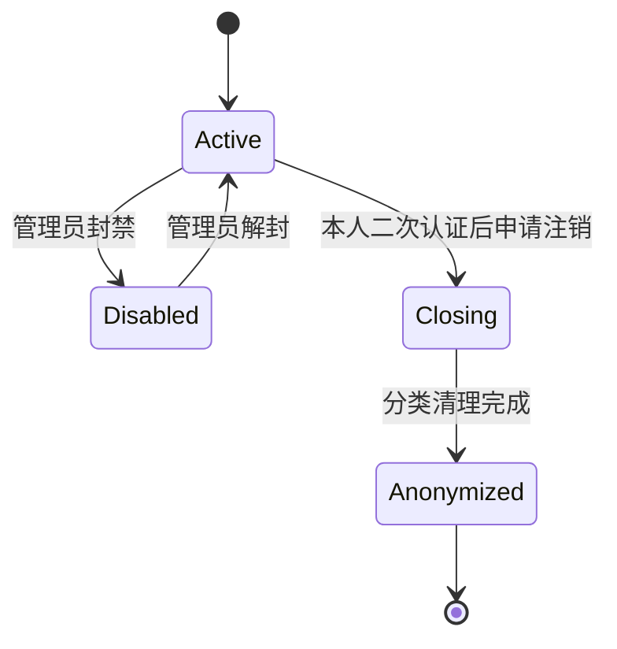

# 用户中心商用级闭环开发方案与计划

> 版本：2026-07-16 审阅稿
>
> 状态：用户已批准先推进 Wave 0 / Wave 1；Wave 0 进入独立实施准备，运行时代码尚未开工
>
> 共同审查：Codex（产品、运行态、触控体验、工程计划）+ Claude（架构、安全、隐私、数据生命周期）
>
> 依据：`docs/reviews/user-center-commercial-closure-audit-2026-07-16.md`

## 一、目标与成功定义

### 1.1 目标

在不改变现有底部导航、不新增重复业务入口、不突破招聘合规边界的前提下，把用户中心从“真实数据入口聚合 + 局部操作”收口为商用级会员闭环：

- 用户知道自己有哪些账户、资产、订单、权益和通知。
- 用户可以安全地查看、复用、下载或删除应由本人控制的数据。
- 用户可以跟踪打印和支付结果，遇到失败有明确的取消、退款、再打印或客服路径。
- 用户可以行使换绑、撤回同意、数据导出和账户注销等权利。
- 运营人员可以在 Admin 中处理用户、隐私工单、权益和订单异常，且所有敏感动作可审计。
- 生产环境具备安全、幂等、监控、告警、回滚和真机验收证据。

### 1.2 商用完成定义（Definition of Done）

同时满足以下条件才允许对外称“用户中心已完成”：

1. 上线页面没有“建设中”、不可用按钮、重复入口或假闭环。
2. 每个可见动作都有真实 API、本人权限、失败态、审计或运营处理路径。
3. 注销/导出/换绑经过二次认证，敏感数据按分类策略处理，不靠裸级联删除。
4. 订单、支付、权益、退款分别有唯一事实源和幂等约束，前端不自行推断资金状态。
5. 新增代码单元/集成/E2E 覆盖达到项目 80% 要求，相关 verify、typecheck、build 和双 CI 通过。
6. 1080×1920 一体机、手机、桌面浏览器、弱网、刷新、会话过期和键盘/读屏路径完成验收。
7. PostgreSQL、Redis、对象存储、短信，以及收费模式下的支付/退款，都以同一提交完成预生产验证。
8. Admin 有处理 SLA、审计、失败重试和异常升级流程，不依赖直接改数据库。

## 二、产品策略选择

### 方案 A：现有入口收口 + 分波闭环（推荐）

保留已经验证的会员资产和服务入口，只删除重复/失效/占位项；数据权利放入“账号设置”二级流程，订单动作放入“打印订单”，权益使用放入真实服务/收银流程，不向用户中心首页继续加卡片。

优点：改动边界清楚、符合入口稳定规则、能按风险拆分、可以逐波上线。

代价：需要前后端、Admin、worker 和数据迁移协同，不能靠单纯改 UI 完成。

### 方案 B：只隐藏未完成功能，保持当前后端

先移除占位和重复入口，不补注销、导出、Admin 运营和售后。

优点：开发量最小。

代价：只能作为短期演示收口，不能达到本方案定义的商用会员中心。

### 方案 C：一次性建设完整会员/套餐/积分/商城体系

同时做会员等级、套餐商城、积分、第三方登录、自动合并、消息推送和营销系统。

优点：表面功能完整。

代价：超出当前真实业务闭环，文件和数据模型会快速膨胀，资金、隐私和运营风险同时叠加，不符合上线前反堆砌原则。

### 决策

采用 **方案 A**。首台设备默认走免费模式；收费模式只有在支付、权益、退款、对账和真机验收同时通过后才开启。

## 三、目标信息架构

### 3.1 用户中心首页

首页继续承担“入口 + 概览”，不变成业务办理大厅：

1. **账户头部**：登录状态、脱敏手机号、未读消息、进行中打印；访客只显示登录引导。
2. **我的资产**：我的简历、我的文档、AI 服务记录、打印订单、我的收藏、我的权益。
3. **常用服务**：保留现有已接真入口，不再新增同义入口。
4. **活动记录**：浏览记录、外部跳转记录、唯一的权益活动入口。
5. **账户与支持**：消息通知、账号设置、帮助中心、意见反馈。

立即删除/隐藏：

- 重复的第二个“权益活动”。
- 与账号设置同路由的“身份切换”。
- 不可用的邮箱登录方式。
- 招聘会扫码凭证、求职打印套餐、AI 服务套餐等占位卡片。

### 3.2 二级流程归位

| 能力 | 归位 | 不允许的做法 |
|---|---|---|
| 换绑、同意管理、导出、注销 | `/me/settings` 内分组或进入设置二级页 | 不在用户中心首页新增 4 张卡片。 |
| 简历删除/复用/下载 | `/me/resumes` | 不复制到“我的文档”形成第二份资产。 |
| 文档下载/保留/删除/再打印 | `/me/documents` | 不让订单页直接绕过文件签名生成新任务。 |
| 订单取消/支付重试/退款/再打印 | `/me/print-orders` 详情 | 不在用户中心首页新增“售后中心”。 |
| 权益查看 | `/me/benefits` | 不在列表页直接改金额或扣次数。 |
| 权益选用和核销 | 真实服务确认页/收银页，由服务端结算 | 不由前端直接更新 BenefitGrant。 |
| 隐私工单处理 | Admin 用户/隐私请求页面 | 不要求运营直接查库或手工改状态。 |

### 3.3 视觉与触控约束

- 新增或实质重做的页面遵循「青序 LightFlow」现行设计目标，复用 `packages/ui`、现有语义 token、字体、图标和表单组件，不再发明一套用户中心视觉语言。
- Wave 0 只做入口真实性和轻量排版收口，不借机发起全量主题迁移；未迁移页面可以保持现状，后续按独立换装任务渐进统一。
- 1080×1920 一体机优先保证首屏账户状态和资产入口，长列表使用清晰分组与加载更多；手机端降为单列，桌面端限制正文宽度。
- 主要触控目标不小于 48×48px，不依赖 hover；危险操作与主操作分区，确认弹层必须支持焦点锁定、Esc 退出、焦点归还和读屏标题/说明。
- 加载、空态、错误、弱网重试、处理中和不可逆结果均使用同一组件和语义色，不用只靠颜色表达状态。

## 四、目标架构

### 4.1 账户与数据权利

首版不猜冷静期：`MEMBER_ACCOUNT_CLOSURE_EXECUTION_ENABLED=false` 且 `MEMBER_ACCOUNT_CLOSURE_COOLING_HOURS` 未配置时 fail closed，Kiosk 不展示可执行注销动作。只有法务/产品签字明确“0 小时直接执行”后，才按上图启用 active 会员自助注销；若批准带撤销的冷静期，必须先另行设计 `Closing -> Active` 的撤销状态机和通知再开启。disabled 账号的注销权首版走人工身份核验/申诉流程，不静默绕过登录和 step-up 门禁。

建议采用 additive 账户状态，不立即删除 `EndUser` 主行：

- `active`：正常使用。
- `disabled`：禁止登录，保留数据和审计，支持人工复核。
- `closing`：注销处理中；是否设置冷静期、时长和撤销方式由法务/产品批准。
- `anonymized`：PII 已按字段完成匿名化，高敏资产已清理，依法需留的订单/退款/审计记录只保留必要字段。

`enabled` 在迁移期保留兼容，服务层以新状态为权威，避免一次性破坏现有 Guard。过渡期必须双写：任何写入 `disabled/closing/anonymized` 的同一事务同时置 `enabled=false`；鉴权切到新状态并完成数据回填前，不允许关闭旧字段门禁。集成测试必须证明 closing/anonymized 账户沿旧 Guard 路径也无法登录或读取本人数据。

### 4.2 二次认证（step-up）

注销、换绑、导出包下载、未来大额退款等敏感动作必须重新验证手机号：

- 挑战记录放 Redis，TTL 建议 5 分钟；验证码限流沿用会员短信风控。
- 验证成功后签发短时、单次使用、绑定 `endUserId + action` 的 step-up token；`deviceId` 仅作为公共终端的审计/风险信号，不作为强身份边界，因为同一一体机会被多个用户共享。
- 普通会员 token、step-up token 和支付会话 token 不混用。
- 日志只记脱敏手机号、请求 ID、设备摘要和结果，不记验证码或明文手机号。

### 4.3 手机号换绑

首版流程：旧号 step-up → 新号验证码 → 新号唯一性校验 → 单事务换绑 → 全部旧会话失效 → 站内通知和审计。

新手机号已被占用时首版拒绝自动合并，创建人工工单。自动合并涉及资产、订单、权益和退款归属，列入 P2 专项，不在本轮实现。

### 4.4 数据导出

复用现有 `UserDataRequest`，不新建第二套隐私工单账本：

导出范围只包含本人可见数据和安全元数据，不包含内部密钥、对象存储 key、验证码、风控规则、模型系统提示或其他用户数据。

### 4.5 注销与分类处置

由专门的 `AccountClosureService` 或等价领域服务编排，不能直接 `delete EndUser`：

| 数据类 | 建议动作 | 验收证据 |
|---|---|---|
| 手机号、昵称等 PII | `phoneHash` 替换为满足非空/唯一约束的不可逆随机墓碑值，`phoneEnc` 替换为不含原号码的随机墓碑密文，昵称清空 | 原手机号 hash 不再存在；管理员和接口不能还原原号码；同一手机号可注册为全新 EndUser 且不继承旧资产。 |
| 简历、扫描件、证件等 FileObject | 先删私有对象，再软删数据库记录 | 对象不存在、签名 URL 失效、删除审计存在。 |
| AI 结果/会话、浏览/跳转、收藏、同意 | 按保留规则删除或撤回 | 本人接口不再返回，清理数量可审计。 |
| 通知、反馈 | 按运营/法务规则删除或匿名解绑 | 不含可识别 PII。 |
| 订单、支付、退款、核销 | 按法务确认期限保留必要凭证并脱敏 | 对账可追溯，不能反向恢复用户 PII。 |
| UserDataRequest、AuditLog | 保留最小审计证据 | 注销后仍能证明请求、审批、执行和结果。 |

每一步必须幂等；中途失败进入可重试状态并告警，不能把请求标为 completed。

### 4.6 订单、支付、权益和退款

- `Order` 是资金事实源；`PrintTask` 只表达打印执行状态。
- `BenefitGrant/RedemptionRecord` 是权益事实源；前端只提交选择，服务端校验适用范围、有效期、剩余次数和并发。
- `Refund` 是退款事实源；退款结果由支付渠道回调/主动查询更新，不由前端改状态。
- 核销、退款、订单创建、回调必须有业务幂等键和数据库唯一约束。
- 打印失败自动退款是独立补偿流程；失败时进入人工队列，不把打印任务和资金状态写成一个状态机。

## 五、分波实施计划

> 工期是单一跨职能小组的净开发估算，不含短信/支付渠道审核、法务等待和 Windows 现场排期。每一波单独分支、单独 CCG 任务、单独验收，禁止一次性大提交。

推荐首批 Wave 0 + Wave 1 预计 **7–13 人日**；包含条件收费闭环和 P2 增强的全量路线约 **22–38 人日**。实际排期在技术设计拆分、法务决策和干净基线复验后锁定，不把外部审核等待时间计入开发人日。

### Wave 0：真实表达与验证基线（P0，1–3 人日）

目标：用户看到的每个入口都真实；后续开发建立可重复验证基线。

范围：

1. 删除重复权益活动、身份切换和邮箱按钮。
2. 隐藏扫码凭证、打印套餐、AI 套餐占位卡。
3. 同步清理设置页关于“身份切换”的遗留注释/文案，避免入口删除后口径漂移。
4. 保留当前二维码实现，更新已经过时的 `verify:qr-login-ui` 断言。
5. 临时限制 Admin/API 把 `export/delete` 工单置为 `completed`；真实执行链上线前 export 只能进入处理中或被明确拒绝，delete 只能保持处理中/失败并走重试或人工升级，禁止普通拒绝、恢复 active 或生成虚假的完成审计。
6. 从正式 migration 重建本地 SQLite 验证库，确认重放后已有 `Order.refundedAmountCents` 和 `RedemptionRecord`；同时跑 PostgreSQL readiness，禁止为这两个既有 schema 能力重复建迁移。
7. 更新用户数据流矩阵和进度文档，明确哪些入口暂不展示。

验收：

- `/profile` 和 `/login` 无“建设中”、重复项和不可用按钮。
- Kiosk profile、QR login、print order UI 守卫全绿；export/delete 在真实闭环完成前不能留下 completed 审计。
- SQLite 主验证和 PostgreSQL readiness 使用相同 schema 通过。

### Wave 1：账户安全与数据权利（P0，6–10 人日）

目标：完成 step-up、数据导出、注销分类处置和 Admin 处理闭环。

子任务：

1. **W1-A 数据模型与状态机**：additive EndUser 状态字段；扩展 `UserDataRequest` 执行/产物/失败字段；修正审计记录在匿名化后的保留关系。
2. **W1-B step-up**：短信挑战、短时单次凭证、频控、设备绑定、会话撤销。
3. **W1-C 异步导出**：worker 聚合、加密包、短期 FileObject、签名下载、到期物理删除。
4. **W1-D 注销编排**：分类清理、PII 匿名化、对象存储删除、财务留存、幂等重试、失败告警。
5. **W1-E Kiosk 设置页**：数据权利列表、状态、确认步骤、处理时限、撤销/帮助；不在首页新增卡片。
6. **W1-F Admin 隐私工单**：列表、筛选、详情、处理、失败重试、审批/拒绝理由、审计。

门禁：

- 删除测试必须证明对象存储、高敏数据、缓存/session 和数据库分类结果一致。
- 导出包不含明文手机号/内部 key/他人数据；过期后不能下载。
- 重复请求、重复 worker 执行和中途失败重试不会重复删除或产生多个有效导出包。
- 运营可以只通过 Admin 完成全流程，不直接改数据库。

### Wave 2：换绑与资产动作一致性（P1，4–7 人日）

目标：用户能迁移账户身份，所有资产页遵循一致但不过度的操作原则。

子任务：

1. 手机号换绑：旧号 step-up、新号验证、冲突拒绝、原 session 全失效、审计和通知。
2. 我的简历：明确原始/诊断/优化/生成版关系；补本人删除、可复用产物下载或导出；服务端游标分页。
3. 我的文档：补真实下载按钮、分页/加载更多、类型/时间筛选；保留策略与删除结果可见。
4. 活动记录：补单条删除和清空本人记录；保持外部跳转只做合规记录，不形成投递。
5. 收藏：列表内可取消，来源失效时显示“来源已下线/不可访问”。
6. 概览：只增加未读消息、进行中打印，以及 `BenefitGrant.validUntil` 有真实值时可计算的临期权益等可行动状态。

门禁：本人隔离、404 防枚举、游标分页稳定、删除幂等、弱网不覆盖已加载列表、移动端/一体机可操作。

### Wave 3：打印售后与权益单点闭环（条件 P0 / 常规 P1，5–8 人日）

目标：若启用收费，完成支付—权益—打印—退款闭环；若保持免费模式，可延后。

子任务：

1. 打印订单详情增加：未支付取消、支付重试、退款进度/凭证、从原文档重新发起打印。
2. 权益页增加：适用服务、有效期、剩余次数、使用/失效记录和“去使用”深链。
3. 收银/服务确认页增加权益选择；服务端计算应付金额并原子核销。
4. 打印失败退款补偿、人工异常队列和对账视图。
5. 套餐仍不开放，直到 SKU、价格、有效期、退款规则、发票/收据、后台运营和条款全部齐备。
6. 收费模式直接复用并强制显式开启现有 `PRINT_REQUIRE_PAID_BEFORE_CLAIM=true`，不另建第二套出纸门禁。

门禁：

- 金额只由服务端计算；客户端篡改无效。
- 同一订单/产物并发提交只核销一次、只退款一次。
- 支付成功不等于打印成功；打印失败不篡改支付原始凭证。
- 支付/退款/核销/人工操作均有请求 ID、审计和对账记录。

### Wave 4：体验增强（P2，3–5 人日）

按真实运营数据决定是否实施：

- AI 顾问对话历史：默认不保存；用户主动开启、短 TTL、可逐条/全部删除、敏感内容治理。
- 消息偏好：分类、深链和站内频控；短信/实时推送后置。
- 账号冲突人工合并工具：只在换绑工单确有规模后专项设计。

### Wave 5：商用预生产与真机验收（P0，3–5 人日 + 外部排期）

1. PostgreSQL 生产实例、Redis、对象存储、短信、环境密钥和备份恢复。
2. Windows Terminal Agent、真实打印机、扫码登录、会话退出、断网恢复。
3. 免费模式完整闭环；收费模式另跑真实小额支付、退款和对账。
4. 1080×1920 触控、手机、桌面、键盘、读屏、弱网、会话过期。
5. 隐私工单演练：导出、撤回同意、注销、失败重试、审计查询。
6. 监控、告警、SOP、回滚和法务清单签字。

## 六、文件预算与功能归位

### 6.1 原则

- 每个 Wave 进一步拆成 2–6 个独立任务；同一任务只解决一个闭环。
- 不向现有 300+ 行页面继续堆复杂表单和状态机；页面编排、表单、hook、API、类型分离。
- 跨端 DTO/状态枚举放 `packages/shared`，前后端不各自复制字符串。
- 复用现有 `UserDataRequest`、FileObject、AuditLog、BenefitGrant、RedemptionRecord、Order、Refund，不建平行账本。

### 6.2 预计涉及目录

| 层 | 目录/文件 | 说明 |
|---|---|---|
| Kiosk | `apps/kiosk/src/pages/profile/**`、`apps/kiosk/src/services/auth/**`、`apps/kiosk/src/services/api/**`、`apps/kiosk/src/routes/index.tsx` | 首页收口、设置/隐私二级流程、资产动作、订单/权益交互。 |
| Admin | `apps/admin/src/routes/users/**`、新增或现有隐私请求路由、Admin API 适配器 | 用户治理与隐私工单；不塞入单一 `index.tsx`。 |
| API | `services/api/src/member-auth/**`、`member-privacy/**`、`member-assets/**`、`member-print-orders/**`、`member-benefits/**`、`benefit-redemption/**`、payment/refund 相关模块 | 状态机、鉴权、本人数据、资金/权益边界。 |
| Worker | `services/worker/**` 或项目既有队列任务目录 | 导出打包、注销编排、补偿和到期清理。 |
| DB | `services/api/prisma/schema.prisma`、SQLite/PostgreSQL 对应 migration | 只做 additive 迁移；先 readiness，后切换。 |
| Shared | `packages/shared/**` | 账户状态、数据请求、step-up、订单/权益 DTO。 |
| Docs | `docs/product/**`、`docs/compliance/**`、`docs/progress/**`、验收/runbook | 业务规则、留存期限、法务结论和验收证据。 |

Terminal Agent 首两波不涉及；Wave 3/5 只验证既有打印执行和断网恢复，不在用户中心任务中重写硬件链路。

## 七、API 和数据契约准入

正式技术设计时按以下能力设计，路径可在实现计划评审时定稿：

| 能力 | 必须具备的契约 |
|---|---|
| step-up | action/device/user 绑定、5 分钟内有效、单次消费、限流、错误不泄露账号存在性。 |
| 换绑 | 双号码验证、唯一性冲突、事务更新、旧 session 全撤销、审计。 |
| 数据请求 | 本人幂等提交、状态查询、可撤销条件、失败码、处理时限、运营备注不直接暴露内部信息。 |
| 导出下载 | 本人 + step-up、单次消费的应用 ticket、ticket 只经 fragment/header 交付、对象存储 URL 不下发、重复下载明确拒绝、包 TTL。 |
| 注销执行 | 分类步骤、step 状态、幂等重试、补偿、完成条件、审计摘要。 |
| 资产删除 | 本人隔离、原因枚举、关联产物策略、对象物理删除结果、审计。 |
| 订单动作 | 订单归属、状态前置条件、幂等键、并发冲突、支付会话 token。 |
| 权益核销 | 适用范围、有效期、余额、订单/产物唯一约束、原子扣减、审计。 |

所有错误使用稳定业务码和用户安全文案；服务端日志保留请求 ID 和内部上下文，但不得把内部错误、存储 key、手机号明文或密钥返回前端。

## 八、安全、合规与运营要求

### 8.1 安全

- 所有输入使用 DTO/schema 验证，状态值使用白名单。
- 会员和 Admin 权限分离；注销执行、退款、用户文件访问等高风险动作使用细粒度权限与审计。
- 手机验证码、step-up、导出下载、支付回调均限流、防重放、超时失效。
- PII 加密密钥只来自环境/密钥管理，启动时验证；上线前轮换已暴露或测试密钥。
- 对象存储私有且启用 at-rest 加密；导出对象 URL 不下发客户端，仅使用 10 分钟内的一次性应用下载凭证。

### 8.2 合规

- 不新增站内投递、收简历、候选人筛选、面试邀约、Offer 或企业自主发岗闭环。
- 活动、岗位和招聘会仍只作为第三方/官方来源入口。
- 删除、匿名化、财务留存、未成年人/学生条款、第三方处理者条款需法务确认并落正式文档。
- 明确用户数据类型、目的、期限、删除方式、导出范围和投诉路径。

### 8.3 运营 SLA

建议在上线前确认：

- 数据导出自动任务目标时限、失败后人工介入时限。
- 注销申请处理时限、是否有冷静期、撤销和申诉方式。
- 退款/打印失败工单的响应和完结时限。
- 用户文件访问、隐私请求、退款和权益调整的审计抽检频率。

## 九、测试与验收矩阵

| 层级 | 必测内容 |
|---|---|
| 单元测试 | 状态机、权限、PII 脱敏、保留策略、金额/权益计算、幂等键、分页 helper。 |
| API 集成 | 本人隔离、越权、并发、重复请求、会话过期、step-up 过期、对象删除、队列失败重试。 |
| 数据库 | SQLite 主 CI + PostgreSQL readiness；migration 前向、回滚/恢复演练；唯一约束和索引。 |
| Kiosk E2E | 登录回跳、资产查看/删除、导出下载、换绑、注销、订单售后、权益选用、弱网恢复。 |
| Admin E2E | 用户搜索、封禁、隐私请求、失败重试、退款/权益异常、审计查询。 |
| 安全 | OTP/step-up 暴力尝试、token 重放、IDOR、一次性下载 ticket 越权/过期/并发消费、fragment 清理、日志 PII 扫描、恶意文件名。 |
| 触控/无障碍 | 48px 触控目标、无 hover 依赖、焦点顺序、弹层焦点锁、读屏标题、错误播报、颜色对比。 |
| 生产 | 真实短信、真实对象存储、PostgreSQL、Redis、Windows、打印机；收费时增加真实支付/退款/对账。 |

每个新业务模块覆盖率不低于 80%；不通过的测试必须明确是代码失败、环境前置条件还是验证库 schema 漂移，不得笼统写“测试通过”。

## 十、可观测性与告警

至少增加以下指标和告警：

- step-up 发送/验证成功率、限流和异常设备数量。
- 数据请求 pending/processing 时长、失败率、导出包过期未删数量。
- 注销每一步的失败和重试次数、对象存储残留数量。
- 打印任务与订单状态不一致、退款待处理、权益核销冲突。
- Admin 高风险操作数量、无请求 ID 或缺审计事件。
- 会员 API 401/403/429、列表加载失败和对象签名失败。

日志和指标只使用内部 ID、请求 ID 和脱敏标识；不记录明文手机号、简历正文或导出包内容。

## 十一、回滚与发布策略

1. 数据库仅 additive 迁移；旧字段至少保留一个稳定版本，先双写/兼容读，再切权威字段。
2. 新功能使用服务端 feature flag：数据权利入口、收费、权益核销分别开关，不用一个总开关控制全部风险。
3. 注销执行分步且幂等；不可逆清理前确认请求状态、step-up 和法务规则，失败不标 completed。
4. 导出和核销任务可安全重试；重复回调/重复点击返回同一业务结果。
5. 先灰度内部/测试账号，再单设备，再小范围；收费模式与免费模式分开验收和回滚。
6. 回滚代码不能恢复已经合法完成的删除，也不能重复退款/重复核销；数据修复必须走审计工具。

## 十二、明确不做

- 不新增用户中心底部导航或重复入口。
- 不建设招聘平台闭环。
- 不做账号自动合并、动态 RBAC 大系统、积分商城、套餐商城、第三方 OAuth。
- 不默认保存 AI 顾问完整对话。
- 不为“看起来完整”增加静态占位页面、假数据、临时脚本或新依赖。
- 不在本任务中重构打印机/Windows Terminal Agent 既有链路。

## 十三、决策与开工门槛

开工前需用户确认以下推荐决策：

1. 采用方案 A，先做 Wave 0 + Wave 1。
2. 首台默认免费模式；收费/权益闭环放 Wave 3 条件上线。
3. 未完成功能直接隐藏，不继续展示“建设中”。
4. 账号冲突首期人工处理，不自动合并。
5. 注销采用分类删除/匿名化；财务和审计期限由法务确认。
6. 方案批准后，再为 Wave 0 和 Wave 1 分别创建精确到文件、测试先行的实施计划，不直接把全部 Wave 混在一个分支。
