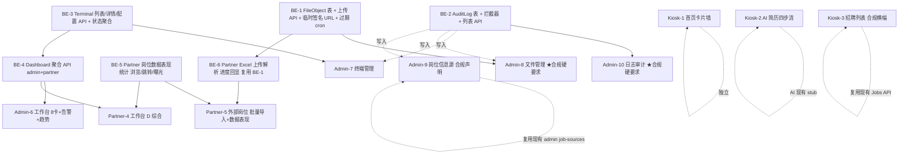

# P0 4 周冲刺计划 + 依赖图 + 关键路径

> 编写时间：2026-05-30
> 输入：[miaoda-reference-catalog.md](../product/miaoda-reference-catalog.md)（49 张图分析 + 10 个 P0 模块）
> 现状基准：[current-progress.md](./current-progress.md)（Phase 0a/0b/#5/#4+#2/Phase C 完成）
> 目标：4 周内完成 10 个 P0 模块，可商用、可演示、可谈合作。

---

## 0. 现状盘点（决定排期的关键事实）

| 已就绪 | 说明 |
|--------|------|
| Auth（Admin/Partner JWT + RolesGuard + ThrottlerGuard） | Phase 0a/C |
| Prisma 8 模型 + seed | Phase 0b |
| Jobs 真实 API（Kiosk 读真表 + Admin 审核/发布状态机 + Partner importJobs） | #4+#2+#5 |
| 全局 ValidationPipe（forbidNonWhitelisted）+ 统一错误体 | 已落 |
| Terminal Agent 全链路（打印出纸）+ Prisma 持久化心跳 | Phase 8 封板 |

| 尚未就绪（决定 P0 的后端依赖） | 阻塞模块 |
|------|------|
| FileObject 模型 + 上传 API + 过期清理 cron | Admin/06 文件管理 |
| AuditLog 模型 + 操作日志中间件 | Admin/14 日志审计 |
| Dashboard 聚合 API（统计、待办、告警） | Admin/01、Partner/04 |
| Terminal 列表 / 配置 API（已有 heartbeat，无 list/detail） | Admin/02 终端管理 |
| Partner 数据表现统计（浏览/跳转/曝光） | Partner/11 |
| 文件上传基础（OSS 或本地 + 临时签名 URL） | Admin/06、Partner/11 Excel 导入回显 |

> JobFair、PrintOrder、AI 服务、AuditLog 都没建模；本计划中 **AuditLog 必做**，其它非 P0 模块不动。

---

## 1. 依赖图（mermaid）

**判定依据**：
- M8 必须等 BE-1 全部就绪（不然"强制清理"是假按钮，合规失分）
- M10 必须等 BE-2（前端没数据 = 0 演示价值）
- M6/M4 等 BE-4（指标卡可临时 mock，但开发完成时点必须有真聚合接口，否则上线即破）
- M7 等 BE-3（heartbeat 已有，但缺 list/detail/config，前端没法做）
- M5 等 BE-5 + BE-6（数据表现列 + 批量导入是两个独立后端补丁）
- **M1/M2/M3/M9 是 0 阻塞**，可以第一周并行启动

---

## 2. 后端依赖补丁清单（按优先级）

| # | 补丁 | 工作量 | 阻塞模块 | 实施关键点 |
|---|------|--------|---------|----------|
| BE-1 | FileObject 表 + 上传 API + 临时签名 URL + 过期 cron | 2.5 天 | M8、BE-6 | `FileObject` 模型字段：id/userId/kind/path/mimetype/size/sha256/expiresAt/sensitiveLevel/deletedAt/deletedBy；本地存储起步（`/data/files/${yyyyMMdd}/${sha256}`），上传 API multer，签名 URL 用 HMAC + 5 分钟 TTL；cron 用 `@nestjs/schedule` 每小时扫一次 `expiresAt < now()`，物理删除 + 写 AuditLog |
| BE-2 | AuditLog 表 + 全局拦截器 + 列表 API | 1.5 天 | M10 | `AuditLog` 字段：id/createdAt/actor(userId+role)/module/action/targetId/targetType/diff(json)/ip/userAgent/requestId；NestJS Interceptor 自动写入 admin 写操作；GET `/admin/audit-logs` 支持 module/action/actor/时间筛选 |
| BE-3 | Terminal 列表/详情/配置 API | 1 天 | M7 | 复用已有 `Terminal` 表 + `TerminalHeartbeat` 表，新增 `GET /admin/terminals`（含最近心跳聚合状态：online/offline/error）、`GET /admin/terminals/:id`、`PATCH /admin/terminals/:id`（备注、所属机构、维护状态） |
| BE-4 | Dashboard 聚合 API（admin+partner） | 1 天 | M6、M4 | `GET /admin/dashboard/summary` 返回 8 卡 + 待处理告警计数 + 24h 趋势（按小时聚合 PrintTask）；`GET /partner/dashboard/summary` 同上但范围限定本机构；告警暂取 heartbeat 离线 + AuditLog 异常事件聚合 |
| BE-5 | Partner 岗位数据表现统计 | 1 天 | M5、M4 | 新增 `JobView` / `JobClick` 极简表（id/jobId/createdAt/sourceType）；Kiosk 列表/详情埋点 → POST `/track/job-view`（无鉴权，IP 限流）；Partner 列表接口加 `views`/`clicks`/`ctr` 聚合字段 |
| BE-6 | Partner Excel 上传解析 + 进度回显 | 1.5 天 | M5 | 复用 BE-1 上传通道；`POST /partner/jobs/import-batches` 接受 fileId，后台用 `xlsx` 解析 → 复用 `importJobs` upsert 流程；`GET /partner/jobs/import-batches/:id` 返回 status/processed/total/errors |

**总后端工作量**：≈ 8.5 天（其中 BE-1/BE-2 是合规硬底盘）

---

## 3. 关键路径（卡 P0 完成的最长链）

**关键路径**：`BE-1 (2.5d) → BE-6 (1.5d) → M5 (3d) = 7 天`

并列长链：`BE-2 (1.5d) → M10 (2d) = 3.5 天`（短，可在 M5 同周完成）

**瓶颈**：BE-1（文件上传 + 签名 + cron）是单点。M8 和 M5 都等它，且需要它进入"真上传 + 真清理"才能算商用。一旦 BE-1 滑期 1 天，M5、M8、M6（dashboard 文件指标卡）全部延后。

> **建议**：BE-1 在 Week 1 Day 1 第一个开（哪怕暂时跳过签名 URL 用本地路径，先把模型 + 上传通了），M8、BE-6 在 Day 3 起就能跟上。

---

## 4. 可并行 vs 必须串行

### 可并行（单人就在分支间切换；两人可直接拆）

| 并行组 | 模块 | 原因 |
|--------|------|------|
| A | M1 Kiosk 首页 + M3 Kiosk 招聘合规横幅 | 纯前端，零后端依赖，复用现有 Jobs API |
| B | M2 Kiosk AI 简历四步流 | AI 已有 stub，UI 重做不影响其他人 |
| C | M9 Admin 岗位信息源合规横幅 | 在已有 admin job-sources 上加横幅 + 文案，不动数据层 |
| D | BE-1 / BE-2 / BE-3 / BE-4 / BE-5 / BE-6 | 6 个后端补丁互相独立，可同周推进 |

### 必须串行

| 串行链 | 原因 |
|--------|------|
| BE-1 → BE-6 → M5 | Excel 上传依赖通用上传通道 |
| BE-1 → M8 | 文件管理必须真上传 + 真签名 + 真 cron 才能演示"强制清理" |
| BE-2 → M10 | AuditLog 没数据，列表页就是空表 |
| BE-3 → M7 | 终端列表无 API |
| BE-4 → M6 / M4 | 工作台聚合卡必须有真接口（可短期 mock，但**演示当天必须切真**） |

### 2 人拆法（如果有第二人）

- **A 人（前端为主）**：Week 1 M1+M3+M9 → Week 2 M2 → Week 3 M5+M7 前端 → Week 4 M6+M4 前端
- **B 人（后端为主）**：Week 1 BE-1+BE-2 → Week 2 BE-3+BE-4 → Week 3 BE-5+BE-6 → Week 4 M8+M10 前端 + 联调

---

## 5. 4 周逐周计划（单人）

### Week 1（5/30 - 6/5）：合规底盘 + 零依赖前端

| 天 | 任务 | 分支 |
|----|------|------|
| Day 1-2 | BE-1 FileObject 表 + 上传 API + 签名 URL（不含 cron） | `feat/be-file-object-upload` |
| Day 3 | BE-1 cron 过期清理 + 单元测试 + AuditLog 钩子 | 同上 |
| Day 4 | BE-2 AuditLog 表 + 全局拦截器 + admin 列表 API | `feat/be-audit-log` |
| Day 5 | M1 Kiosk 首页卡片墙重做（7 模块卡，shadcn grid-cols-3，删彩色渐变） | `feat/kiosk-home-cards` |

**Week 1 验收**（演示给老板看的话）：
- BE-1 接口可 curl 上传/下载 + 文件 1 小时后自动消失（cron）
- BE-2 任意 admin 写操作自动落 AuditLog（看数据库 row 数）
- M1 首页 7 大模块卡片墙完成，触控尺寸合规（≥56px 主按钮、≥48px 可点击区域）

### Week 2（6/6 - 6/12）：合规典范页 + AI 简历核心场景

| 天 | 任务 | 分支 |
|----|------|------|
| Day 1 | M3 Kiosk 招聘列表加合规横幅 + CTA 文案审查 + M9 Admin 岗位信息源加合规声明横幅 | `feat/kiosk-jobs-compliance` + `feat/admin-job-sources-compliance` |
| Day 2 | M10 Admin 日志审计前端（列表 + 筛选 + 详情抽屉，接 BE-2） | `feat/admin-audit-log-ui` |
| Day 3-5 | M2 Kiosk AI 简历四步流（上传 stepper + 诊断雷达图 + 优化对比 split view） | `feat/kiosk-ai-resume-flow` |

**Week 2 验收**：
- M3 招聘列表顶部横幅 + "查看岗位"/"去来源平台投递" 文案全覆盖
- M9 岗位信息源顶部蓝色合规声明（直接抄 catalog 文案）
- M10 日志审计可看到 Week 1 BE-1/BE-2 跑出来的真实日志（强制清理、上传、登录等）
- M2 简历上传 → 诊断 → 优化 → 对比 四步打通（AI 仍用 stub）

### Week 3（6/13 - 6/19）：终端管理 + Partner 主战场

| 天 | 任务 | 分支 |
|----|------|------|
| Day 1 | BE-3 Terminal 列表/详情/配置 API | `feat/be-terminal-list-api` |
| Day 2 | BE-5 Partner 数据表现统计 + Kiosk 埋点 | `feat/be-job-tracking` |
| Day 3 | BE-6 Partner Excel 上传解析（复用 BE-1） | `feat/be-partner-excel-import` |
| Day 4-5 | M5 Partner 外部岗位管理（批量导入 + 数据表现列） | `feat/partner-jobs-import` |

**Week 3 验收**：
- BE-3 admin 可查询所有终端 + 配置备注
- M5 Partner 上传 Excel → 进度回显 → 落 Job 表（pending+draft）→ 列表显示 views/clicks
- BE-5 Kiosk 浏览岗位详情 → Partner 列表 views+1

### Week 4（6/20 - 6/26）：合规硬要求 + 工作台联调

| 天 | 任务 | 分支 |
|----|------|------|
| Day 1 | BE-4 Dashboard 聚合 API（admin + partner） | `feat/be-dashboard-summary` |
| Day 2 | M7 Admin 终端管理（列表 + 状态徽章 + 配置抽屉） | `feat/admin-terminals-ui` |
| Day 3 | M8 Admin 文件管理（强制清理按钮 + 隐私字段 + 操作落 AuditLog） | `feat/admin-files-cleanup` |
| Day 4 | M6 Admin 工作台 + M4 Partner 工作台 D 综合方案 | `feat/admin-partner-dashboard` |
| Day 5 | 全链路联调 + 合规词扫描 + 录演示视频 + 进度文档同步 | `chore/p0-sprint-wrap` |

**Week 4 验收**（最终交付）：
- 10 个 P0 模块全部 merge 到 main
- `pnpm lint / typecheck / build` 三端全通
- 合规词扫描 0 命中（一键投递/候选人/HR/投递简历/收简历）
- 录制 5 分钟演示视频：Kiosk 首页 → 招聘合规展示 → AI 简历四步 → Admin 工作台 → 文件强制清理 → 日志审计可追溯
- `docs/progress/current-progress.md` 更新到 Phase #P0 sprint 封板

---

## 6. 每周演示验收清单

| 周 | 必须能演示 | 不能糊弄的 |
|----|----------|-----------|
| W1 | 文件 1 小时过期自动删 + 任意 admin 操作落日志 + Kiosk 新首页 | 真 cron 真删，不是 console.log；首页卡片白底+1px 边框，不是渐变 |
| W2 | 招聘页顶部合规横幅 + 日志审计能列出 W1 的真实操作 + AI 简历四步走通 | 文案严格"查看岗位/去来源平台投递"；日志带 actor+ip+requestId |
| W3 | Partner 上传 Excel → 导入 50 条岗位 → views/clicks 真数据 | 不允许 mock 数据混进；Excel 解析失败要有 errors 数组 |
| W4 | 工作台 8 卡真数据 + 文件管理强制清理点一次掉 N 条 + AuditLog 同步出现该操作记录 | 8 卡数据要能解释每个数字的来源 SQL |

---

## 7. 风险红旗

| # | 风险 | 影响模块 | 缓解方案 |
|---|------|---------|---------|
| R1 | **BE-1 滑期**（单点关键路径） | M5、M8、BE-6 | Week 1 Day 1 优先；如 Day 3 还没过签名 URL，签名 URL 推到 Week 2，先用 fileId 直查（admin 内部够用） |
| R2 | **Terminal Agent 是 Phase 8 单机产物，多终端真实数据没来源** | M7 终端列表只有 1 台 | Week 3 在 seed 里插 5 台 mock terminal（不同 status/location/orgId），仅作演示；上线前注明"待真机接入" |
| R3 | **Dashboard 趋势图无真历史**（PrintTask 表才 30 条种子） | M6、M4 趋势卡 | Week 4 seed 注入 7 天历史 PrintTask（小时分布合理），演示真实；上线后真数据自然替换 |
| R4 | **M2 AI 简历四步流 AI 仍是 stub**，"诊断 70 分" 数据是 mock | M2 | 已在 Phase 7.6 文档声明 Provider 可切换；演示时用 mockProvider + 真 OCR 路径（OCR 可用阿里 OSS OCR 替代，1 天内可接） |
| R5 | **AuditLog 拦截器性能** — 每次写操作多一次 DB 写 | 全后端 | 用 fire-and-forget 异步队列（in-memory，1s 批量 flush），主接口不等待 |
| R6 | **M5 Excel 上传超大文件**（5MB+）解析阻塞 NestJS event loop | M5、BE-6 | 限制单文件 ≤ 2MB / ≤ 500 行；超出走"分批上传"提示；不引入 BullMQ（4 周内不值得） |
| R7 | **合规横幅文案被产品改字** | M3、M9 | 文案 freeze 在 catalog 里，所有改字需 commit 时挂 [compliance] tag，方便审计回溯 |
| R8 | **Phase 8 Terminal Agent 反过来要求 BE-3 改字段**（多终端实战可能加字段） | BE-3、M7 | BE-3 设计时给 Terminal 加 `metadata JSON` 字段，agent 临时字段写 metadata 不改 schema |

---

## 8. 4 周后的产物形态（用于谈合作）

- 一台一体机插电开机 → Kiosk 首页 7 模块卡片墙 → 点"岗位信息" → 顶部合规横幅 + 列表 + "查看岗位"/"去来源平台投递" → 整个浏览路径无任何招聘闭环字眼
- 合作机构登录 Partner 后台 → 工作台 8 卡看自己数据 → 上传 Excel 导入 50 条岗位 → 系统显示"已转交审核（pending）"
- 管理员登录 Admin → 工作台 8 卡 + 今日告警 → 点"岗位信息源"看到顶部蓝色合规声明 → 审核 Partner 上传 → 发布 → Kiosk 立即可见
- 任何敏感文件（简历/身份证）上传 → 1 小时后自动删除 → AuditLog 留痕"强制清理 145 个过期隐私文件"
- 全程录像 5 分钟可发给地方人社局、合作院校、合作招聘平台谈方案

---

## 9. 进度文档更新约定

- 每个分支 merge 前在 `docs/progress/current-progress.md` 表格末尾追加一行（日期 + 模块 + commit hash）
- Week 4 Day 5 把 §三优先级任务列表的 P0 全部勾掉，新增 "P0 4 周冲刺 已封板" 一节
- 不在本文档再次更新进度（本文档只作排期 baseline，进度由 current-progress.md 承载）

---

**结束。下一步：从 BE-1 起手，分支 `feat/be-file-object-upload`，今天就动。**
