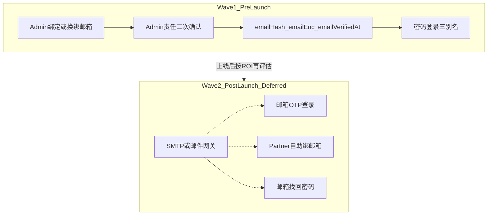

# 合作机构账号「手机 / 邮箱」双通道登录 — 商用方案

> **日期**：2026-07-25  
> **评审组织**：Lead 推荐 + Antigravity 方案评审委员会（PM / Security / Backend Architect / Reality Checker / Partner Ops）+ Antigravity Reality Check 二轮压力测试  
> **状态**：待老板拍板（尚未开工、未改运行时代码）  
> **评审结论**：**条件性批准 Wave 1（有限 Go）**；**上线前严禁推进邮箱 OTP / SMTP 邮件网关（No-Go）**。

---

## 0. Lead 推荐（先说结论）

**推荐：Wave 1 =「密码登录三别名 + Admin 代绑邮箱」；不做邮箱验证码登录。**

| 问题 | 推荐 |
|------|------|
| 邮箱怎么登录？ | 密码登录可用：用户名 / 已验证手机 / **已验证邮箱** |
| 谁来绑定？ | **Admin「合作机构管理 → 账号」代绑/换绑**（镜像现有手机能力） |
| 要不要邮箱 OTP？ | **上线前不做**（仓库无发信能力；高校邮箱拦截风险高） |
| 何时开工？ | **P0 验收通过后**的微型窗口，不与支付 / SMS / Windows 真机抢带宽 |

理由一句话：机构痛点是「记不住系统分配的 username」，用邮箱当密码登录别名就能消化大部分客服工单；第二套 OTP 通道现在 ROI 不够、还会拖垮上线。

---

## 1. 执行摘要

| 维度 | 结论 |
|------|------|
| **决策建议** | **有限 Go：Wave 1**；**拒绝 Wave 2（SMTP + 邮箱 OTP + 邮箱找回）** |
| **核心痛点** | 合作机构老师轮岗 / 非每日登录，易忘 `username`；手机未验证时无法用手机登录或短信找回 |
| **Wave 1 交付** | ① 密码登录支持 `username` / `verified_phone` / `verified_email` ② Admin 为 Partner 账号绑定/换绑邮箱（人工核验确认后生效） |
| **Non-Goals** | SMTP / 邮件网关；邮箱 OTP 登录；邮箱找回密码；把机构资料邮箱当登录身份；上线前 Partner 自助绑邮箱 |
| **工期（修正后）** | **2.5 – 3.0 人日**（初估 1.5–2 人日偏乐观；见 §7） |
| **排期** | P0（支付 / SMS / Windows / 密钥 / 法务）验收通过后，封板前微型窗口 |

---

## 2. 问题与商业价值

### 2.1 运维痛点

- 系统常分配格式化用户名（如 `partner_xxx_01`），机构侧记忆成本高。
- Admin 创建账号时手机可能未提供或未验证（`phoneVerifiedAt` 为空），手机登录 / 短信找回不可用。
- 忘记 username 且手机未就绪时，只能客服人工核验改密，单次约 15–30 分钟。

### 2.2 收益

- 用工作邮箱作密码登录别名，贴合高校 / 人才机构习惯。
- 按手机号同级的 Hash + Enc + VerifiedAt 规范落库，补齐 PII 资产口径。
- **不引入**发信基础设施，避免上线前采购、域名 SPF/DKIM、送达率扯皮。

---

## 3. 现状差距（代码事实）

| 现状 | 差距 |
|------|------|
| Partner 已支持 username / 已验证手机 + 密码；短信 OTP；Admin 手机换绑 | **无** User 邮箱列族 |
| 手机：`phoneHash` / `phoneEnc` / `phoneVerifiedAt` | 需对称新增 `emailHash` / `emailEnc` / `emailVerifiedAt` |
| API **无** SMTP / 邮件 Provider | Wave 1 **不得假装能发邮件** |
| `Organization` 主模型无登录用邮箱；`OfflineAgency.contactEmail` / 类型里的资料邮箱 ≠ 登录身份 | **严禁**混用为登录别名 |

---

## 4. 方案分层

### Wave 1（推荐，上线前可做）

1. **密码登录三合一**：`findUserByLoginId` 增加邮箱路径；仅 `emailVerifiedAt != null` 可作别名。
2. **Admin 代绑/换绑**：录入邮箱 → 勾选「设为已验证登录别名」→ **责任二次确认弹窗** → 落库；CAS 防重复占用；换绑递增 `tokenVersion` 踢旧会话。
3. **Partner 登录文案**：占位改为「用户名 / 已验证手机号 / 已验证邮箱」；短信 Tab 明确「邮箱暂不支持验证码登录」。

### Wave 2（上线后视 ROI，当前 No-Go）

邮件网关、邮箱 OTP、邮箱找回、Partner 自助绑邮箱。

### 边界红线

- 不做平台内投递 / 收简历 / 候选人管理（合规）。
- 不做「验证码已发送到邮箱」等虚假反馈。
- 机构展示用联系邮箱 ≠ 账号登录邮箱。

---

## 5. 身份与安全原则

| 字段 | 格式 | 用途 |
|------|------|------|
| `emailHash` | HMAC-SHA256(pepper, normalize) | `@unique` 查找，不可逆 |
| `emailEnc` | AES-256-GCM | Admin/详情脱敏展示 |
| `emailVerifiedAt` | DateTime? | 为空则禁止作登录别名 |
| `emailVerifyMethod`（建议） | `admin_manual` \| 预留 `otp` | 避免「Verified」语义欺骗 |

配套要求：

- 登录失败统一 `INVALID_CREDENTIALS`（防枚举）。
- AuditLog 只记脱敏邮箱 + 操作人 + 核验方式；禁止明文。
- Admin 人工核验须二次确认文案，明确责任归属。
- Reality Check：**建议** Admin 敏感换绑增加 session re-auth / 当前密码确认，降低失窃 Admin 会话批量改绑风险。

---

## 6. 产品体验要点

**Admin**

1. 合作机构管理 → 账号 → 展示脱敏邮箱与验证状态。  
2. 绑定/修改 → 输入邮箱 → 勾选「管理员已人工核实，设为登录别名」→ 二次确认。  
3. 唯一冲突时诚实报错，不泄露其他机构信息。

**Partner 登录**

- 密码 Tab：三别名 + 密码。  
- 短信 Tab：仅手机；输入邮箱格式时前端提示改用密码登录。

---

## 7. 范围、工期、依赖、验收

### 工期（采纳 Reality Check 修正）

| 模块 | 内容 | 人日 |
|------|------|------|
| Schema | SQLite + PG 双轨 `email*` 字段 + unique | 0.4 |
| API | 登录识别、Admin 代绑 CAS、审计、tokenVersion | 1.0 |
| Shared / UI | DTO + Admin 表单 + Partner 文案 | 0.5 |
| Verify / 回归 | 专项 verify + 既有 admin-orgs / phone 相关脚本适配 | 0.6–1.0 |
| **合计** | | **2.5 – 3.0** |

> 初版委员会估 1.5–2 人日偏紧：未充分计入双 schema、CI 双 job、既有 verify 适配。

### 依赖

- **外部**：Wave 1 **零**发信依赖。  
- **内部**：复用现有加密 key、`tokenVersion`、Admin 账号管理面。

### 验收标准（最小）

1. 库内无明文邮箱列；hash/enc/verifiedAt 行为正确。  
2. username / verified phone / verified email + 密码均可登录；未验证邮箱不可作别名。  
3. Admin 换绑后旧 JWT 失效。  
4. 审计有脱敏记录与 `admin_manual`（或等价）核验方式。  
5. 短信登录路径不接受邮箱、无虚假「已发信」文案。

---

## 8. Go / No-Go 矩阵

| 维度 | 全套邮箱 OTP（方案 A） | Wave 1 精简（方案 B） | 现有 P0 |
|------|----------------------|---------------------|---------|
| 商业价值 | 高但边际递减 | 精准打「忘 username」 | 生命线 |
| 工期 | 5–8 人日 + 域名备案 | 2.5–3 人日 | 收口中 |
| 外部依赖 | SMTP + SPF/DKIM | 无 | 已规划 |
| 拖垮上线风险 | 极高 | 低（须排在 P0 后） | — |
| 委员会 | **No-Go** | **Conditional Go** | **第一优先** |

---

## 9. 委员会共识、分歧与拍板选项

### 共识

1. 不做招聘闭环能力。  
2. 邮箱 PII 必须与手机同级加密隔离。  
3. 上线前不做邮箱 OTP / 不引入邮件 Provider。  
4. **必须排在 P0 之后**。

### 分歧与裁决

| 议题 | 甲方 | 乙方 | 裁决 |
|------|------|------|------|
| 无 SMTP 时能否写 `emailVerifiedAt` | PM/Ops：Admin 勾选即生效 | Sec：未经邮箱控制权证明 | **允许受托验证**，但必须二次确认 + 审计记录核验方式；建议加 `emailVerifyMethod=admin_manual`，避免未来误当「邮箱可达已证明」去做找回密码 |

### Reality Check 附加条件（开工前必须写进实施计划）

1. 工期按 **2.5–3 人日**，并先列文件预算与需改 verify 清单。  
2. Admin 代绑须审计闸 + 防滥用（二次确认；建议 re-auth）。  
3. UI/API 明确区分「机构联系信息」与「账号登录邮箱」。  
4. `verified_email` 语义标注为 Admin 受托验证，而非 SMTP 证明。

---

## 10. 给老板的二选一

### 方案一（推荐）：批准 Wave 1 剪裁版

- 做：加密邮箱字段 + Admin 代绑 + 密码三别名登录。  
- 不做：邮箱 OTP、邮箱找回、Partner 自助绑邮箱、SMTP。  
- 时机：P0 通过后微型窗口。  
- 代价：约 2.5–3 人日；零发信采购。

### 方案二：本阶段完全不做邮箱登录

- 代价：上线后客服持续承接「忘 username / 手机未就绪」工单。  
- 仅当确认机构侧全部走手机且无邮箱诉求时可选。

**委员会 + Lead 共同推荐：方案一；方案 A（全套 OTP）上线前明确拒绝。**

---

## 11. 你确认后的下一步（未授权前不动代码）

1. 老板拍板：方案一 / 方案二。  
2. 若方案一：出 TDD 实施计划（文件预算、双 schema migration、verify 清单、Admin re-auth 是否纳入 Wave 1）。  
3. 独立分支从干净 `main` 开工；不碰支付 / 打印 / Kiosk 会员登录。

---

*签署视角：Lead 推荐 · Antigravity 委员会（gemini-3.1-pro-high）· Reality Check（claude-opus-4-6-thinking）*  
*本文件仅为商用决策材料，不代表已进入开发或已部署。*
