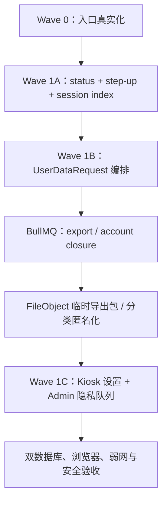

# User Center Wave 0–1 Commercial Closure Program Implementation Plan

> **For agentic workers:** REQUIRED SUB-SKILL: Use superpowers:subagent-driven-development (recommended) or superpowers:executing-plans to implement this plan task-by-task. Steps use checkbox (`- [ ]`) syntax for tracking.

**Goal:** 按已批准的方案 A，在独立干净工作区中先完成用户中心真实表达与验证基线，再完成账户状态、二次认证、数据导出、账户注销、Kiosk 设置和 Admin 隐私运营闭环。

**Architecture:** Wave 0 只清理失效入口、修复静态守卫和封住虚假 `completed`；Wave 1 在现有 `EndUser`、`UserDataRequest`、`FileObject`、`AuditLog`、Redis 会话和 NestJS BullMQ 运行时上做 additive 扩展。项目当前 `services/worker` 只有占位 `package.json`，因此首版敏感异步任务放入 `services/api/src/member-privacy/**`，复用 `AppModule` 已注册的 BullMQ root connection，不新建第二套进程或账本。

**Tech Stack:** React 18 + Vite + TypeScript + Tailwind CSS + `@ai-job-print/ui`；NestJS 11 + Prisma 7；SQLite / PostgreSQL 双 schema；Redis + BullMQ；本地/COS 私有对象存储；现有 AuditService、FilesService 和会员短信通道。

---

## 1. 执行边界

### 1.1 分支与依赖顺序

| 顺序 | 分支 | 对应详细计划 | 依赖 |
|---|---|---|---|
| 1 | `codex/user-center-wave0-truth-baseline` | `2026-07-16-user-center-wave0-truth-baseline.md` | 最新干净 `main` |
| 2 | `codex/user-center-wave1-account-security` | `2026-07-16-user-center-wave1-account-security.md` | Wave 0 合入后的 `main` |
| 3 | `codex/user-center-wave1-data-rights` | `2026-07-16-user-center-wave1-data-rights.md` | Wave 1 account-security 合入后的 `main` + 法务分类留存矩阵签字 |
| 4 | `codex/user-center-wave1-ops-ui` | `2026-07-16-user-center-wave1-ops-ui.md` | Wave 1 data-rights 合入后的 `main` + 注销执行 feature flag 获准 |

每个分支单独建立 CCG task、独立 worktree、独立复审和验收。当前包含用户在途改动的工作区只用于只读分析和写本计划，禁止直接开始运行时代码。

### 1.2 全局禁止项

- 不新增用户中心首页卡片、底部导航或同义入口。
- 不实现邮箱/OAuth 登录、账号自动合并、套餐商城、站内投递、企业候选人流程。
- 不直接删除 `EndUser` 主行，不依赖 Prisma cascade 代表“注销完成”。
- 不把 `deviceId` 当成公共终端的强身份凭证。
- 不在导出包中写入明文手机号、验证码、token、对象存储 key、内部 prompt、风控规则或其他用户数据。
- 不在没有 `REDIS_URL` 的生产运行态内联执行导出或注销；队列不可用必须 fail closed。
- 不触碰 `apps/terminal-agent/**`、打印机型号配置或硬件协议。
- 不改用户当前未提交的 AI 顾问、设计文档、workspace 配置和其他无关文件。

### 1.3 法务/产品参数门禁

以下参数不在代码里猜测；实现时先以环境变量和保守默认值承载，生产开启前必须由法务/产品签字：

```text
MEMBER_EXPORT_TTL_HOURS=24
MEMBER_STEP_UP_TTL_SECONDS=300
MEMBER_DATA_REQUEST_SLA_HOURS=72
MEMBER_ACCOUNT_CLOSURE_EXECUTION_ENABLED=false
MEMBER_ACCOUNT_CLOSURE_COOLING_HOURS=<法务确认后显式设置；未设置时 fail closed>
MEMBER_FINANCIAL_RETENTION_DAYS=<法务确认后设置>
```

默认禁止运行不可逆注销 processor。法务必须先确认冷静期、反馈/通知/权益处置、财务与审计保留期限及最小审计字段；未签字或任一参数缺失时，API 不开放 delete 申请、Kiosk 不展示注销动作、worker 对 closure job fail closed。若法务要求冷静期，必须先新增撤销状态机与通知，再开启执行开关。

## 2. 目标状态与事实源



唯一事实源：

- 账户状态：`EndUser.status`；迁移期同时保留 `enabled` 旧门禁并同事务双写。
- 数据权利请求：`UserDataRequest`；禁止新增第二张“隐私工单”表。
- 导出产物：`FileObject` 私有短期记录；`UserDataRequest.exportFileId` 关联。
- 异步执行：`member-privacy` BullMQ queue；BullMQ job 只负责调度，最终状态仍落 `UserDataRequest`。
- 文件物理删除：`FilesService.ownerDelete/forceDelete` 和 `StorageService`；禁止直接只删数据库行。
- 资金/打印审计：`Order`、`Refund`、`PrintTask` 保留必要记录并解除会员 PII 关联，不由注销 worker 重写金额或支付状态。
- 操作证据：`AuditLog`；不记录明文手机号、导出内容、验证码和签名 URL。

## 3. 跨计划契约

### 3.1 共享字面量

```ts
export type EndUserStatus = 'active' | 'disabled' | 'closing' | 'anonymized'

export type MemberStepUpAction =
  | 'export_data_request'
  | 'export_data_download'
  | 'close_account'

export type MemberDataRequestType = 'export' | 'delete' | 'revoke_consent'

export type MemberDataRequestStatus =
  | 'pending'
  | 'handling'
  | 'ready'
  | 'completed'
  | 'expired'
  | 'failed'
  | 'rejected'
  | 'cancelled'
```

这些类型放在 `packages/shared/src/types/member-privacy.ts`，API/Kiosk/Admin 统一导入，禁止三端复制字符串联合类型。

### 3.2 状态转换

| 请求类型 | 允许转换 | 完成定义 |
|---|---|---|
| `export` | pending → handling → ready；ready → handling（download cleanup）→ completed；ready → expired；handling/ready → failed；pending/failed → rejected | `ready` 表示产物存在；响应流成功结束后进入交付收口，reconciler 完成物理删除与账本 CAS 后才 `completed`。`completed` 仅证明服务端交付与清理成功，不证明客户端已永久保存。自然过期进入 `expired` 并清 `activeKey`。 |
| `delete` | pending → handling → completed；handling → failed；failed → pending（retry） | delete 创建即进入 `closing`，之后禁止普通 reject/cancel。所有分类步骤成功、对象已物理删除、会话已撤销、PII 已墓碑化后才 `completed`；失败只能重试或人工升级，不能恢复成 active。 |
| `revoke_consent` | 同一事务直接创建 completed；事务失败不留请求行 | 撤回、账本和 required 审计原子提交，不进入异步 pending |

任何 API/Admin 都不得绕过服务层直接写状态。`export/delete` 的 `completed` 只允许 worker/下载收口服务写入；Admin 对 export 可拒绝或重试，对 delete 只能重试/升级，不能伪造终态或在进入 closing 后普通拒绝。

同一会员的 export 与 delete 必须跨类型互斥：存在 `pending/handling/ready` export 时拒绝 delete，存在非终态 delete 时拒绝 export。注销或导出过期必须撤销该请求的全部 download claim/ticket，并由协调任务收敛请求状态，不能留下永久 `ready`。

### 3.3 统一错误码

```ts
export type MemberPrivacyErrorCode =
  | 'STEP_UP_REQUIRED'
  | 'STEP_UP_CHALLENGE_EXPIRED'
  | 'STEP_UP_CODE_INVALID'
  | 'STEP_UP_TOKEN_INVALID'
  | 'DATA_REQUEST_EXECUTION_INCOMPLETE'
  | 'DATA_REQUEST_ALREADY_ACTIVE'
  | 'DATA_REQUEST_IN_PROGRESS'
  | 'DATA_REQUEST_INVALID_TRANSITION'
  | 'DATA_REQUEST_QUEUE_UNAVAILABLE'
  | 'IDEMPOTENCY_KEY_REUSED'
  | 'QUEUE_ENQUEUE_FAILED'
  | 'EXPORT_NOT_READY'
  | 'EXPORT_DOWNLOAD_IN_PROGRESS'
  | 'EXPORT_ALREADY_DOWNLOADED'
  | 'EXPORT_EXPIRED'
  | 'EXPORT_TOO_LARGE'
  | 'ACCOUNT_NOT_ACTIVE'
  | 'ACCOUNT_CLOSURE_NOT_AVAILABLE'
  | 'ACCOUNT_CLOSURE_FAILED'
```

step-up grant 采用原子 `GET+DEL`，对外不区分“从未存在”和“已被重放”，两者统一返回 `STEP_UP_TOKEN_INVALID`，避免泄露凭证状态。异步执行原因另用 shared allowlist，不与 API error 混用：

```ts
export const MEMBER_PRIVACY_FAILURE_CODES = [
  'QUEUE_ENQUEUE_FAILED',
  'EXPORT_ARTIFACT_MISSING',
  'EXPORT_TOO_LARGE',
  'EXPORT_CLEANUP_FAILED',
  'ACCOUNT_CLOSURE_STEP_FAILED',
] as const
export type MemberPrivacyFailureCode = (typeof MEMBER_PRIVACY_FAILURE_CODES)[number]
```

`QUEUE_ENQUEUE_FAILED` 是唯一同时出现在两张表的码：同步 API 抛它告知本次请求未成功入队，同时账本 `failureCode` 保留它供 Admin retry/对账。其他 failure code 不得直接当 API error 返回。

## 4. 提交与复审节奏

每个详细计划按任务提交；不得把四个分支压成一个大提交。推荐 Conventional Commit：

```text
test: lock user center truth baseline
fix: prevent false privacy request completion
feat: add member account status and step-up
feat: add member data export orchestration
feat: add member account closure orchestration
feat: connect member privacy operations ui
test: add user center wave1 acceptance gates
docs: record user center wave1 verification
```

以下变更必须并行调用 Claude + Antigravity 只读复审：auth、Redis 原子脚本、Prisma migration、匿名化/删除、签名下载、Admin 状态转换。Antigravity 若仍因额度不可用，必须记录失败证据，不能写成“双模型通过”；运行时代码合入需要额度恢复或用户另行批准替代门禁。

## 5. 全局完成门禁

- [ ] 四份详细计划均按顺序执行，不跳过 Wave 0。
- [ ] SQLite fresh DB 和 PostgreSQL readiness 都从正式 migration 构建通过。
- [ ] `EndUser.status` 与 `enabled` 旧门禁双写测试通过。
- [ ] step-up token 按 user + action 绑定，5 分钟内、单次消费、重放失败。
- [ ] 导出包只含白名单字段；一次性应用下载凭证 ≤10 分钟，只经 URL fragment 交付并以 header 消费；对象存储 URL 不下发客户端；产物 ≤24 小时；并发下载只成功一次。
- [ ] 下载使用有租约的 claim；对象至少保留到 HTTP response `finish`，失败/租约超时可重新 step-up 领取；reconciler 能收口“流已结束待清理”和自然过期状态。
- [ ] 注销 create 响应丢失时，closing 账号可用原未过期 JWT + 同一 Idempotency-Key 只读查询最小回执；普通本人接口、QR claim 和新会话仍全部拒绝。
- [ ] 注销中途失败为 `failed` 且可重试，不产生 `completed`；重试不重复删除或重写财务状态。
- [ ] 原手机号 hash 不再存在；同号码能创建全新 EndUser；旧资产不会转移。
- [ ] 所有旧 session 和 step-up grant 失效；closing/anonymized 账号沿旧 `enabled` 门禁也被拒。
- [ ] Kiosk 1080×1920、手机、桌面、键盘、读屏、弱网和会话过期验收通过。
- [ ] Admin 能筛选、查看、拒绝 export、重试失败请求、升级 delete 失败并查看审计摘要，无需直接改库；delete 不存在普通 reject/cancel/恢复 active。
- [ ] `pnpm` lint/typecheck/build、相关 verify、`git diff --check` 和双 CI 全绿。

## 6. 停止条件

- 当前分支不是从最新干净 `main` 创建，或 worktree 含无关修改。
- schema 迁移会删除列、改写历史金额、删除审计或破坏 PostgreSQL/SQLite parity。
- 需要生产短信、COS、Redis 或真实会员 PII 才能完成本地测试。
- 发现匿名化会让原手机号仍命中旧账号，或会让新账号继承旧资产。
- 发现任一可见入口仍是假按钮、建设中或无真实失败态。
- 任一 Critical/High 安全审查未修复。
